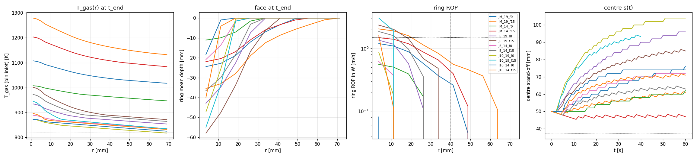
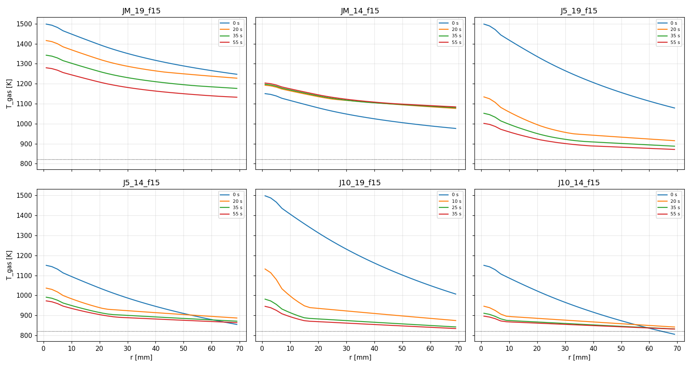
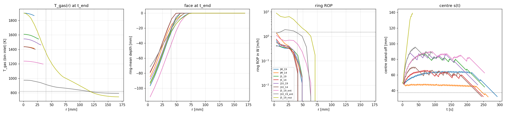
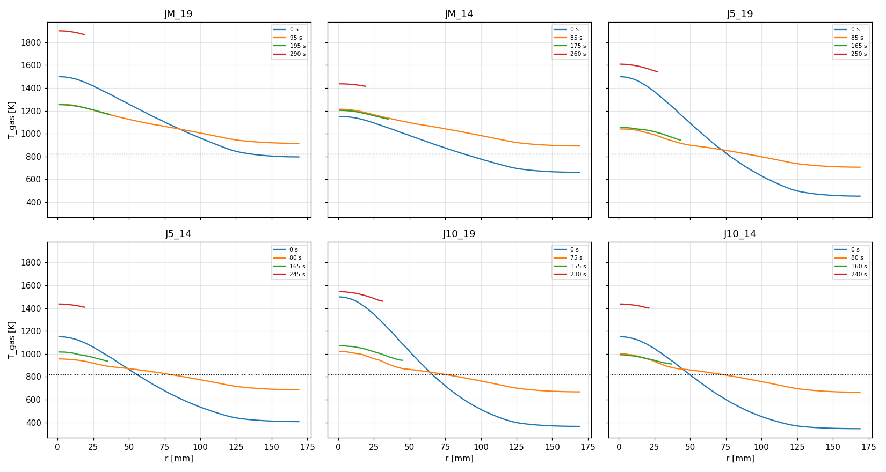

# D2a2 results: energy-conserving wall-jet T_gas(r, s)

## 0. Pre-registration (written 2026-09-16, before any run of this set)

> The first set of runs (first packet version, nozzle T at stagnation) is kept
> in [v1_nozzle/RESULTS.md](v1_nozzle/RESULTS.md). Its findings are used below
> where stated.

### Reference solution (verbatim from `ACTIVE_STEP.md`)

Ring ROP at r = 40 mm, and hole Ø = the largest r whose pinned closed-form
ROP is ≥ 0.9 × 1.5 m/h. Flat face at s = SOD.

| T_nozzle | stagnation treatment | anchor | ring ROP (r = 40 mm) | hole Ø |
|---|---|---|---|---|
| 1900 K | free-jet decay kept (item 1) | J-M | 0.90 m/h | 60 mm |
| | | J-5 | 1.68 | 87 |
| | | J-10 | 1.27 | 79 |
| 1900 K | nozzle T at stagnation | J-M | 1.63 | 91 |
| | | J-5 | 2.98 | 109 |
| | | J-10 | 2.27 | 92 |
| 1436 K | decay kept | J-M / J-5 / J-10 | 0.38 / 0.74 / 0.55 | none / 61 / 62 |
| 1436 K | nozzle T at stagnation | J-M / J-5 / J-10 | 0.89 / 1.66 / 1.26 | 59 / 87 / 79 |

Cap mdot·cp·(T_stag − T_s) at T_s = 821 K:

| T_nozzle | nozzle T at stagnation | decay kept (T_stag ~1498 K / ~1150 K) |
|---|---|---|
| 1900 K | 20.4 kW | 12.8 kW |
| 1436 K | 11.6 kW | 6.2 kW |

Predictions:
1. Face power stays below the cap for every run, and is far below D2a's
   21–29 kW for the weak-h anchor.
2. At the foot ring, Martin is the slowest anchor under every treatment; the
   bracket anchors make the Ø 80–110 mm holes.
3. With the decay kept, at 1900 K: J-5 has a ring ROP inside Meier's
   1.3–1.6 m/h ±20 % band, J-10 is just under it, and Martin is well under
   it. Hole Ø: J-5 ~87 mm, J-10 ~79 mm, J-M ~60 mm. (Information for D2b,
   not a score.)
4. The 1436 K result depends on the stagnation treatment; no conclusion about
   the chamber thermocouple is pre-registered.

### Implementer's replica of the reference (`walljet.py`, before running)

Same definition; this study's h(r, s) (Martin shape beyond r_core); h_Martin
= 1449 / 1392 W/m²K. Each cell is ring ROP [m/h] / hole Ø [mm], **with face
losses | without**.

| T_nozzle | treatment | T_stag | J-M | J-5 | J-10 |
|---|---|---|---|---|---|
| 1900 K | decay | 1498 K | 1.04/66 \| 1.02/66 | 1.88/92 \| 1.85/91 | 1.45/82 \| 1.40/81 |
| 1900 K | nozzle | 1900 K | 1.69/94 \| 1.68/93 | 3.03/110 \| 2.99/109 | 2.33/93 \| 2.28/92 |
| 1900 K | decay + entrained mass | 1498 K | 1.11/69 \| 1.10/69 | 2.40/105 \| 2.37/104 | 2.35/96 \| 2.31/95 |
| 1436 K | decay | 1150 K | 0.45/11 \| 0.44/10 | 0.89/66 \| 0.86/66 | 0.69/66 \| 0.64/65 |
| 1436 K | nozzle | 1436 K | 0.91/60 \| 0.89/59 | 1.71/88 \| 1.67/87 | 1.31/79 \| 1.26/79 |
| 1436 K | decay + entrained mass | 1150 K | 0.49/12 \| 0.48/12 | 1.14/73 \| 1.11/73 | 1.13/75 \| 1.08/74 |

- **The "nozzle T at stagnation" rows reproduce the reference** to
  ≤ 0.06 m/h and ≤ 3 mm; the 1436 K row is exact.
- **The "decay kept" rows do not.** Here they are 10–13 % higher (1900 K:
  1.02/1.85/1.40 vs 0.90/1.68/1.27 m/h) and 4–6 mm wider.
  - They agree with the planner's own quoted check (1.01 / 1.74 / 1.38) for
    J-M and J-10, but J-5 is 1.85 here vs 1.74.
  - The reference's decay rows are reproduced if T_stag ≈ 1434 K rather than
    the stated ~1498 K, i.e. phi = 5 × 7.1 mm / 50 mm. **D2a's `jet.py` has
    D = 7.1 mm**, so the reference probably used the thesis bore in the
    decay. Not resolved here; the code uses `jet_D = 7.5e-3`.
  - With 1498 K, both bracket anchors sit **inside** Meier's band
    [1.04, 1.92] m/h (1.3–1.6 ±20 %): J-5 at 1.85–1.88 m/h, near the top
    edge, and J-10 at 1.40–1.45 m/h. Prediction 3's "J-10 just under the
    band" therefore does not follow at 1498 K. Martin (1.02–1.04 m/h) is just
    under the band's lower edge, not "well under".
- **The first packet version's pre-registration was wrong** about the hole
  column: it used an excess = 528 K criterion (see v1_nozzle §0). The
  reference above replaces it.

### Implementer's notes before running

- **Centre equilibrium.** With the decay, the stagnation temperature falls as
  the centre deepens, so the centre self-regulates.
  - Closed-form equilibrium stand-off at 1.5 m/h: JM_19 68 mm, JM_14 ≈ SOD
    (its centre ROP at SOD is 1.36 m/h, so it sits slightly inside SOD),
    J5_19 94 mm, J5_14 68 mm, J10_19 103 mm, J10_14 74 mm.
  - The v1 runaway (centre 2.8–36 m/h under the nozzle treatment) should be
    gone for the decay runs and present again in J5_19_noz and
    JM_19_f15_noz.
- **Coherence cap.** v1 found every 3-D wall saturated at `input_drilling`'s
  coherence cap (63°, 2 cells), with the capped centre overheating (T_top
  > 900 K on 3–12 % of firings). With a self-regulating centre, less
  saturation is expected. It is reported, not changed (Meier inputs: CLI
  overrides only, and the kernel choice is D2b's).

<!-- RESULTS -->

## 1. Part 1: 2-D slab (machinery and trend only)

Slab jet share mdot·w/(π r_core) = 0.002055 kg/s; powers are slab values. No number from this part enters the conclusions.

| run | h_ref | T_noz | treatment | t_end | centre depth | centre ROP (W) | centre s (W mean) | r_wall 2/10/20/40 mm | hole Ø (10 mm) | hole Ø (ref crit.) | r_fire | ring ROP @40 | closed form @40 (q) | reference @40 / Ø | steady? |
|---|---|---|---|---|---|---|---|---|---|---|---|---|---|---|---|
| JM_19_f0 | 1449 | 1900 | decay | 60 s | 26.0 mm | 1.13 m/h | 76 (71) mm | 41 / 27 / 15 / 0 | 54 mm | 0 mm | 45 mm | 0.26 m/h | 0.38 m/h (0.12 MW/m², s 53 mm) | 1.04 m/h / 66 mm | centre ROP 1.0→1.0 m/h; r_wall(10) 23→27 mm; centre s steady from — s |
| JM_19_f15 | 1449 | 1900 | decay | 60 s | 35.0 mm | 2.02 m/h | 61 (59) mm | 57 / 35 / 23 / 0 | 70 mm | 45 mm | 65 mm | 0.56 m/h | 0.66 m/h (0.21 MW/m², s 34 mm) | 1.04 m/h / 66 mm | centre ROP 2.1→1.9 m/h; r_wall(10) 31→35 mm; centre s steady from 31 s |
| JM_14_f0 | 1392 | 1436 | decay | 60 s | 11.9 mm | 0.59 m/h | 62 (59) mm | 23 / 6 / 0 / 0 | 12 mm | 0 mm | 27 mm | 0.00 m/h | 0.21 m/h (0.07 MW/m², s 50 mm) | 0.45 m/h / 11 mm | centre ROP 0.7→0.5 m/h; r_wall(10) 0→6 mm; centre s steady from — s |
| JM_14_f15 | 1392 | 1436 | decay | 60 s | 21.9 mm | 1.52 m/h | 47 (47) mm | 41 / 25 / 9 / 0 | 50 mm | 30 mm | 49 mm | 0.40 m/h | 0.52 m/h (0.17 MW/m², s 28 mm) | 0.45 m/h / 11 mm | centre ROP 1.6→1.5 m/h; r_wall(10) 19→25 mm; centre s steady from 0 s |
| J5_19_f0 | 5000 | 1900 | decay | 60 s | 45.3 mm | 1.43 m/h | 96 (91) mm | 29 / 23 / 19 / 6 | 46 mm | 15 mm | 31 mm | 0.00 m/h | 0.29 m/h (0.09 MW/m², s 50 mm) | 1.88 m/h / 92 mm | centre ROP 1.6→1.0 m/h; r_wall(10) 23→23 mm; centre s steady from — s |
| J5_19_f15 | 5000 | 1900 | decay | 60 s | 59.5 mm | 2.44 m/h | 85 (82) mm | 37 / 29 / 23 / 15 | 58 mm | 45 mm | 37 mm | 0.00 m/h | 0.42 m/h (0.14 MW/m², s 25 mm) | 1.88 m/h / 92 mm | centre ROP 2.7→2.2 m/h; r_wall(10) 27→29 mm; centre s steady from 60 s |
| J5_14_f0 | 5000 | 1436 | decay | 60 s | 22.0 mm | 0.60 m/h | 72 (70) mm | 15 / 11 / 4 / 0 | 23 mm | 0 mm | 15 mm | 0.00 m/h | 0.14 m/h (0.05 MW/m², s 50 mm) | 0.89 m/h / 66 mm | centre ROP 0.7→0.5 m/h; r_wall(10) 11→11 mm; centre s steady from 30 s |
| J5_14_f15 | 5000 | 1436 | decay | 60 s | 37.1 mm | 1.90 m/h | 63 (63) mm | 27 / 21 / 17 / 0 | 42 mm | 30 mm | 27 mm | 0.00 m/h | 0.38 m/h (0.12 MW/m², s 25 mm) | 0.89 m/h / 66 mm | centre ROP 2.1→1.8 m/h; r_wall(10) 19→21 mm; centre s steady from 27 s |
| J10_19_f0 | 10000 | 1900 | decay | 60 s | 53.2 mm | 1.16 m/h | 104 (101) mm | 15 / 13 / 11 / 6 | 27 mm | 0 mm | 15 mm | 0.00 m/h | 0.11 m/h (0.03 MW/m², s 50 mm) | 1.45 m/h / 82 mm | centre ROP 1.4→0.5 m/h; r_wall(10) 13→13 mm; centre s steady from 37 s |
| J10_19_f15 | 10000 | 1900 | decay | 40 s | 59.2 mm | 3.23 m/h | 93 (90) mm | 15 / 15 / 13 / 8 | 31 mm | 30 mm | 15 mm | 0.00 m/h | 0.42 m/h (0.13 MW/m², s 33 mm) | 1.45 m/h / 82 mm | centre ROP 3.7→2.8 m/h; r_wall(10) 15→15 mm; centre s steady from — s |
| J10_14_f0 | 10000 | 1436 | decay | 60 s | 23.1 mm | 0.24 m/h | 74 (74) mm | 8 / 8 / 4 / 0 | 15 mm | 0 mm | 8 mm | 0.00 m/h | 0.23 m/h (0.07 MW/m², s 50 mm) | 0.69 m/h / 66 mm | centre ROP 0.5→0.0 m/h; r_wall(10) 8→8 mm; centre s steady from 25 s |
| J10_14_f15 | 10000 | 1436 | decay | 60 s | 45.2 mm | 1.79 m/h | 71 (70) mm | 13 / 8 / 8 / 4 | 15 mm | 15 mm | 13 mm | 0.00 m/h | 0.34 m/h (0.11 MW/m², s 25 mm) | 0.69 m/h / 66 mm | centre ROP 2.0→1.8 m/h; r_wall(10) 8→8 mm; centre s steady from 28 s |
| JM_19_f15_cp092 | 1449 | 1900 | decay | 60 s | 36.0 mm | 2.09 m/h | 61 (59) mm | 55 / 35 / 23 / 0 | 70 mm | 45 mm | 61 mm | 0.56 m/h | 0.64 m/h (0.20 MW/m², s 34 mm) | 1.04 m/h / 66 mm | centre ROP 2.1→2.0 m/h; r_wall(10) 29→35 mm; centre s steady from 31 s |
| JM_19_f15_cp108 | 1449 | 1900 | decay | 60 s | 35.0 mm | 2.01 m/h | 61 (59) mm | 59 / 37 / 23 / 0 | 74 mm | 45 mm | 67 mm | 0.60 m/h | 0.68 m/h (0.22 MW/m², s 34 mm) | 1.04 m/h / 66 mm | centre ROP 2.1→1.9 m/h; r_wall(10) 31→37 mm; centre s steady from 30 s |
| JM_19_f15_Tent600 | 1449 | 1900 | decay | 60 s | 40.0 mm | 2.26 m/h | 65 (62) mm | 63 / 39 / 27 / 0 | 78 mm | 45 mm | 69 mm | 0.73 m/h | 0.78 m/h (0.25 MW/m², s 36 mm) | 1.04 m/h / 66 mm | centre ROP 2.4→2.1 m/h; r_wall(10) 33→39 mm; centre s steady from 60 s |
| JM_19_f15_dr1 | 1449 | 1900 | decay | 60 s | 36.0 mm | 2.05 m/h | 61 (59) mm | 57 / 37 / 23 / 0 | 74 mm | 45 mm | 65 mm | 0.56 m/h | 0.66 m/h (0.21 MW/m², s 34 mm) | 1.04 m/h / 66 mm | centre ROP 2.1→2.1 m/h; r_wall(10) 31→37 mm; centre s steady from 31 s |
| JM_19_f15_noz | 1449 | 1900 | nozzle | 55 s | 63.5 mm | 4.30 m/h | 91 (82) mm | 69 / 65 / 41 / 23 | 130 mm | 90 mm | 69 mm | 1.61 m/h | 1.68 m/h (0.53 MW/m², s 49 mm) | 1.69 m/h / 94 mm | centre ROP 4.4→4.2 m/h; r_wall(10) 51→65 mm; centre s steady from — s |
| JM_19_f15_ent | 1449 | 1900 | decay +mass | 60 s | 36.0 mm | 2.11 m/h | 61 (59) mm | 65 / 39 / 25 / 0 | 78 mm | 45 mm | 69 mm | 0.71 m/h | 0.75 m/h (0.24 MW/m², s 36 mm) | 1.11 m/h / 69 mm | centre ROP 2.1→2.1 m/h; r_wall(10) 33→39 mm; centre s steady from 30 s |

At the common time t = 40 s (the shortest run's stop):

| run | centre depth | r_fire | r_wall(2 mm) | r_wall(10 mm) | jet_P_face | jet_T_exhaust |
|---|---|---|---|---|---|---|
| JM_19_f0 | 20.0 mm | 43 mm | 39 mm | 23 mm | 0.28 kW | 1052 K |
| JM_19_f15 | 23.0 mm | 57 mm | 49 mm | 29 mm | 0.43 kW | 1175 K |
| JM_14_f0 | 8.0 mm | 25 mm | 21 mm | 0 mm | 0.18 kW | 962 K |
| JM_14_f15 | 14.0 mm | 37 mm | 33 mm | 17 mm | 0.31 kW | 1080 K |
| J5_19_f0 | 39.3 mm | 31 mm | 29 mm | 23 mm | 0.27 kW | 859 K |
| J5_19_f15 | 47.5 mm | 37 mm | 35 mm | 27 mm | 0.39 kW | 880 K |
| J5_14_f0 | 20.0 mm | 15 mm | 15 mm | 11 mm | 0.17 kW | 839 K |
| J5_14_f15 | 29.1 mm | 25 mm | 23 mm | 19 mm | 0.28 kW | 861 K |
| J10_19_f0 | 49.2 mm | 15 mm | 15 mm | 13 mm | 0.20 kW | 818 K |
| J10_19_f15 | 59.2 mm | 15 mm | 15 mm | 15 mm | 0.27 kW | 832 K |
| J10_14_f0 | 23.1 mm | 8 mm | 8 mm | 8 mm | 0.14 kW | 817 K |
| J10_14_f15 | 35.2 mm | 9 mm | 9 mm | 8 mm | 0.20 kW | 832 K |
| JM_19_f15_cp092 | 23.0 mm | 55 mm | 47 mm | 27 mm | 0.43 kW | 1163 K |
| JM_19_f15_cp108 | 23.0 mm | 57 mm | 49 mm | 29 mm | 0.44 kW | 1186 K |
| JM_19_f15_Tent600 | 28.0 mm | 63 mm | 53 mm | 31 mm | 0.48 kW | 1210 K |
| JM_19_f15_dr1 | 23.0 mm | 57 mm | 49 mm | 29 mm | 0.43 kW | 1175 K |
| JM_19_f15_noz | 47.4 mm | 69 mm | 69 mm | 49 mm | 0.88 kW | 1557 K |
| JM_19_f15_ent | 26.0 mm | 63 mm | 53 mm | 31 mm | 0.43 kW | 1202 K |

| run | jet_P_face end (W mean) | jet_P_cap | face / cap | face / 2.83 kW | jet_T_stag end (W mean) | jet_s_c | jet_P_decay (W mean) | nozzle budget | jet_P_exhaust | jet_T_exhaust (W mean) | jet_r_reach | floor supply | T_gas(r_core) / T_gas(40 mm) |
|---|---|---|---|---|---|---|---|---|---|---|---|---|---|
| JM_19_f0 | 0.22 (0.27) kW | 2.04 kW | 0.11 | 0.1× | 1086 (1149) K | 76 mm | 2.09 (1.93) kW | 4.13 kW | 1.82 kW | 1001 (1045) K | 69 mm | 0.0 W | 1067 / 1037 K |
| JM_19_f15 | 0.38 (0.41) kW | 2.54 kW | 0.15 | 0.1× | 1281 (1317) K | 61 mm | 1.59 (1.50) kW | 4.13 kW | 2.15 kW | 1132 (1157) K | 69 mm | 0.0 W | 1212 / 1163 K |
| JM_14_f0 | 0.14 (0.17) kW | 1.78 kW | 0.08 | 0.1× | 984 (1023) K | 62 mm | 1.16 (1.06) kW | 2.94 kW | 1.63 kW | 929 (955) K | 69 mm | 0.0 W | 981 / 963 K |
| JM_14_f15 | 0.31 (0.31) kW | 2.34 kW | 0.13 | 0.1× | 1205 (1199) K | 47 mm | 0.59 (0.61) kW | 2.94 kW | 2.03 kW | 1084 (1080) K | 69 mm | 0.0 W | 1148 / 1108 K |
| J5_19_f0 | 0.19 (0.25) kW | 1.61 kW | 0.12 | 0.1× | 921 (957) K | 96 mm | 2.52 (2.42) kW | 4.13 kW | 1.42 kW | 847 (858) K | 69 mm | 0.0 W | 888 / 870 K |
| J5_19_f15 | 0.34 (0.38) kW | 1.82 kW | 0.19 | 0.1× | 1002 (1027) K | 85 mm | 2.31 (2.24) kW | 4.13 kW | 1.48 kW | 870 (878) K | 69 mm | 0.0 W | 927 / 888 K |
| J5_14_f0 | 0.13 (0.16) kW | 1.51 kW | 0.09 | 0.0× | 880 (902) K | 73 mm | 1.43 (1.37) kW | 2.94 kW | 1.38 kW | 830 (838) K | 69 mm | 0.0 W | 863 / 851 K |
| J5_14_f15 | 0.26 (0.29) kW | 1.71 kW | 0.15 | 0.1× | 957 (975) K | 65 mm | 1.23 (1.18) kW | 2.94 kW | 1.45 kW | 857 (864) K | 69 mm | 0.0 W | 907 / 882 K |
| J10_19_f0 | 0.14 (0.18) kW | 1.49 kW | 0.09 | 0.0× | 873 (888) K | 104 mm | 2.64 (2.60) kW | 4.13 kW | 1.35 kW | 818 (817) K | 69 mm | 0.0 W | 846 / 834 K |
| J10_19_f15 | 0.27 (0.32) kW | 1.66 kW | 0.17 | 0.1× | 939 (963) K | 93 mm | 2.47 (2.41) kW | 4.13 kW | 1.38 kW | 832 (836) K | 69 mm | 0.0 W | 869 / 854 K |
| J10_14_f0 | 0.12 (0.14) kW | 1.49 kW | 0.08 | 0.0× | 872 (873) K | 74 mm | 1.45 (1.45) kW | 2.94 kW | 1.37 kW | 825 (819) K | 69 mm | 0.0 W | 855 / 842 K |
| J10_14_f15 | 0.17 (0.19) kW | 1.55 kW | 0.11 | 0.1× | 897 (905) K | 71 mm | 1.39 (1.36) kW | 2.94 kW | 1.38 kW | 831 (831) K | 69 mm | 0.0 W | 862 / 849 K |
| JM_19_f15_cp092 | 0.38 (0.41) kW | 2.33 kW | 0.16 | 0.1× | 1281 (1318) K | 61 mm | 1.46 (1.38) kW | 3.80 kW | 1.96 kW | 1121 (1146) K | 69 mm | 0.0 W | 1207 / 1154 K |
| JM_19_f15_cp108 | 0.39 (0.42) kW | 2.74 kW | 0.14 | 0.1× | 1281 (1316) K | 61 mm | 1.72 (1.62) kW | 4.46 kW | 2.35 kW | 1141 (1166) K | 69 mm | 0.0 W | 1217 / 1171 K |
| JM_19_f15_Tent600 | 0.44 (0.47) kW | 1.93 kW | 0.23 | 0.2× | 1350 (1382) K | 65 mm | 1.41 (1.33) kW | 3.34 kW | 1.49 kW | 1179 (1201) K | 69 mm | 0.0 W | 1272 / 1216 K |
| JM_19_f15_dr1 | 0.38 (0.41) kW | 2.54 kW | 0.15 | 0.1× | 1281 (1317) K | 61 mm | 1.59 (1.50) kW | 4.13 kW | 2.15 kW | 1132 (1157) K | 69 mm | 0.0 W | 1214 / 1164 K |
| JM_19_f15_noz | 0.87 (0.88) kW | 4.13 kW | 0.21 | 0.3× | 1900 (1900) K | 91 mm | 0.00 (0.00) kW | 4.13 kW | 3.26 kW | 1561 (1557) K | 69 mm | 0.0 W | 1752 / 1637 K |
| JM_19_f15_ent | 0.41 (0.44) kW | 4.13 kW | 0.10 | 0.1× | 1281 (1314) K | 61 mm | -0.00 (-0.00) kW | 4.13 kW | 3.72 kW | 1182 (1206) K | 69 mm | 0.0 W | 1237 / 1204 K |

| run | T_fire mean [p10, p90] | pinned | face: unset / idle / qneg / minrule | rim | ledger max | max slope | out of Martin range | vol. rate |
|---|---|---|---|---|---|---|---|---|
| JM_19_f0 | 821.4 [815.2, 828.8] K | 0.59 | 0.38 / 0.00 / 0.00 / 0.037 | 0 | 5.1e-15 | 42° | 0.43 of 168 | — cm³/s |
| JM_19_f15 | 821.1 [814.7, 828.4] K | 0.78 | 0.18 / 0.00 / 0.00 / 0.044 | 0 | 5.5e-15 | 50° | 0.33 of 228 | — cm³/s |
| JM_14_f0 | 821.2 [815.3, 829.2] K | 0.30 | 0.65 / 0.00 / 0.00 / 0.051 | 0 | 4.2e-15 | 36° | 0.75 of 96 | — cm³/s |
| JM_14_f15 | 821.6 [815.2, 828.9] K | 0.56 | 0.42 / 0.00 / 0.00 / 0.019 | 0 | 5.4e-15 | 38° | 0.43 of 168 | — cm³/s |
| J5_19_f0 | 820.6 [814.3, 828.9] K | 0.36 | 0.59 / 0.05 / 0.00 / 0.001 | 3 | 6.5e-15 | 64° | 0.63 of 114 | — cm³/s |
| J5_19_f15 | 821.2 [814.9, 828.2] K | 0.52 | 0.48 / 0.00 / 0.00 / 0.003 | 1 | 6.2e-15 | 66° | 0.48 of 149 | — cm³/s |
| J5_14_f0 | 820.9 [815.0, 827.7] K | 0.20 | 0.77 / 0.02 / 0.00 / 0.008 | 0 | 9.2e-15 | 58° | 1.00 of 64 | — cm³/s |
| J5_14_f15 | 821.0 [815.1, 827.6] K | 0.35 | 0.65 / 0.00 / 0.00 / 0.000 | 6 | 2.8e-15 | 64° | 0.70 of 103 | — cm³/s |
| J10_19_f0 | 820.6 [815.4, 827.3] K | 0.13 | 0.79 / 0.07 / 0.00 / 0.002 | 4 | 1.1e-14 | 73° | 1.00 of 58 | — cm³/s |
| J10_19_f15 | 820.7 [814.7, 827.7] K | 0.20 | 0.79 / 0.01 / 0.00 / 0.000 | 3 | 6.6e-15 | 77° | 1.00 of 60 | — cm³/s |
| J10_14_f0 | 823.1 [818.4, 833.9] K | 0.03 | 0.90 / 0.08 / 0.00 / 0.002 | 2 | 5.0e-15 | 67° | 1.00 of 29 | — cm³/s |
| J10_14_f15 | 821.1 [814.7, 828.2] K | 0.10 | 0.88 / 0.01 / 0.00 / 0.000 | 19 | 6.1e-15 | 78° | 1.00 of 36 | — cm³/s |
| JM_19_f15_cp092 | 821.0 [814.7, 828.3] K | 0.76 | 0.20 / 0.00 / 0.00 / 0.041 | 0 | 6.8e-15 | 50° | 0.32 of 224 | — cm³/s |
| JM_19_f15_cp108 | 821.0 [814.7, 828.3] K | 0.80 | 0.15 / 0.00 / 0.00 / 0.050 | 0 | 5.5e-15 | 53° | 0.35 of 233 | — cm³/s |
| JM_19_f15_Tent600 | 821.1 [814.7, 828.6] K | 0.86 | 0.08 / 0.00 / 0.00 / 0.058 | 0 | 5.5e-15 | 52° | 0.41 of 256 | — cm³/s |
| JM_19_f15_dr1 | 821.1 [814.7, 828.5] K | 0.78 | 0.17 / 0.00 / 0.00 / 0.044 | 0 | 6.0e-15 | 50° | 0.33 of 228 | — cm³/s |
| JM_19_f15_noz | 821.3 [815.3, 828.6] K | 0.98 | 0.00 / 0.00 / 0.00 / 0.023 | 0 | 5.4e-15 | 63° | 0.46 of 280 | — cm³/s |
| JM_19_f15_ent | 821.1 [814.7, 828.5] K | 0.86 | 0.08 / 0.00 / 0.00 / 0.063 | 0 | 6.9e-15 | 49° | 0.41 of 258 | — cm³/s |

Sensitivities (JM_19, feed 1.5 m/h):

| run | centre ROP (W) | ring ROP @40 | r_wall(10 mm) | jet_P_face | jet_T_exhaust | T_gas(40 mm) |
|---|---|---|---|---|---|---|
| JM_19_f15 | 2.02 | 0.56 | 35 mm | 383 W | 1132 K | 1163 K |
| JM_19_f15_cp092 | 2.09 (+3.2%) | 0.56 (-0.2%) | 35 mm | 377 W (-1.6%) | 1121 K | 1154 K |
| JM_19_f15_cp108 | 2.01 (-0.8%) | 0.60 (+6.8%) | 37 mm | 388 W (+1.4%) | 1141 K | 1171 K |
| JM_19_f15_Tent600 | 2.26 (+11.9%) | 0.73 (+30.8%) | 39 mm | 440 W (+14.9%) | 1179 K | 1216 K |
| JM_19_f15_dr1 | 2.05 (+1.6%) | 0.56 (+0.1%) | 37 mm | 383 W (-0.0%) | 1132 K | 1164 K |
| JM_19_f15_noz | 4.30 (+112.8%) | 1.61 (+186.5%) | 65 mm | 872 W (+127.6%) | 1561 K | 1637 K |
| JM_19_f15_ent | 2.11 (+4.4%) | 0.71 (+26.8%) | 39 mm | 412 W (+7.6%) | 1182 K | 1204 K |

T_gas(r) [K] at the profile times (bin inlet, interpolated):

| run | t | r = 10 | 18.75 | 30 | 40 | 60 | 80 | 100 mm |
|---|---|---|---|---|---|---|---|---|
| JM_19_f15 | 0 s | 1448 | 1402 | 1351 | 1317 | 1265 | nan | nan |
| JM_19_f15 | 20 s | 1370 | 1328 | 1287 | 1264 | 1238 | nan | nan |
| JM_19_f15 | 35 s | 1302 | 1266 | 1230 | 1210 | 1184 | nan | nan |
| JM_19_f15 | 55 s | 1244 | 1212 | 1181 | 1163 | 1139 | nan | nan |
| JM_14_f15 | 0 s | 1116 | 1084 | 1048 | 1024 | 989 | nan | nan |
| JM_14_f15 | 20 s | 1164 | 1138 | 1116 | 1105 | 1084 | nan | nan |
| JM_14_f15 | 35 s | 1168 | 1142 | 1118 | 1104 | 1087 | nan | nan |
| JM_14_f15 | 55 s | 1174 | 1148 | 1122 | 1108 | 1090 | nan | nan |
| J5_19_f15 | 0 s | 1418 | 1346 | 1265 | 1206 | 1113 | nan | nan |
| J5_19_f15 | 20 s | 1059 | 1002 | 957 | 942 | 923 | nan | nan |
| J5_19_f15 | 35 s | 997 | 956 | 922 | 908 | 894 | nan | nan |
| J5_19_f15 | 55 s | 959 | 927 | 901 | 888 | 876 | nan | nan |
| J5_14_f15 | 0 s | 1095 | 1044 | 987 | 945 | 879 | nan | nan |
| J5_14_f15 | 20 s | 983 | 943 | 923 | 914 | 895 | nan | nan |
| J5_14_f15 | 35 s | 949 | 918 | 900 | 892 | 877 | nan | nan |
| J5_14_f15 | 55 s | 935 | 907 | 888 | 882 | 869 | nan | nan |
| J10_19_f15 | 0 s | 1406 | 1324 | 1231 | 1162 | 1049 | nan | nan |
| J10_19_f15 | 10 s | 997 | 937 | 922 | 910 | 885 | nan | nan |
| J10_19_f15 | 25 s | 913 | 883 | 874 | 865 | 849 | nan | nan |
| J10_19_f15 | 35 s | 893 | 869 | 861 | 854 | 840 | nan | nan |
| J10_14_f15 | 0 s | 1087 | 1030 | 965 | 916 | 836 | nan | nan |
| J10_14_f15 | 20 s | 895 | 886 | 876 | 867 | 849 | nan | nan |
| J10_14_f15 | 35 s | 874 | 868 | 860 | 852 | 838 | nan | nan |
| J10_14_f15 | 55 s | 867 | 862 | 855 | 849 | 837 | nan | nan |

Run settings: JM_19_f0: dt 4 ms, overshoot 0.95 K/step, wall 0.6 min; JM_19_f15: dt 4 ms, overshoot 0.95 K/step, wall 0.6 min; JM_14_f0: dt 4 ms, overshoot 0.45 K/step, wall 0.6 min; JM_14_f15: dt 4 ms, overshoot 0.79 K/step, wall 0.7 min; J5_19_f0: dt 4 ms, overshoot 3.34 K/step, wall 0.7 min; J5_19_f15: dt 4 ms, overshoot 3.34 K/step, wall 0.7 min; J5_14_f0: dt 4 ms, overshoot 1.66 K/step, wall 0.7 min; J5_14_f15: dt 4 ms, overshoot 1.66 K/step, wall 0.7 min; J10_19_f0: dt 2 ms, overshoot 3.35 K/step, wall 1.3 min; J10_19_f15: dt 2 ms, overshoot 3.35 K/step, wall 0.8 min; J10_14_f0: dt 4 ms, overshoot 3.35 K/step, wall 0.7 min; J10_14_f15: dt 4 ms, overshoot 3.35 K/step, wall 0.6 min; JM_19_f15_cp092: dt 4 ms, overshoot 0.95 K/step, wall 0.6 min; JM_19_f15_cp108: dt 4 ms, overshoot 0.95 K/step, wall 0.6 min; JM_19_f15_Tent600: dt 4 ms, overshoot 0.95 K/step, wall 0.6 min; JM_19_f15_dr1: dt 4 ms, overshoot 0.95 K/step, wall 0.6 min; JM_19_f15_noz: dt 4 ms, overshoot 1.53 K/step, wall 0.5 min; JM_19_f15_ent: dt 4 ms, overshoot 0.95 K/step, wall 0.4 min.

## 2. Part 2: 3-D quarter domain, feed 1.5 m/h

Quarter domain with mdot/4; powers are ×4 (full jet).

| run | h_ref | T_noz | treatment | t_end | centre depth | centre ROP (W) | centre s (W mean) | r_wall 2/10/20/40 mm | hole Ø (10 mm) | hole Ø (ref crit.) | r_fire | ring ROP @40 | closed form @40 (q) | reference @40 / Ø | steady? |
|---|---|---|---|---|---|---|---|---|---|---|---|---|---|---|---|
| JM_19 | 1449 | 1900 | decay | 293 s of 300 s, nozzle collision at column (8, 0) | 103.9 mm | 1.23 m/h | 32 (55) mm | 65 / 53 / 44 / 33 | 105 mm | 0 mm | 70 mm | 0.09 m/h | 2.20 m/h (0.70 MW/m², s -48 mm) | 1.04 m/h / 66 mm | centre ROP 1.4→0.1 m/h; r_wall(10) 53→53 mm; centre s steady from — s |
| JM_14 | 1392 | 1436 | decay | 264 s of 300 s, nozzle collision at column (8, 0) | 91.8 mm | 1.31 m/h | 32 (44) mm | 58 / 46 / 37 / 27 | 92 mm | 15 mm | 64 mm | 0.08 m/h | 1.16 m/h (0.37 MW/m², s -44 mm) | 0.45 m/h / 11 mm | centre ROP 1.4→0.8 m/h; r_wall(10) 46→46 mm; centre s steady from — s |
| J5_19 | 5000 | 1900 | decay | 253 s | 99.3 mm | 0.78 m/h | 45 (67) mm | 53 / 46 / 41 / 34 | 93 mm | 0 mm | 55 mm | 0.16 m/h | 5.35 m/h (1.71 MW/m², s -35 mm) | 1.88 m/h / 92 mm | centre ROP 1.2→0.1 m/h; r_wall(10) 46→46 mm; centre s steady from — s |
| J5_14 | 5000 | 1436 | decay | 250 s of 300 s, nozzle collision at column (8, 0) | 85.2 mm | 0.64 m/h | 32 (52) mm | 46 / 40 / 35 / 26 | 79 mm | 0 mm | 47 mm | 0.04 m/h | 4.34 m/h (1.38 MW/m², s -46 mm) | 0.89 m/h / 66 mm | centre ROP 1.2→0.0 m/h; r_wall(10) 40→40 mm; centre s steady from — s |
| J10_19 | 10000 | 1900 | decay | 232 s | 93.3 mm | 0.37 m/h | 47 (70) mm | 52 / 47 / 41 / 32 | 94 mm | 0 mm | 52 mm | 0.11 m/h | 9.56 m/h (3.05 MW/m², s -28 mm) | 1.45 m/h / 82 mm | centre ROP 0.9→0.0 m/h; r_wall(10) 47→47 mm; centre s steady from — s |
| J10_14 | 10000 | 1436 | decay | 245 s of 300 s, nozzle collision at column (8, 0) | 84.0 mm | 0.66 m/h | 32 (53) mm | 46 / 41 / 35 / 26 | 82 mm | 0 mm | 46 mm | 0.03 m/h | 8.66 m/h (2.76 MW/m², s -44 mm) | 0.69 m/h / 66 mm | centre ROP 1.4→0.0 m/h; r_wall(10) 41→41 mm; centre s steady from — s |
| J5_19_ent | 5000 | 1900 | decay +mass | 253 s | 117.4 mm | 1.24 m/h | 63 (79) mm | 68 / 57 / 51 / 41 | 114 mm | 0 mm | 70 mm | 0.47 m/h | 2.75 m/h (0.88 MW/m², s -15 mm) | 2.40 m/h / 105 mm | centre ROP 1.3→0.5 m/h; r_wall(10) 57→57 mm; centre s steady from — s |
| J10_19_ent | 10000 | 1900 | decay +mass | 92 s of 232 s, stopped by user decision (cost) | 75.5 mm | 1.10 m/h | 88 (88) mm | 60 / 49 / 41 / 30 | 99 mm | 0 mm | 61 mm | 1.33 m/h | 1.32 m/h (0.42 MW/m², s 32 mm) | 2.35 m/h / 96 mm | centre ROP 0.6→1.2 m/h; r_wall(10) 43→49 mm; centre s steady from 68 s |
| J5_19_noz | 5000 | 1900 | nozzle | 31 s | 101.2 mm | 11.31 m/h | 139 (127) mm | 67 / 53 / 43 / 33 | 105 mm | 120 mm | 71 mm | 3.25 m/h | 3.86 m/h (1.23 MW/m², s 60 mm) | 3.03 m/h / 110 mm | centre ROP 14.9→4.9 m/h; r_wall(10) 47→53 mm; centre s steady from — s |

At the common time t = 31 s (the shortest run's stop):

| run | centre depth | r_fire | r_wall(2 mm) | r_wall(10 mm) | jet_P_face | jet_T_exhaust |
|---|---|---|---|---|---|---|
| JM_19 | 19.0 mm | 51 mm | 44 mm | 26 mm | 8.23 kW | 914 K |
| JM_14 | 10.0 mm | 35 mm | 30 mm | 0 mm | 6.72 kW | 848 K |
| J5_19 | 41.5 mm | 39 mm | 37 mm | 30 mm | 7.64 kW | 651 K |
| J5_14 | 23.1 mm | 30 mm | 28 mm | 22 mm | 6.79 kW | 636 K |
| J10_19 | 47.5 mm | 33 mm | 33 mm | 25 mm | 7.43 kW | 609 K |
| J10_14 | 31.3 mm | 23 mm | 23 mm | 16 mm | 6.06 kW | 593 K |
| J5_19_ent | 41.6 mm | 52 mm | 49 mm | 36 mm | 9.97 kW | 805 K |
| J10_19_ent | 55.4 mm | 40 mm | 39 mm | 31 mm | 8.13 kW | 767 K |
| J5_19_noz | 101.2 mm | 71 mm | 67 mm | 53 mm | 21.84 kW | 745 K |

| run | jet_P_face end (W mean) | jet_P_cap | face / cap | face / 2.83 kW | jet_T_stag end (W mean) | jet_s_c | jet_P_decay (W mean) | nozzle budget | jet_P_exhaust | jet_T_exhaust (W mean) | jet_r_reach | floor supply | T_gas(r_core) / T_gas(40 mm) |
|---|---|---|---|---|---|---|---|---|---|---|---|---|---|
| JM_19 | 0.71 (1.39) kW | 30.39 kW | 0.02 | 0.3× | 1900 (1423) K | 32 mm | 0.00 (9.02) kW | 30.39 kW | 29.68 kW | 1862 (1350) K | 20 mm | 0.0 W | 1867 / 1866 K |
| JM_14 | 0.44 (1.24) kW | 21.61 kW | 0.02 | 0.2× | 1436 (1267) K | 32 mm | 0.00 (3.19) kW | 21.61 kW | 21.18 kW | 1413 (1202) K | 20 mm | 0.0 W | 1415 / 1415 K |
| J5_19 | 1.30 (1.78) kW | 25.54 kW | 0.05 | 0.5× | 1643 (1217) K | 45 mm | 4.85 (12.92) kW | 30.39 kW | 24.24 kW | 1575 (1123) K | 27 mm | -0.0 W | 1574 / 1543 K |
| J5_14 | 0.59 (1.20) kW | 21.61 kW | 0.03 | 0.2× | 1436 (1133) K | 32 mm | 0.00 (5.73) kW | 21.61 kW | 21.02 kW | 1405 (1070) K | 20 mm | -0.1 W | 1409 / 1408 K |
| J10_19 | 1.53 (2.12) kW | 24.06 kW | 0.06 | 0.5× | 1565 (1186) K | 47 mm | 6.34 (13.51) kW | 30.39 kW | 22.53 kW | 1484 (1074) K | 30 mm | -2.8 W | 1510 / 1461 K |
| J10_14 | 0.66 (1.32) kW | 21.61 kW | 0.03 | 0.2× | 1436 (1127) K | 32 mm | 0.00 (5.85) kW | 21.61 kW | 20.95 kW | 1401 (1057) K | 20 mm | -2.2 W | 1407 / 1401 K |
| J5_19_ent | 1.37 (2.51) kW | 30.39 kW | 0.05 | 0.5× | 1255 (1061) K | 63 mm | -0.00 (-0.00) kW | 30.39 kW | 29.02 kW | 1212 (999) K | 35 mm | -0.1 W | 1225 / 1197 K |
| J10_19_ent | 8.31 (8.44) kW | 30.39 kW | 0.27 | 2.9× | 981 (978) K | 88 mm | -0.00 (-0.00) kW | 30.39 kW | 22.08 kW | 793 (787) K | 168 mm | -0.7 W | 961 / 915 K |
| J5_19_noz | 21.84 (22.27) kW | 30.39 kW | 0.72 | 7.7× | 1900 (1900) K | 139 mm | 0.00 (0.00) kW | 30.39 kW | 8.55 kW | 745 (723) K | 168 mm | 0.0 W | 1752 / 1355 K |

| run | T_fire mean [p10, p90] | pinned | face: unset / idle / qneg / minrule | rim | ledger max | max slope | out of Martin range | vol. rate |
|---|---|---|---|---|---|---|---|---|
| JM_19 | 830.1 [815.5, 860.9] K | 0.04 | 0.74 / 0.02 / 0.19 / 0.000 | 0 | 1.3e-14 | 65° | 1.00 of 820 | 0.43 cm³/s |
| JM_14 | 822.4 [815.0, 830.9] K | 0.05 | 0.80 / 0.01 / 0.14 / 0.000 | 0 | 2.0e-14 | 65° | 1.00 of 652 | 0.59 cm³/s |
| J5_19 | 832.1 [815.5, 851.3] K | 0.03 | 0.84 / 0.05 / 0.08 / 0.002 | 6 | 8.5e-15 | 65° | 1.00 of 534 | 0.50 cm³/s |
| J5_14 | 825.2 [815.3, 831.2] K | 0.02 | 0.89 / 0.03 / 0.06 / 0.001 | 6 | 1.3e-14 | 64° | 1.00 of 394 | 0.42 cm³/s |
| J10_19 | 836.8 [815.5, 857.9] K | 0.02 | 0.86 / 0.06 / 0.06 / 0.002 | 23 | 1.7e-14 | 64° | 0.97 of 505 | 0.50 cm³/s |
| J10_14 | 830.7 [815.7, 834.5] K | 0.01 | 0.89 / 0.04 / 0.05 / 0.002 | 14 | 1.7e-14 | 65° | 1.00 of 395 | 0.41 cm³/s |
| J5_19_ent | 826.3 [815.2, 835.5] K | 0.08 | 0.75 / 0.04 / 0.13 / 0.002 | 10 | 2.3e-14 | 64° | 0.92 of 864 | 1.33 cm³/s |
| J10_19_ent | 824.1 [815.0, 830.2] K | 0.12 | 0.85 / 0.02 / 0.00 / 0.004 | 19 | 1.2e-14 | 57° | 0.17 of 666 | 3.73 cm³/s |
| J5_19_noz | 859.5 [815.6, 988.7] K | 0.23 | 0.77 / 0.00 / 0.00 / 0.000 | 0 | 3.9e-15 | 65° | 0.45 of 869 | 12.58 cm³/s |

**Early window (the closure's numbers; read these, not W, for the decay runs — see §3):**

| run | treatment | window E | t_flank (40 mm ring above nozzle) | ring ROP @40 (E) | reference @40 | centre ROP (E) | jet_s_c (E mean) | jet_T_stag (E mean) | T_gas(40 mm) | jet_P_face (E mean) | jet_P_decay (E mean) | hole Ø (10 mm) at E end | reference Ø |
|---|---|---|---|---|---|---|---|---|---|---|---|---|---|
| JM_19 | decay | 40–110 s | 180 s | 0.54 m/h | 1.04 m/h | 1.80 m/h | 62 mm | 1268 K | 1135 K (110 s) | 6.76 kW | 11.95 kW | 96 mm | 66 mm |
| JM_14 | decay | 40–110 s | 160 s | 0.48 m/h | 0.45 m/h | 1.44 m/h | 47 mm | 1197 K | 1128 K (110 s) | 6.00 kW | 4.51 kW | 79 mm | 11 mm |
| J5_19 | decay | 40–110 s | 170 s | 0.57 m/h | 1.88 m/h | 1.53 m/h | 84 mm | 1015 K | 924 K (110 s) | 6.07 kW | 16.74 kW | 84 mm | 92 mm |
| J5_14 | decay | 40–110 s | 140 s | 0.24 m/h | 0.89 m/h | 1.23 m/h | 63 mm | 972 K | 911 K (110 s) | 5.49 kW | 8.78 kW | 71 mm | 66 mm |
| J10_19 | decay | 40–110 s | 165 s | 0.71 m/h | 1.45 m/h | 1.63 m/h | 83 mm | 1017 K | 908 K (110 s) | 6.67 kW | 16.70 kW | 88 mm | 82 mm |
| J10_14 | decay | 40–110 s | 140 s | 0.21 m/h | 0.69 m/h | 1.26 m/h | 63 mm | 969 K | 869 K (110 s) | 5.95 kW | 8.83 kW | 74 mm | 66 mm |
| J5_19_ent | decay +mass | 40–110 s | 220 s | 0.62 m/h | 2.40 m/h | 1.44 m/h | 87 mm | 987 K | 963 K (110 s) | 7.34 kW | -0.00 kW | 103 mm | 105 mm |
| J10_19_ent | decay +mass | 40–92 s | not reached | 1.27 m/h | 2.35 m/h | 0.97 m/h | 89 mm | 973 K | 915 K (90 s) | 8.33 kW | -0.00 kW | 99 mm | 96 mm |
| J5_19_noz | nozzle | 16–31 s | not reached | 3.19 m/h | 3.03 m/h | 9.81 m/h | 127 mm | 1900 K | 1355 K (30 s) | 22.27 kW | 0.00 kW | 105 mm | 110 mm |

Stagnation treatments (1900 K), window W:

| run | ring ROP @40 (W) | hole Ø (ref crit.) | hole Ø (10 mm) | r_fire | centre ROP (W) | centre s (W mean) | jet_T_stag (W mean) | jet_P_face (W mean) |
|---|---|---|---|---|---|---|---|---|
| J5_19 | 0.16 m/h | 0 mm | 93 mm | 55 mm | 0.78 m/h | 67 mm | 1217 K | 1.78 kW |
| J5_19_ent | 0.47 m/h | 0 mm | 114 mm | 70 mm | 1.24 m/h | 79 mm | 1061 K | 2.51 kW |
| J5_19_noz | 3.25 m/h | 120 mm | 105 mm | 71 mm | 11.31 m/h | 127 mm | 1900 K | 22.27 kW |
| J10_19 | 0.11 m/h | 0 mm | 94 mm | 52 mm | 0.37 m/h | 70 mm | 1186 K | 2.12 kW |
| J10_19_ent | 1.33 m/h | 0 mm | 99 mm | 61 mm | 1.10 m/h | 88 mm | 978 K | 8.44 kW |

T_gas(r) [K] at the profile times (bin inlet, interpolated):

| run | t | r = 10 | 18.75 | 30 | 40 | 60 | 80 | 100 mm |
|---|---|---|---|---|---|---|---|---|
| JM_19 | 0 s | 1486 | 1451 | 1386 | 1323 | 1194 | 1072 | 961 |
| JM_19 | 95 s | 1250 | 1227 | 1187 | 1155 | 1098 | 1053 | 1005 |
| JM_19 | 195 s | 1246 | 1227 | 1190 | nan | nan | nan | nan |
| JM_19 | 290 s | 1891 | 1867 | nan | nan | nan | nan | nan |
| JM_14 | 0 s | 1142 | 1118 | 1072 | 1029 | 939 | 854 | 777 |
| JM_14 | 85 s | 1205 | 1185 | 1150 | 1122 | 1074 | 1031 | 983 |
| JM_14 | 175 s | 1196 | 1176 | 1142 | nan | nan | nan | nan |
| JM_14 | 260 s | 1430 | 1415 | nan | nan | nan | nan | nan |
| J5_19 | 0 s | 1478 | 1423 | 1315 | 1206 | 981 | 784 | 630 |
| J5_19 | 85 s | 1035 | 1011 | 968 | 927 | 882 | 843 | 797 |
| J5_19 | 165 s | 1046 | 1032 | 999 | 956 | nan | nan | nan |
| J5_19 | 250 s | 1598 | 1574 | nan | nan | nan | nan | nan |
| J5_14 | 0 s | 1136 | 1098 | 1022 | 945 | 785 | 645 | 534 |
| J5_14 | 80 s | 950 | 936 | 904 | 884 | 855 | 817 | 774 |
| J5_14 | 165 s | 1008 | 986 | 952 | nan | nan | nan | nan |
| J5_14 | 245 s | 1428 | 1409 | nan | nan | nan | nan | nan |
| J10_19 | 0 s | 1475 | 1411 | 1286 | 1157 | 892 | 671 | 514 |
| J10_19 | 75 s | 1009 | 985 | 939 | 888 | 848 | 809 | 762 |
| J10_19 | 155 s | 1064 | 1043 | 999 | 957 | nan | nan | nan |
| J10_19 | 230 s | 1535 | 1510 | 1464 | nan | nan | nan | nan |
| J10_14 | 0 s | 1134 | 1090 | 1003 | 912 | 724 | 565 | 452 |
| J10_14 | 80 s | 988 | 959 | 909 | 873 | 843 | 803 | 757 |
| J10_14 | 160 s | 982 | 962 | 926 | nan | nan | nan | nan |
| J10_14 | 240 s | 1428 | 1407 | nan | nan | nan | nan | nan |

Run settings: JM_19: dt 4 ms, overshoot 0.95 K/step, ended early; JM_14: dt 4 ms, overshoot 0.79 K/step, ended early; J5_19: dt 4 ms, overshoot 3.34 K/step, wall 30.6 min; J5_14: dt 4 ms, overshoot 1.66 K/step, ended early; J10_19: dt 2 ms, overshoot 3.35 K/step, wall 60.8 min; J10_14: dt 4 ms, overshoot 3.35 K/step, ended early; J5_19_ent: dt 4 ms, overshoot 3.34 K/step, wall 35.7 min; J10_19_ent: dt 2 ms, overshoot 3.35 K/step, ended early; J5_19_noz: dt 2 ms, overshoot 2.66 K/step, wall 5.3 min.

<!-- DISCUSSION -->

## 3. Discussion

### How to read Part 2 (important)

Under a **prescribed** 1.5 m/h feed with the stagnation decay, the runs go
through two regimes.

- **Early (up to ~140–220 s): the closure works as intended.**
  - The centre drills ahead of the nozzle until its own rate matches the
    feed. The axis stand-off settles at 47–89 mm (window E means), close to
    the closed-form equilibria (JM_19 68, J5_19 94, J10_19 103 mm).
  - T_stag therefore sits at 970–1270 K, not the reference's 1498 K. The
    self-regulation the packet asked for (item 1) is visible, and the centre
    no longer runs away: its E rate is 1.2–1.8 m/h, against 2.8–36 m/h in v1.
- **Late: the prescribed feed takes over.**
  - Off-axis the rock drills slower than the feed, so the descending nozzle
    plane passes the r = 40 mm ring at t_flank = 140–220 s.
  - From then on the no-flux rule (item 3) switches the flank off, the
    coherence cap (2 cells, 63°) stops the centre from getting ahead of its
    frozen neighbours, and the nozzle finally reaches column (8, 0), at
    r = 17 mm, just inside the 18.75 mm collision radius.
  - The run aborts on the D2a collision guard: **JM_19 at 293 s, JM_14 at
    264 s, J5_14 at 250 s, J10_14 at 245 s.** J5_19 (253 s) and J10_19
    (232 s) reached their depth stop first.
  - This is not a code fault. It is the prescribed feed outrunning the flank,
    which D2b's feet rule removes by construction (the nozzle sits 50 mm above
    the rock at r = 40 mm).
  - The late-window (W) ring ROP, face power and "hole Ø (ref crit.) = 0"
    therefore describe a frozen flank, not the closure. **The early window E
    is the closure's answer.** All data up to each abort is used.
- **J10_19_ent was stopped by hand at 92 s** (user decision, cost). Its E
  window is 40–92 s, and its flank was not yet overtaken.

### (i) Predictions

1. **Face power below the cap, and far below D2a's 21–29 kW for weak h —
   confirmed.**
   - The in-code invariant held on every row. The early-window face power of
     the decay runs is 5.5–8.3 kW (full jet), below the T_fire-referenced
     12.8 kW (1900 K) and 6.2 kW (1436 K) of the reference table except
     JM_14 (6.0 kW), where outer rock colder than T_fire absorbs.
   - Martin at 1900 K: 6.8 kW, against D2a's 20.9 kW.
   - The nozzle treatment (J5_19_noz) takes 21.8 kW, as in v1.
2. **"At the foot ring Martin is the slowest anchor under every treatment;
   the bracket anchors make the Ø 80–110 mm holes" — refuted.**
   - Ring ROP at 40 mm (E) at 1900 K: JM 0.54, J5 0.57, J10 0.71 m/h, so
     Martin is only marginally the slowest.
   - At 1436 K it is the **fastest**: JM 0.48, J5 0.24, J10 0.21 m/h.
   - Hole Ø at 10 mm depth (E end), 1900 K: JM 96 mm, J5 84 mm, J10 88 mm, so
     Martin makes the widest hole, not a ~60 mm one. At 1436 K: 79 / 71 /
     74 mm.
   - Reason: at the stand-off the centre actually settles at, T_stag is
     lowest for the bracket anchors (their centres lead furthest, s_c ≈ 84 mm
     vs 62 mm for Martin: T_stag 1015 vs 1268 K). That removes the bracket's
     h advantage at the ring.
3. **"With the decay kept, at 1900 K, J-5 is inside Meier's band, J-10 just
   under, Martin well under; hole Ø J-5 ~87, J-10 ~79, J-M ~60 mm" —
   refuted for ROP, partly confirmed for the bracket hole widths.**
   - All three ring ROPs (0.54–0.71 m/h) are below the band's lower edge
     (1.04 m/h), roughly 2–3× under the reference. The reference fixes
     s_c = SOD (T_stag 1498 K); the simulation's centre leads the nozzle.
   - Hole Ø: J5 84 mm (reference 92, pre-registered ~87), J10 88 mm
     (82 / ~79); Martin 96 mm (66 / ~60) does not match.
   - (The reference's own decay rows are 10–13 % below this study's replica;
     §0 suspects D = 7.1 mm in the decay.)
4. **1436 K (no prediction).** Under the decay every 1436 K case drills the
   ring at only 0.21–0.48 m/h, and all three collided with the nozzle.
   - No 1436 K treatment run is in the packet (the treatment runs are
     1900 K only), so the dependence the prediction states is shown by the
     closed form only (§0: ring ROP 0.45–0.89 → 0.91–1.71 m/h, decay →
     nozzle).
   - The chamber-TC temperature cannot sustain a 1.5 m/h feed off-axis in
     any decay run here.

**Nozzle-treatment check.** J5_19_noz reproduces its reference: ring ROP
3.19 vs 3.03 m/h, hole Ø 105 vs 110 mm. Its centre runs away again (9.8 m/h,
s_c 127 mm), with the v1 cap overheating (T_fire p90 989 K).

### (ii) Corrections to D2a's RESULTS.md (supersessions)

- **J-5 / J-10 hole width.** D2a's R_h = 149 / 170 mm came from the s ≤ 0
  clamp, which put potential-core gas on the unrecessed outer top. With no
  flux above the nozzle plane and an enthalpy-limited, stand-off-decayed
  T_gas, the bracket anchors make Ø 84–88 mm holes at 1900 K (Martin
  Ø 96 mm). D2a's reading "h at r = 100 mm is still ≈ 2 kW/m²K" is withdrawn.
- **Face power.**
  - D2a's 20.9–29.0 kW grew with the domain because h ∝ 1/r was paired with a
    radially uniform T_gas.
  - Under the closure face power is bounded by the jet and saturates: 5.5–
    8.3 kW with the decay, 21.8 kW with nozzle T at stagnation.
  - D2a's reading that face power is domain-truncated information is
    withdrawn.
  - The relevant cap is m·cp·(T_stag − T_rock), and cold rock can exceed the
    T_fire-referenced value (JM_14).
- **"Under a prescribed feed the centre ROP is an identity" is superseded
  too.**
  - Under the nozzle treatment the centre runs away from any feed (v1;
    J5_19_noz here).
  - Under the decay the centre self-regulates, but the flank does not keep up
    with 1.5 m/h, and the nozzle collides with the rock.
  - D2a's identity held only because its T_gas(s) decayed for every column.

### (iii) Sensitivities, and the D2b recommendation

- **cp ×0.92 / ×1.08** (Part 1 slab, trend):
  - centre ROP +3.2 % / −0.8 %;
  - ring ROP at 40 mm −0.2 % / +6.8 %;
  - r_wall(10 mm) 35 / 37 mm against 35 mm;
  - jet_P_face −1.6 % / +1.4 %.
  - No conclusion moves.
- **jet_T_ent = 600 K** (slab):
  - ring ROP at 40 mm +31 %, centre ROP +12 %, r_wall(10 mm) +4 mm;
  - T_stag rises with the floor (T_ent + (T_nozzle − T_ent) φ), so a hot
    recirculation floor raises the flux everywhere;
  - this can move a D2b ring ROP by tens of percent. Keep 293.15 K as the
    baseline (packet), and report it.
- **jet_dr 2 → 1 mm:**
  - slab: centre ROP +1.6 %, ring ROP +0.1 %;
  - `unit/jet_enthalpy` (d): −0.4 % centre, −1.4 % at r = 30 mm.
  - Not a factor.
- **Stagnation treatment (3-D, 1900 K, window E):**

| anchor | decay, nozzle mass | decay, entrained mass | nozzle T |
|---|---|---|---|
| J-5 ring ROP @40 | 0.57 m/h | 0.62 m/h | 3.19 m/h |
| J-10 ring ROP @40 | 0.71 m/h | 1.27 m/h | — |
| J-5 hole Ø (10 mm, E end) | 84 mm | 103 mm | 105 mm |
| J-10 hole Ø | 88 mm | 99 mm | — |
| J-5 / J-10 T_stag (E) | 1015 / 1017 K | 987 / 973 K | 1900 K |

- **What moves a D2b verdict.**
  - The treatment choice moves the J-10 ring ROP by ×1.8 and every hole by
    10–20 mm.
  - The nozzle treatment moves everything by ×5 and brings back the
    runaway.
  - T_ent moves ring ROP by ~30 %.
  - cp and jet_dr do not.
- **Recommendation for D2b, made before D2b: `jet_stagnation = decay` with
  `jet_entrained_mass = 1`.**
  - **Decay, because it is required.** Without it the centre runs away from
    any feed (v1, J5_19_noz), and D2b's feet rule would then drill an
    unbounded central pit against the coherence cap.
  - **Entrained mass, because it is the energy-conserving member of the
    pair.** It is exactly the mixed-cup state of the nozzle jet diluted with
    T_ent fluid, and jet_P_decay = 0, so the nozzle budget closes on face +
    exhaust.
  - The nozzle-mass variant throws away 45–65 % of the nozzle excess
    (jet_P_decay 12–17 kW of 30.4 kW in E at 1900 K). That contradicts the
    premise of this step.
  - **Known bias of the recommended choice:** it uses the mixed-cup, not the
    centreline, temperature (low near the axis), and it treats all entrained
    fluid as T_ent (cold).
  - This is not tuned toward Meier: its J-10 ring ROP (1.27 m/h) happens to
    lie inside the band, and its J-5 (0.62) does not.
- **Cold entrainment beyond the stagnation mixing** is still neglected. That
  is an upper bound on flux, and so on reach.

### (iv) What D2b inherits

Ring flux and ring ROP at r = 40 mm in the early window (full-jet, 1900 K
unless noted). The closed form is at the ring's actual s and T_gas.

| run | ring ROP @40 (E) | T_gas(40 mm) | hole Ø (10 mm) | flank overtaken at |
|---|---|---|---|---|
| JM_19 | 0.54 m/h | 1135 K | 96 mm | 180 s |
| J5_19 | 0.57 m/h | 924 K | 84 mm | 170 s |
| J10_19 | 0.71 m/h | 908 K | 88 mm | 165 s |
| J5_19_ent | 0.62 m/h | 963 K | 103 mm | 220 s |
| J10_19_ent | 1.27 m/h | 915 K | 99 mm | not by 92 s |
| JM_14 / J5_14 / J10_14 | 0.48 / 0.24 / 0.21 m/h | 1128 / 911 / 869 K | 79 / 71 / 74 mm | 160 / 140 / 140 s |

- **Holes at least as wide as the Ø 80 mm burner.** Every 1900 K anchor
  makes one (84–103 mm at 10 mm depth). At 1436 K the holes are Ø 71–79 mm,
  so the feet (r = 34–40 mm) would stand on the flank.
- **Flag: the feet rule will likely run slower than Meier's band.**
  - With the recommended treatment, the ring at 40 mm drilled at 0.6
    (J-5) and 1.3 (J-10) m/h while the centre led the nozzle, and at 0.5–0.7
    m/h for the nozzle-mass decay.
  - Under the feet rule the feed equals the ring's ROP, and the centre leads
    only as far as the cap and the decay allow, so s_c and T_stag will
    differ. Only D2b can give the number, but no anchor stalls outright.
- **Flags for D2b, carried from v1 and still open:**
  1. Every wall here is at the coherence cap of `input_drilling` (max slope
     64–65°; 57° for J10_19_ent). The capped cells overheat under the pinned
     flux in the nozzle treatment. Decide `spall.surface_normal = 1` vs the
     cap before scoring.
  2. **Rim columns:** 6–23 never-fired columns inside r_wall(2 mm) in the
     bracket decay runs (0 for Martin and the nozzle treatment), a symptom
     of the frozen flank.
  3. **Slab (Part 1) cross-check of the treatment effect:** on JM_19,
     entrained mass +27 % and nozzle +187 % in ring ROP at 40 mm (window W).
     Same direction as 3-D.
  4. Score 2 vs 1 mm on a steady window only.

### (v) Provenance

**No parameter was adjusted toward Meier's ROP, hole diameter or volume
rate.** The anchor grid and treatments are the packet's. One packet run
(J10_19_ent) was cut short at 92 s by user decision.

Numbers taken from outside the repo, with their sources:

- Martin (1977) G, F and validity ranges (via D2a's check against Zuckerman &
  Lior 2006);
- Sutherland constants for air (White, *Viscous Fluid Flow*);
- the potential-core length 5 D (free-jet literature, the packet's default);
- nozzle D = 7.5 mm and SOD = 50 mm (Meier burner drawing VT5, sheets 14 and
  1);
- mdot = 52 + 2.47 kg/h, T_nozzle = 1900 K (adiabatic) and 1436 K (chamber
  TC, 1163 °C), Meier's 2.47 cm³/s and ΔT_fire = 528 K for the 2.83 kW figure
  (Meier 2017 thesis, via the repo reference `.md`);
- h_ref bracket 5e3 / 1e4 W/m²K (reference bracket; Meier Ch. 7 citing
  Potter Drilling);
- cp = 1250 J/kgK (planner's value, not checked against a table here).
