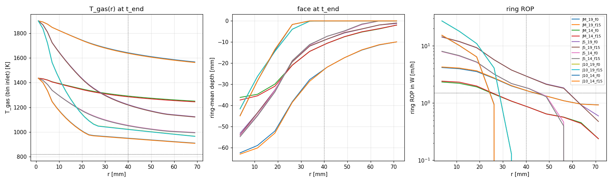
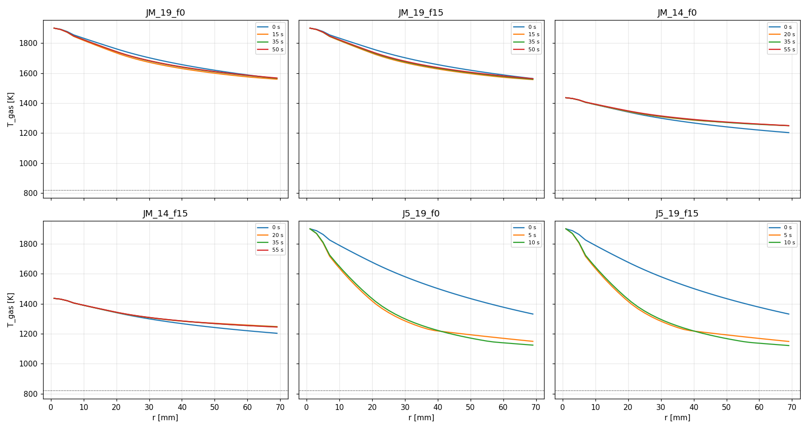
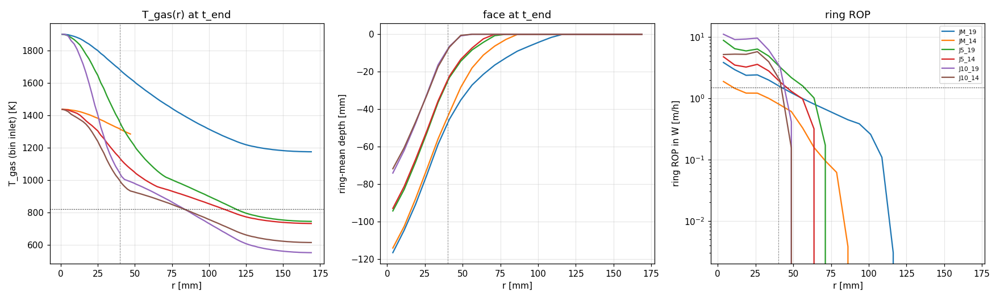
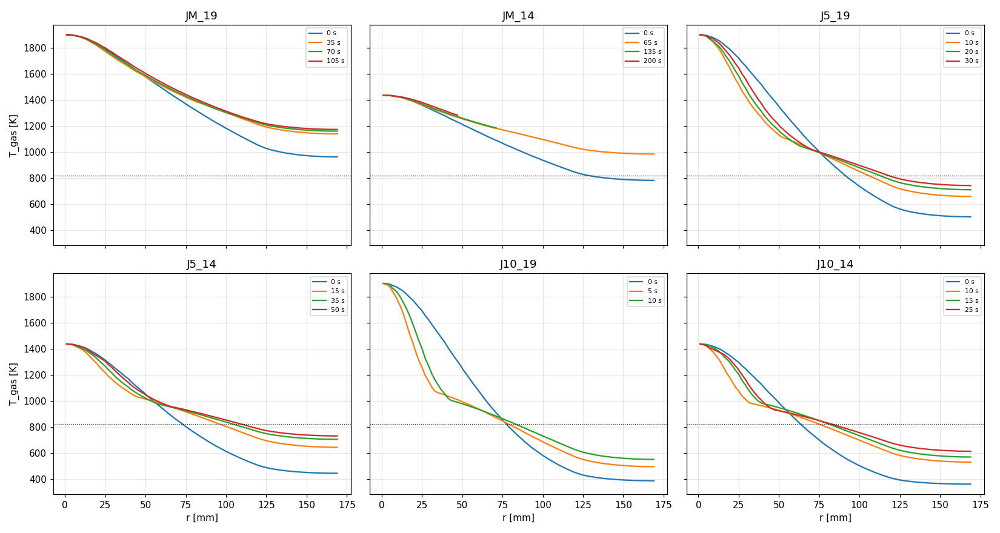

# D2a2 results, first packet version (superseded): nozzle T at stagnation

> **Record only.** These runs implement the first version of the D2a2 packet,
> where T_gas at the stagnation bin is always T_nozzle. That is the revised
> packet's `jet_stagnation = nozzle` with nozzle mass. The packet was revised
> on 2026-09-16 while this set ran; the current results are in
> [../RESULTS.md](../RESULTS.md). Kept for the runaway-centre and
> coherence-cap findings (§3). The binary differed only in lacking the
> `jet_D` / decay keys and three thermo columns.

## 0. Pre-registration (written 2026-09-16, before any study run)

### Planner's table (verbatim from `ACTIVE_STEP.md`)

Jet enthalpy cap `mdot*cp*(T_nozzle - T_s)`: **20.4 kW** at 1900 K,
**11.6 kW** at 1436 K (cp = 1250 J/kgK).

| `h_ref` [W/m2K] | `L` [mm] | `f_core` | P absorbed to r=170 mm @1900 K | hole Ø @1900 K | hole Ø @1436 K |
|---|---|---|---|---|---|
| 1400 (Martin) | 115 | 0.08 | 15.4 kW | 182 mm | 53 mm |
| 3000 | 54 | 0.18 | 19.4 kW | 93 mm | none |
| 5000 | 32 | 0.29 | 20.3 kW | 61 mm | none |
| 10000 | 16 | 0.58 | 20.4 kW | none | none |

Predictions:
1. The hole-width ranking inverts relative to D2a: Martin widest, the bracket
   anchors narrowest.
2. Face power is bounded by the cap for every anchor, approaching it for the
   bracket anchors.
3. `T_nozzle = 1436 K` is too cold to drill Meier's hole for any anchor.
4. Neither Martin nor the bracket reproduces Ø 85–93 mm; the hand inversion
   puts Ø 89 mm at `h_ref ≈ 3.2 kW/m2K`. **This is not an anchor.**

### Implementer's notes on the table (from `walljet.py`, before running)

- **L, f_core, P(170 mm) and the caps reproduce exactly** at D = 7.5 mm
  (r_core = 18.75 mm).
- **The "hole Ø" column does not follow from its stated definition.** With a
  uniform T_s = T_fire, the excess T_gas − T_fire decays exponentially and
  never reaches zero, so "where T_gas falls to T_fire" has no solution. Every
  entry is reproduced exactly (182 / 53 / 93 / 61 mm, and each "none") by the
  criterion **excess = ΔT_fire = 528 K**, i.e. T_gas = T_fire + 528 K ≈ 1349 K.
  The column is kept as pre-registered. The runs decide the hole edge; the
  simulation's outer rock is colder than T_fire, absorbs more, and ends the
  hole sooner than a uniform-T_fire closed form.
- **With the physical criterion** (pinned closed-form ROP > 0, i.e.
  h(T_gas − T_fire) > the face losses, study h(r, s) at SOD, uniform
  T_s = T_fire), the continuous march gives the removal edge and power below.
  This is an **upper bound** on the hole radius for the reason just given.

| case | h_ref | T_nozzle | centre ROP bound | T_gas(r_core) | T_gas(40 mm) | ROP(40 mm) | edge r (q > loss) | P(170 mm) |
|---|---|---|---|---|---|---|---|---|
| JM_19 | 1449 | 1900 | 5.2 m/h | 1812 K | 1638 K | 1.68 m/h | 170 mm (edge of range) | 15.7 kW |
| JM_14 | 1392 | 1436 | 2.8 m/h | 1388 K | 1292 K | 0.89 m/h | 164 mm | 8.8 kW |
| J5_19 | 5000 | 1900 | 18.1 m/h | 1627 K | 1235 K | 2.99 m/h | 121 mm | 20.3 kW |
| J5_14 | 5000 | 1436 | 10.3 m/h | 1280 K | 1057 K | 1.67 m/h | 107 mm | 11.6 kW |
| J10_19 | 10000 | 1900 | 36.4 m/h | 1423 K | 980 K | 2.28 m/h | 82 mm | 20.4 kW |
| J10_14 | 10000 | 1436 | 20.7 m/h | 1164 K | 912 K | 1.26 m/h | 75 mm | 11.6 kW |

Martin h here uses film properties at (T_nozzle + T_fire)/2 per case: 1449
and 1392 W/m²K. At D2a's 1500 K film it is 1400, the planner's value.

- **Implementer's prediction 5 (runaway centre).** The closure gives the
  innermost bin T_gas = T_nozzle whatever the stand-off, and h(r, s) is
  clamped at s = 12 D. So the stagnation column drills at 2.8–36 m/h for every
  anchor, above the prescribed 1.5 m/h feed.
  - The centre outruns the nozzle and the stand-off grows until h sits on its
    12 D clamp.
  - **No run can reach a steady bowl**, and the runs stop when the centre
    would reach 40 mm above the domain bottom: 15–204 s in Part 2 and 7–60 s
    in Part 1.
  - This is a property of the packet's closure: there is no free-jet
    centreline decay with stand-off, and entrainment is out of scope. D2b
    inherits it (see section 5).
- Implementer's reading of prediction 3 before running: the continuous march
  says 1436 K **does** drill for every anchor, because the excess stays
  positive. Whether it drills a hole as wide as Meier's is for the runs.

<!-- RESULTS -->

## 1. Part 1: 2-D slab (machinery and trend only)

Slab jet share mdot·w/(π r_core) = 0.002055 kg/s; powers are slab values. No number from this part enters the conclusions.

| run | h_ref | T_noz | t_end | centre depth | centre ROP (W) | centre s | r_wall 2/10/20/40 mm | hole Ø (10 mm) | r_fire | ring ROP @40 | closed form @40 (q) | steady? |
|---|---|---|---|---|---|---|---|---|---|---|---|---|
| JM_19_f0 | 1449 | 1900 | 55 s | 63.4 mm | 4.20 m/h | 114 mm | 69 / 65 / 41 / 23 | 130 mm | 69 mm | 1.60 m/h | 1.66 m/h (0.53 MW/m², s 72 mm) | centre ROP 4.2→4.2 m/h; r_wall(10) 51→65 mm |
| JM_19_f15 | 1449 | 1900 | 55 s | 63.5 mm | 4.30 m/h | 91 mm | 69 / 65 / 41 / 23 | 130 mm | 69 mm | 1.61 m/h | 1.68 m/h (0.53 MW/m², s 49 mm) | centre ROP 4.4→4.2 m/h; r_wall(10) 51→65 mm |
| JM_14_f0 | 1392 | 1436 | 60 s | 37.0 mm | 2.33 m/h | 88 mm | 67 / 39 / 25 / 0 | 78 mm | 69 mm | 0.84 m/h | 0.89 m/h (0.28 MW/m², s 61 mm) | centre ROP 2.5→2.2 m/h; r_wall(10) 31→39 mm |
| JM_14_f15 | 1392 | 1436 | 60 s | 37.0 mm | 2.45 m/h | 63 mm | 67 / 39 / 25 / 0 | 78 mm | 69 mm | 0.84 m/h | 0.89 m/h (0.28 MW/m², s 36 mm) | centre ROP 2.5→2.4 m/h; r_wall(10) 31→39 mm |
| J5_19_f0 | 5000 | 1900 | 15 s | 56.0 mm | 14.79 m/h | 106 mm | 59 / 35 / 25 / 11 | 70 mm | 69 mm | 2.84 m/h | 2.88 m/h (0.92 MW/m², s 59 mm) | centre ROP 15.0→14.6 m/h; r_wall(10) 31→35 mm |
| J5_19_f15 | 5000 | 1900 | 15 s | 56.0 mm | 14.87 m/h | 100 mm | 59 / 35 / 25 / 11 | 70 mm | 69 mm | 2.82 m/h | 2.87 m/h (0.91 MW/m², s 52 mm) | centre ROP 15.1→14.6 m/h; r_wall(10) 31→35 mm |
| J5_14_f0 | 5000 | 1436 | 27 s | 55.0 mm | 8.08 m/h | 106 mm | 53 / 35 / 25 / 13 | 70 mm | 57 mm | 1.80 m/h | 1.65 m/h (0.52 MW/m², s 57 mm) | centre ROP 8.4→7.5 m/h; r_wall(10) 31→35 mm |
| J5_14_f15 | 5000 | 1436 | 27 s | 57.1 mm | 7.99 m/h | 97 mm | 53 / 33 / 25 / 13 | 66 mm | 57 mm | 1.79 m/h | 1.63 m/h (0.52 MW/m², s 46 mm) | centre ROP 8.5→7.4 m/h; r_wall(10) 31→33 mm |
| J10_19_f0 | 10000 | 1900 | 7 s | 47.9 mm | 30.39 m/h | 98 mm | 27 / 19 / 13 / 4 | 38 mm | 31 mm | 0.00 m/h | 2.91 m/h (0.93 MW/m², s 50 mm) | centre ROP 31.2→29.8 m/h; r_wall(10) 17→19 mm |
| J10_19_f15 | 10000 | 1900 | 7 s | 47.7 mm | 30.50 m/h | 95 mm | 27 / 19 / 13 / 4 | 38 mm | 31 mm | 0.00 m/h | 2.89 m/h (0.92 MW/m², s 47 mm) | centre ROP 31.1→29.9 m/h; r_wall(10) 17→19 mm |
| J10_14_f0 | 10000 | 1436 | 13 s | 49.2 mm | 16.29 m/h | 100 mm | 25 / 19 / 13 / 6 | 38 mm | 25 mm | 0.00 m/h | 1.84 m/h (0.58 MW/m², s 50 mm) | centre ROP 17.4→14.8 m/h; r_wall(10) 17→19 mm |
| J10_14_f15 | 10000 | 1436 | 13 s | 49.1 mm | 16.56 m/h | 95 mm | 25 / 19 / 13 / 6 | 38 mm | 25 mm | 0.00 m/h | 1.81 m/h (0.58 MW/m², s 45 mm) | centre ROP 17.4→15.0 m/h; r_wall(10) 17→19 mm |
| JM_19_f15_cp092 | 1449 | 1900 | 55 s | 63.5 mm | 4.30 m/h | 91 mm | 69 / 61 / 41 / 23 | 122 mm | 69 mm | 1.56 m/h | 1.64 m/h (0.52 MW/m², s 48 mm) | centre ROP 4.4→4.2 m/h; r_wall(10) 49→61 mm |
| JM_19_f15_cp108 | 1449 | 1900 | 55 s | 63.4 mm | 4.32 m/h | 91 mm | 69 / 69 / 43 / 25 | 138 mm | 69 mm | 1.64 m/h | 1.71 m/h (0.55 MW/m², s 50 mm) | centre ROP 4.4→4.2 m/h; r_wall(10) 53→69 mm |
| JM_19_f15_Tent600 | 1449 | 1900 | 55 s | 63.5 mm | 4.30 m/h | 91 mm | 69 / 65 / 41 / 23 | 130 mm | 69 mm | 1.61 m/h | 1.68 m/h (0.53 MW/m², s 49 mm) | centre ROP 4.4→4.2 m/h; r_wall(10) 51→65 mm |
| JM_19_f15_dr1 | 1449 | 1900 | 55 s | 63.4 mm | 4.29 m/h | 91 mm | 69 / 65 / 41 / 23 | 130 mm | 69 mm | 1.61 m/h | 1.68 m/h (0.54 MW/m², s 49 mm) | centre ROP 4.4→4.2 m/h; r_wall(10) 51→65 mm |

At the common time t = 7 s (the shortest run's stop):

| run | centre depth | r_fire | r_wall(2 mm) | r_wall(10 mm) | jet_P_face | jet_T_exhaust |
|---|---|---|---|---|---|---|
| JM_19_f0 | 5.0 mm | 35 mm | 25 mm | 0 mm | 0.86 kW | 1563 K |
| JM_19_f15 | 5.0 mm | 35 mm | 25 mm | 0 mm | 0.87 kW | 1562 K |
| JM_14_f0 | 2.0 mm | 17 mm | 0 mm | 0 mm | 0.47 kW | 1253 K |
| JM_14_f15 | 2.0 mm | 17 mm | 0 mm | 0 mm | 0.47 kW | 1252 K |
| J5_19_f0 | 23.4 mm | 45 mm | 37 mm | 21 mm | 1.97 kW | 1132 K |
| J5_19_f15 | 23.4 mm | 45 mm | 37 mm | 21 mm | 1.98 kW | 1130 K |
| J5_14_f0 | 9.2 mm | 27 mm | 25 mm | 1 mm | 1.07 kW | 1019 K |
| J5_14_f15 | 9.2 mm | 27 mm | 25 mm | 1 mm | 1.07 kW | 1019 K |
| J10_19_f0 | 47.9 mm | 31 mm | 27 mm | 19 mm | 2.43 kW | 953 K |
| J10_19_f15 | 47.7 mm | 31 mm | 27 mm | 19 mm | 2.43 kW | 952 K |
| J10_14_f0 | 21.5 mm | 21 mm | 19 mm | 11 mm | 1.35 kW | 912 K |
| J10_14_f15 | 21.4 mm | 19 mm | 19 mm | 11 mm | 1.34 kW | 913 K |
| JM_19_f15_cp092 | 5.0 mm | 35 mm | 23 mm | 0 mm | 0.85 kW | 1539 K |
| JM_19_f15_cp108 | 5.0 mm | 37 mm | 25 mm | 0 mm | 0.88 kW | 1583 K |
| JM_19_f15_Tent600 | 5.0 mm | 35 mm | 25 mm | 0 mm | 0.87 kW | 1562 K |
| JM_19_f15_dr1 | 5.0 mm | 35 mm | 25 mm | 0 mm | 0.87 kW | 1562 K |

| run | jet_P_face end (W mean) | jet_P_cap | face / cap | face / 2.83 kW | jet_P_exhaust | jet_T_exhaust (W mean) | jet_r_reach | floor supply | T_gas(r_core) / T_gas(40 mm) |
|---|---|---|---|---|---|---|---|---|---|
| JM_19_f0 | 0.86 (0.87) kW | 4.13 kW | 0.21 | 0.3× | 3.27 kW | 1564 (1563) K | 69 mm | 0.0 W | 1753 / 1642 K |
| JM_19_f15 | 0.87 (0.88) kW | 4.13 kW | 0.21 | 0.3× | 3.26 kW | 1561 (1557) K | 69 mm | 0.0 W | 1752 / 1637 K |
| JM_14_f0 | 0.48 (0.48) kW | 2.94 kW | 0.16 | 0.2× | 2.45 kW | 1249 (1248) K | 69 mm | 0.0 W | 1354 / 1291 K |
| JM_14_f15 | 0.50 (0.50) kW | 2.94 kW | 0.17 | 0.2× | 2.44 kW | 1243 (1243) K | 69 mm | 0.0 W | 1350 / 1286 K |
| J5_19_f0 | 2.03 (2.01) kW | 4.13 kW | 0.49 | 0.7× | 2.10 kW | 1111 (1119) K | 69 mm | 0.0 W | 1457 / 1222 K |
| J5_19_f15 | 2.03 (2.01) kW | 4.13 kW | 0.49 | 0.7× | 2.10 kW | 1109 (1117) K | 69 mm | 0.0 W | 1453 / 1219 K |
| J5_14_f0 | 1.14 (1.13) kW | 2.94 kW | 0.39 | 0.4× | 1.80 kW | 994 (997) K | 57 mm | 0.0 W | 1189 / 1054 K |
| J5_14_f15 | 1.14 (1.13) kW | 2.94 kW | 0.39 | 0.4× | 1.79 kW | 991 (995) K | 57 mm | 0.0 W | 1186 / 1051 K |
| J10_19_f0 | 2.43 (2.41) kW | 4.13 kW | 0.59 | 0.9× | 1.69 kW | 953 (963) K | 31 mm | 0.0 W | 1173 / 1022 K |
| J10_19_f15 | 2.43 (2.41) kW | 4.13 kW | 0.59 | 0.9× | 1.69 kW | 952 (962) K | 31 mm | 0.0 W | 1171 / 1021 K |
| J10_14_f0 | 1.37 (1.36) kW | 2.94 kW | 0.47 | 0.5× | 1.56 kW | 902 (907) K | 25 mm | 0.0 W | 1025 / 950 K |
| J10_14_f15 | 1.38 (1.36) kW | 2.94 kW | 0.47 | 0.5× | 1.56 kW | 900 (906) K | 25 mm | 0.0 W | 1022 / 948 K |
| JM_19_f15_cp092 | 0.86 (0.87) kW | 3.80 kW | 0.23 | 0.3× | 2.94 kW | 1536 (1533) K | 69 mm | 0.0 W | 1739 / 1617 K |
| JM_19_f15_cp108 | 0.88 (0.89) kW | 4.46 kW | 0.20 | 0.3× | 3.58 kW | 1582 (1579) K | 69 mm | 0.0 W | 1762 / 1655 K |
| JM_19_f15_Tent600 | 0.87 (0.88) kW | 3.34 kW | 0.26 | 0.3× | 2.47 kW | 1561 (1557) K | 69 mm | 0.0 W | 1752 / 1637 K |
| JM_19_f15_dr1 | 0.87 (0.88) kW | 4.13 kW | 0.21 | 0.3× | 3.26 kW | 1561 (1557) K | 69 mm | 0.0 W | 1756 / 1639 K |

| run | T_fire mean [p10, p90] | pinned | face: unset / idle / qneg / minrule | rim | ledger max | max slope | out of Martin range | vol. rate |
|---|---|---|---|---|---|---|---|---|
| JM_19_f0 | 821.3 [815.3, 828.6] K | 0.98 | 0.00 / 0.00 / 0.00 / 0.023 | 0 | 6.4e-15 | 62° | 0.54 of 280 | — cm³/s |
| JM_19_f15 | 821.3 [815.3, 828.6] K | 0.98 | 0.00 / 0.00 / 0.00 / 0.023 | 0 | 5.4e-15 | 63° | 0.46 of 280 | — cm³/s |
| JM_14_f0 | 821.1 [814.8, 828.5] K | 0.86 | 0.09 / 0.00 / 0.00 / 0.054 | 0 | 3.4e-15 | 50° | 0.43 of 269 | — cm³/s |
| JM_14_f15 | 821.1 [814.8, 828.3] K | 0.86 | 0.09 / 0.00 / 0.00 / 0.053 | 0 | 2.5e-15 | 53° | 0.43 of 267 | — cm³/s |
| J5_19_f0 | 821.9 [815.5, 829.2] K | 0.84 | 0.16 / 0.00 / 0.00 / 0.000 | 0 | 6.0e-15 | 61° | 0.36 of 238 | — cm³/s |
| J5_19_f15 | 821.9 [815.5, 829.2] K | 0.83 | 0.17 / 0.00 / 0.00 / 0.000 | 0 | 2.3e-15 | 61° | 0.36 of 237 | — cm³/s |
| J5_14_f0 | 821.9 [815.5, 829.0] K | 0.72 | 0.28 / 0.00 / 0.00 / 0.001 | 0 | 3.4e-15 | 62° | 0.34 of 214 | — cm³/s |
| J5_14_f15 | 821.9 [815.5, 829.1] K | 0.71 | 0.29 / 0.00 / 0.00 / 0.001 | 0 | 2.4e-15 | 63° | 0.34 of 210 | — cm³/s |
| J10_19_f0 | 822.2 [816.0, 829.5] K | 0.37 | 0.63 / 0.00 / 0.00 / 0.000 | 0 | 2.5e-15 | 64° | 0.66 of 109 | — cm³/s |
| J10_19_f15 | 822.2 [816.0, 829.5] K | 0.36 | 0.64 / 0.00 / 0.00 / 0.000 | 0 | 5.0e-15 | 64° | 0.66 of 109 | — cm³/s |
| J10_14_f0 | 822.3 [816.1, 829.2] K | 0.32 | 0.68 / 0.00 / 0.00 / 0.000 | 0 | 2.8e-15 | 66° | 0.73 of 98 | — cm³/s |
| J10_14_f15 | 822.3 [816.0, 829.5] K | 0.32 | 0.68 / 0.00 / 0.00 / 0.000 | 0 | 4.2e-15 | 66° | 0.73 of 98 | — cm³/s |
| JM_19_f15_cp092 | 821.3 [815.3, 828.6] K | 0.97 | 0.00 / 0.00 / 0.00 / 0.026 | 0 | 5.6e-15 | 63° | 0.46 of 280 | — cm³/s |
| JM_19_f15_cp108 | 821.3 [815.3, 828.6] K | 0.98 | 0.00 / 0.00 / 0.00 / 0.022 | 0 | 3.9e-15 | 62° | 0.46 of 280 | — cm³/s |
| JM_19_f15_Tent600 | 821.3 [815.3, 828.6] K | 0.98 | 0.00 / 0.00 / 0.00 / 0.023 | 0 | 5.4e-15 | 63° | 0.46 of 280 | — cm³/s |
| JM_19_f15_dr1 | 821.3 [815.4, 828.5] K | 0.98 | 0.00 / 0.00 / 0.00 / 0.023 | 0 | 3.7e-15 | 63° | 0.46 of 280 | — cm³/s |

Sensitivities (JM_19, feed 1.5 m/h):

| run | centre ROP (W) | ring ROP @40 | r_wall(10 mm) | jet_P_face | jet_T_exhaust | T_gas(40 mm) |
|---|---|---|---|---|---|---|
| JM_19_f15 | 4.30 | 1.61 | 65 mm | 872 W | 1561 K | 1637 K |
| JM_19_f15_cp092 | 4.30 (-0.2%) | 1.56 (-2.6%) | 61 mm | 859 W (-1.4%) | 1536 K | 1617 K |
| JM_19_f15_cp108 | 4.32 (+0.3%) | 1.64 (+2.3%) | 69 mm | 882 W (+1.2%) | 1582 K | 1655 K |
| JM_19_f15_Tent600 | 4.30 (+0.0%) | 1.61 (+0.0%) | 65 mm | 872 W (+0.0%) | 1561 K | 1637 K |
| JM_19_f15_dr1 | 4.29 (-0.3%) | 1.61 (-0.0%) | 65 mm | 871 W (-0.0%) | 1561 K | 1639 K |

T_gas(r) [K] at the profile times (bin inlet, interpolated):

| run | t | r = 10 | 18.75 | 30 | 40 | 60 | 80 | 100 mm |
|---|---|---|---|---|---|---|---|---|
| JM_19_f0 | 0 s | 1833 | 1771 | 1703 | 1657 | 1588 | nan | nan |
| JM_19_f0 | 15 s | 1818 | 1745 | 1672 | 1631 | 1575 | nan | nan |
| JM_19_f0 | 35 s | 1823 | 1753 | 1682 | 1640 | 1584 | nan | nan |
| JM_19_f0 | 50 s | 1823 | 1753 | 1684 | 1642 | 1586 | nan | nan |
| JM_19_f15 | 0 s | 1833 | 1771 | 1703 | 1657 | 1588 | nan | nan |
| JM_19_f15 | 15 s | 1817 | 1743 | 1670 | 1628 | 1572 | nan | nan |
| JM_19_f15 | 35 s | 1820 | 1748 | 1676 | 1633 | 1578 | nan | nan |
| JM_19_f15 | 50 s | 1822 | 1752 | 1680 | 1637 | 1581 | nan | nan |
| JM_14_f0 | 0 s | 1390 | 1347 | 1300 | 1268 | 1220 | nan | nan |
| JM_14_f0 | 20 s | 1391 | 1350 | 1309 | 1286 | 1260 | nan | nan |
| JM_14_f0 | 35 s | 1392 | 1352 | 1312 | 1289 | 1258 | nan | nan |
| JM_14_f0 | 55 s | 1393 | 1354 | 1315 | 1291 | 1260 | nan | nan |
| JM_14_f15 | 0 s | 1390 | 1347 | 1300 | 1268 | 1220 | nan | nan |
| JM_14_f15 | 20 s | 1390 | 1348 | 1307 | 1284 | 1258 | nan | nan |
| JM_14_f15 | 35 s | 1390 | 1349 | 1308 | 1285 | 1255 | nan | nan |
| JM_14_f15 | 55 s | 1391 | 1350 | 1309 | 1286 | 1255 | nan | nan |
| J5_19_f0 | 0 s | 1789 | 1690 | 1581 | 1501 | 1377 | nan | nan |
| J5_19_f0 | 5 s | 1637 | 1442 | 1286 | 1219 | 1170 | nan | nan |
| J5_19_f0 | 10 s | 1648 | 1457 | 1299 | 1222 | 1140 | nan | nan |
| J5_19_f15 | 0 s | 1789 | 1690 | 1581 | 1501 | 1377 | nan | nan |
| J5_19_f15 | 5 s | 1636 | 1440 | 1284 | 1218 | 1169 | nan | nan |
| J5_19_f15 | 10 s | 1646 | 1453 | 1296 | 1219 | 1137 | nan | nan |
| J5_14_f0 | 0 s | 1360 | 1292 | 1215 | 1160 | 1071 | nan | nan |
| J5_14_f0 | 10 s | 1288 | 1177 | 1088 | 1056 | 1025 | nan | nan |
| J5_14_f0 | 15 s | 1291 | 1181 | 1092 | 1048 | 1015 | nan | nan |
| J5_14_f0 | 25 s | 1296 | 1189 | 1099 | 1054 | 1006 | nan | nan |
| J5_14_f15 | 0 s | 1360 | 1292 | 1215 | 1160 | 1071 | nan | nan |
| J5_14_f15 | 10 s | 1286 | 1175 | 1086 | 1054 | 1023 | nan | nan |
| J5_14_f15 | 15 s | 1289 | 1178 | 1088 | 1045 | 1012 | nan | nan |
| J5_14_f15 | 25 s | 1295 | 1186 | 1096 | 1051 | 1003 | nan | nan |
| J10_19_f0 | 0 s | 1770 | 1657 | 1530 | 1436 | 1286 | nan | nan |
| J10_19_f0 | 5 s | 1438 | 1173 | 1043 | 1022 | 983 | nan | nan |
| J10_19_f15 | 0 s | 1770 | 1657 | 1530 | 1436 | 1286 | nan | nan |
| J10_19_f15 | 5 s | 1436 | 1171 | 1041 | 1021 | 982 | nan | nan |
| J10_14_f0 | 0 s | 1349 | 1272 | 1184 | 1118 | 1011 | nan | nan |
| J10_14_f0 | 5 s | 1165 | 1022 | 998 | 979 | 942 | nan | nan |
| J10_14_f0 | 10 s | 1175 | 1025 | 964 | 950 | 922 | nan | nan |
| J10_14_f15 | 0 s | 1349 | 1272 | 1184 | 1118 | 1011 | nan | nan |
| J10_14_f15 | 5 s | 1164 | 1021 | 997 | 978 | 941 | nan | nan |
| J10_14_f15 | 10 s | 1173 | 1022 | 962 | 948 | 920 | nan | nan |

Run settings: JM_19_f0: dt 4 ms, overshoot 1.53 K/step, wall 0.4 min; JM_19_f15: dt 4 ms, overshoot 1.53 K/step, wall 0.4 min; JM_14_f0: dt 4 ms, overshoot 0.82 K/step, wall 0.4 min; JM_14_f15: dt 4 ms, overshoot 0.82 K/step, wall 0.4 min; J5_19_f0: dt 2 ms, overshoot 2.66 K/step, wall 0.2 min; J5_19_f15: dt 2 ms, overshoot 2.66 K/step, wall 0.2 min; J5_14_f0: dt 4 ms, overshoot 3.02 K/step, wall 0.2 min; J5_14_f15: dt 4 ms, overshoot 3.02 K/step, wall 0.2 min; J10_19_f0: dt 1 ms, overshoot 2.67 K/step, wall 0.2 min; J10_19_f15: dt 1 ms, overshoot 2.67 K/step, wall 0.2 min; J10_14_f0: dt 2 ms, overshoot 3.03 K/step, wall 0.2 min; J10_14_f15: dt 2 ms, overshoot 3.03 K/step, wall 0.2 min; JM_19_f15_cp092: dt 4 ms, overshoot 1.53 K/step, wall 0.4 min; JM_19_f15_cp108: dt 4 ms, overshoot 1.53 K/step, wall 0.4 min; JM_19_f15_Tent600: dt 4 ms, overshoot 1.53 K/step, wall 0.4 min; JM_19_f15_dr1: dt 4 ms, overshoot 1.53 K/step, wall 0.3 min.

## 2. Part 2: 3-D quarter domain, feed 1.5 m/h

Quarter domain with mdot/4; powers are ×4 (full jet).

| run | h_ref | T_noz | t_end | centre depth | centre ROP (W) | centre s | r_wall 2/10/20/40 mm | hole Ø (10 mm) | r_fire | ring ROP @40 | closed form @40 (q) | steady? |
|---|---|---|---|---|---|---|---|---|---|---|---|---|
| JM_19 | 1449 | 1900 | 110 s | 123.6 mm | 4.06 m/h | 128 mm | 105 / 82 / 64 / 44 | 164 mm | 114 mm | 1.56 m/h | 1.77 m/h (0.56 MW/m², s 50 mm) | centre ROP 4.2→3.8 m/h; r_wall(10) 72→82 mm |
| JM_14 | 1392 | 1436 | 204 s | 117.1 mm | 2.06 m/h | 83 mm | 79 / 64 / 54 / 42 | 128 mm | 84 mm | 0.79 m/h | 0.95 m/h (0.30 MW/m², s 7 mm) | centre ROP 2.2→1.8 m/h; r_wall(10) 64→64 mm |
| J5_19 | 5000 | 1900 | 31 s | 101.2 mm | 11.31 m/h | 139 mm | 67 / 53 / 43 / 33 | 105 mm | 71 mm | 3.25 m/h | 3.86 m/h (1.23 MW/m², s 60 mm) | centre ROP 14.9→4.9 m/h; r_wall(10) 47→53 mm |
| J5_14 | 5000 | 1436 | 55 s | 99.2 mm | 6.08 m/h | 127 mm | 64 / 51 / 42 / 32 | 103 mm | 67 mm | 1.86 m/h | 2.24 m/h (0.71 MW/m², s 49 mm) | centre ROP 8.2→3.1 m/h; r_wall(10) 46→51 mm |
| J10_19 | 10000 | 1900 | 15 s | 79.2 mm | 14.50 m/h | 124 mm | 46 / 37 / 32 / 24 | 74 mm | 48 mm | 3.27 m/h | 3.15 m/h (1.00 MW/m², s 50 mm) | centre ROP 22.0→7.4 m/h; r_wall(10) 33→37 mm |
| J10_14 | 10000 | 1436 | 27 s | 77.3 mm | 5.72 m/h | 117 mm | 46 / 38 / 33 / 23 | 76 mm | 48 mm | 1.96 m/h | 2.48 m/h (0.79 MW/m², s 46 mm) | centre ROP 8.5→6.6 m/h; r_wall(10) 34→38 mm |

At the common time t = 15 s (the shortest run's stop):

| run | centre depth | r_fire | r_wall(2 mm) | r_wall(10 mm) | jet_P_face | jet_T_exhaust |
|---|---|---|---|---|---|---|
| JM_19 | 15.1 mm | 57 mm | 46 mm | 27 mm | 14.99 kW | 1107 K |
| JM_14 | 7.0 mm | 36 mm | 28 mm | 0 mm | 9.68 kW | 924 K |
| J5_19 | 58.0 mm | 58 mm | 53 mm | 38 mm | 22.90 kW | 689 K |
| J5_14 | 31.7 mm | 44 mm | 40 mm | 30 mm | 14.98 kW | 644 K |
| J10_19 | 79.2 mm | 48 mm | 46 mm | 37 mm | 24.83 kW | 587 K |
| J10_14 | 61.2 mm | 39 mm | 36 mm | 30 mm | 16.39 kW | 569 K |

| run | jet_P_face end (W mean) | jet_P_cap | face / cap | face / 2.83 kW | jet_P_exhaust | jet_T_exhaust (W mean) | jet_r_reach | floor supply | T_gas(r_core) / T_gas(40 mm) |
|---|---|---|---|---|---|---|---|---|---|
| JM_19 | 13.71 (13.89) kW | 30.39 kW | 0.45 | 4.8× | 16.68 kW | 1175 (1166) K | 113 mm | 0.0 W | 1841 / 1680 K |
| JM_14 | 2.82 (4.69) kW | 21.61 kW | 0.13 | 1.0× | 18.80 kW | 1287 (1188) K | 45 mm | 0.0 W | 1404 / 1314 K |
| J5_19 | 21.84 (22.27) kW | 30.39 kW | 0.72 | 7.7× | 8.55 kW | 745 (723) K | 71 mm | 0.0 W | 1752 / 1355 K |
| J5_14 | 13.22 (13.63) kW | 21.61 kW | 0.61 | 4.7× | 8.40 kW | 737 (716) K | 67 mm | 0.0 W | 1352 / 1133 K |
| J10_19 | 24.83 (25.33) kW | 30.39 kW | 0.82 | 8.8× | 5.57 kW | 587 (561) K | 48 mm | 0.0 W | 1607 / 1039 K |
| J10_14 | 15.45 (15.94) kW | 21.61 kW | 0.71 | 5.5× | 6.16 kW | 619 (593) K | 48 mm | -0.0 W | 1326 / 993 K |

| run | T_fire mean [p10, p90] | pinned | face: unset / idle / qneg / minrule | rim | ledger max | max slope | out of Martin range | vol. rate |
|---|---|---|---|---|---|---|---|---|
| JM_19 | 830.0 [815.0, 837.2] K | 0.52 | 0.43 / 0.00 / 0.00 / 0.049 | 0 | 4.7e-15 | 65° | 0.75 of 2149 | 8.62 cm³/s |
| JM_14 | 831.6 [815.2, 863.4] K | 0.22 | 0.63 / 0.00 / 0.14 / 0.007 | 0 | 5.9e-15 | 65° | 0.84 of 1201 | 2.82 cm³/s |
| J5_19 | 859.5 [815.6, 988.7] K | 0.23 | 0.77 / 0.00 / 0.00 / 0.000 | 0 | 3.9e-15 | 65° | 0.45 of 869 | 12.58 cm³/s |
| J5_14 | 847.2 [815.6, 909.7] K | 0.19 | 0.80 / 0.00 / 0.00 / 0.002 | 0 | 6.5e-15 | 65° | 0.32 of 785 | 6.86 cm³/s |
| J10_19 | 897.4 [816.1, 1130.6] K | 0.10 | 0.90 / 0.00 / 0.00 / 0.000 | 1 | 3.4e-15 | 65° | 0.18 of 409 | 12.28 cm³/s |
| J10_14 | 861.0 [815.8, 981.2] K | 0.09 | 0.90 / 0.00 / 0.00 / 0.004 | 2 | 2.6e-15 | 64° | 0.17 of 403 | 7.24 cm³/s |

T_gas(r) [K] at the profile times (bin inlet, interpolated):

| run | t | r = 10 | 18.75 | 30 | 40 | 60 | 80 | 100 mm |
|---|---|---|---|---|---|---|---|---|
| JM_19 | 0 s | 1883 | 1837 | 1749 | 1665 | 1493 | 1330 | 1183 |
| JM_19 | 35 s | 1880 | 1825 | 1729 | 1651 | 1511 | 1395 | 1303 |
| JM_19 | 70 s | 1880 | 1830 | 1741 | 1662 | 1520 | 1402 | 1304 |
| JM_19 | 105 s | 1884 | 1841 | 1759 | 1680 | 1535 | 1414 | 1314 |
| JM_14 | 0 s | 1424 | 1392 | 1332 | 1274 | 1154 | 1041 | 938 |
| JM_14 | 65 s | 1425 | 1393 | 1340 | 1296 | 1219 | 1157 | 1097 |
| JM_14 | 135 s | 1425 | 1397 | 1346 | 1302 | 1223 | nan | nan |
| JM_14 | 200 s | 1427 | 1404 | 1359 | 1314 | nan | nan | nan |
| J5_19 | 0 s | 1872 | 1796 | 1649 | 1503 | 1203 | 942 | 738 |
| J5_19 | 10 s | 1832 | 1662 | 1413 | 1252 | 1075 | 967 | 852 |
| J5_19 | 20 s | 1840 | 1708 | 1473 | 1297 | 1069 | 974 | 880 |
| J5_19 | 30 s | 1859 | 1752 | 1544 | 1355 | 1100 | 981 | 898 |
| J5_14 | 0 s | 1417 | 1365 | 1263 | 1160 | 946 | 760 | 613 |
| J5_14 | 15 s | 1397 | 1298 | 1156 | 1064 | 977 | 894 | 803 |
| J5_14 | 35 s | 1404 | 1336 | 1202 | 1098 | 969 | 907 | 837 |
| J5_14 | 50 s | 1415 | 1352 | 1244 | 1133 | 984 | 916 | 853 |
| J10_19 | 0 s | 1867 | 1778 | 1606 | 1431 | 1079 | 788 | 582 |
| J10_19 | 5 s | 1766 | 1465 | 1130 | 1042 | 938 | 814 | 687 |
| J10_19 | 10 s | 1824 | 1607 | 1240 | 1039 | 936 | 838 | 731 |
| J10_14 | 0 s | 1414 | 1354 | 1236 | 1114 | 863 | 652 | 503 |
| J10_14 | 10 s | 1361 | 1191 | 1003 | 960 | 888 | 797 | 698 |
| J10_14 | 15 s | 1402 | 1306 | 1105 | 980 | 911 | 826 | 733 |
| J10_14 | 25 s | 1390 | 1326 | 1147 | 993 | 897 | 831 | 756 |

Run settings: JM_19: dt 4 ms, overshoot 1.53 K/step, wall 14.1 min; JM_14: dt 4 ms, overshoot 0.82 K/step, wall 24.5 min; J5_19: dt 2 ms, overshoot 2.66 K/step, wall 7.5 min; J5_14: dt 4 ms, overshoot 3.02 K/step, wall 7.8 min; J10_19: dt 1 ms, overshoot 2.67 K/step, wall 8.1 min; J10_14: dt 2 ms, overshoot 3.03 K/step, wall 7.1 min.

<!-- DISCUSSION -->

## 3. Discussion

**Read this first: no Part 2 run reaches a steady bowl, and the hole shapes
are shaped by the coherence cap.**

- **The centre outruns the feed** (implementer's prediction 5, confirmed).
  - The stagnation bin always gets T_nozzle and h is clamped at 12 D, so the
    centre drills at 2–15 m/h against the 1.5 m/h feed. The centre stand-off
    ends at 83–139 mm (11–19 D).
  - Every run stops on the depth rule, at 15–204 s.
- **`input_drilling` sets `spall.flake_coherence_length = 0.004`.** A firing
  column may sit at most 2 cells below its shallowest neighbour, a 63° wall.
  - Every Part 2 run reports a 64–65° maximum slope, i.e. saturated.
  - The J10_19 top-cell map at 15 s is an exact 2-cell staircase from the
    axis outward.
  - Once the cone is saturated, the centre can only descend as fast as the
    flank allows. The centre window ROP falls from 34 to 7 m/h in J10_19
    (after ~9 s) and from 17 to 5 m/h in J5_19 (after ~19 s). Meanwhile the
    capped centre cell keeps receiving the pinned flux and overheats: 3–12 %
    of firings have T_top > 900 K, all in r < 26 mm, all second (cell-voiding)
    firings, with the same a_f as the rest.
  - A 1-D control (the C1 column, h = 1e4, T_gas = 1900 K, same Weibull block,
    no cap) drills steadily at 34.7 m/h with T_fire p99 = 838 K. The hot
    firings are therefore a cap effect, not a closure or dt effect.
  - D2a ran on the same input.
- **Robust vs cap-influenced.** The T_gas profiles, face powers and r_fire
  (the outermost fired column) are the robust outputs. r_wall(d) at depth and
  the late centre depths of the bracket anchors are cap-influenced.

### (i) Predictions

1. **Ranking inverts — confirmed at the end of each run, not at early
   times.**
   - Outermost fired column r_fire at t_end: JM_19 114 mm > JM_14 84 mm >
     J5_19 71 / J5_14 67 mm > J10_19 48 / J10_14 48 mm.
   - Hole Ø at 10 mm depth: 164 / 128 / 105 / 103 / 74 / 76 mm.
   - The gas reach orders the same way at every time: T_gas(60 mm) at t_end is
     1535 K (JM_19), 1100 K (J5_19), 936 K (J10_19, 10 s).
   - **At the common 15 s the order is by heating speed:** r_fire JM_19
     57 mm, J5_19 58 mm, J10_19 48 mm. The inversion develops as the strong-h
     anchors' gas is spent near the axis.
   - **Caveats.**
     - The runs have different lengths.
     - JM_19's gas leaves the domain at 1175 K (16.7 kW exhaust), so its width
       is a domain-limited lower bound.
     - The J10 edges were still moving: T_gas(40–60 mm) ≈ 1000–900 K is still
       above T_fire, and r_wall(10 mm) grew 33 → 37 mm in the last quarter.
2. **Face power is bounded by the cap — confirmed, by construction.**
   - The invariant never tripped, and jet_P_face ≤ jet_P_cap on every row of
     every run. End face power / full cap: 0.45 (JM_19), 0.72 (J5_19), 0.82
     (J10_19), 0.61 (J5_14), 0.71 (J10_14).
   - JM_14 falls to 0.13 at 204 s: after 120 s the nozzle is below the
     unrecessed rim, and those columns get no flux. Its W mean is 4.69 kW.
   - The full cap is mdot cp (T_nozzle − T_ent) = 30.4 kW at 1900 K and
     21.6 kW at 1436 K.
   - **The planner's 20.4 / 11.6 kW figures are referenced to T_s = T_fire,
     and cold outer rock exceeds them.** J10_19 absorbs 24.8 kW, J5_19
     21.8 kW, J10_14 15.5 kW and J5_14 13.2 kW, because rock below T_fire
     still takes heat from gas that is itself below T_fire.
   - Against Meier's 2.83 kW rock-side removal power, face power is 1.0× to
     8.8×. Most of it heats rock that is not removed.
3. **"1436 K is too cold to drill Meier's hole for any anchor" — refuted.**
   - JM_14 drills Ø 128 mm at 10 mm depth (r_fire 84 mm), J5_14 Ø 103 mm, and
     J10_14 Ø 76 mm (still widening).
   - The chamber-TC nozzle temperature drills as wide as or wider than Meier's
     hole in this model, so the runs give no evidence that the TC reads low.
   - The pre-registered table's "none" entries come from its excess = 528 K
     criterion (section 0), not from the closure.
4. **"Neither Martin nor the bracket reproduces Ø 85–93 mm" — not decidable
   from these runs.**
   - At t_end, Martin is wider (164 / 128 mm), J5 wider (105 / 103 mm), and
     J10 narrower (74 / 76 mm) but still widening through the target range.
   - No run is steady and every wall is cap-limited, so no steady diameter is
     available.
   - The 3.2 kW/m²K inversion was not run, as required.

### (ii) Corrections to D2a's RESULTS.md (supersessions)

- **J-5 / J-10 hole width.** D2a's R_h = 149 / 170 mm came from the s ≤ 0
  clamp, which put potential-core gas on the unrecessed outer top. With no jet
  flux above the nozzle plane and an enthalpy-limited T_gas, the bracket
  anchors give the **narrowest** holes (r_fire 48–71 mm) and Martin the
  widest. D2a's reading "h at r = 100 mm is still ≈ 2 kW/m²K" is withdrawn.
- **Face power.**
  - D2a's 20.9–29.0 kW grew with the domain because h ∝ 1/r was paired with a
    radially uniform T_gas.
  - Under the closure face power is bounded and saturates as the gas is spent:
    the bracket anchors reach 0.7–0.8 of the full cap.
  - D2a's reading that face power is domain-truncated information is
    withdrawn.
  - **Refinement of the reviewer's comparison:** the relevant cap is
    mdot·cp·(T_nozzle − T_rock), and cold rock can exceed the
    T_fire-referenced 20.4 kW. The argument that D2a's power grows without
    bound stands.
- **Also superseded: "under a prescribed feed the centre ROP is an identity".**
  That held because D2a's T_gas decayed with stand-off, so the centre
  self-regulated. Under this closure the centre runs away from any feed below
  its closed-form rate (2.8–36 m/h here).

### (iii) Sensitivities

All sensitivities are Part 1 slab runs on JM_19 at 1.5 m/h: trends only.

- **cp ±8 %:**
  - centre ROP −0.2 % / +0.3 %;
  - ring ROP at 40 mm −2.6 % / +2.3 %;
  - r_wall(10 mm) 61 / 69 mm against 65 mm (±6 %);
  - jet_P_face −1.4 % / +1.2 %;
  - T_exhaust −25 / +21 K.
  - This moves hole widths by about as much as cp moves, and moves no
    prediction.
- **jet_T_ent = 600 K:** no change, because the slab gas never falls below
  1557 K.
  - In Part 2 the bracket anchors' far-field gas does fall to 561–723 K (window means; 587–745 K at the end), so a
    600 K floor **would** bind for J10_19 and J10_14 beyond ~100 mm. It could
    add floor-supplied heat to the outer rock there, but not near the hole
    edges, which lie at ≤ 71 mm.
- **jet_dr 2 → 1 mm:**
  - centre ROP −0.3 %, ring ROP at 40 mm 0.0 %, jet_P_face 0.0 %;
  - `unit/jet_enthalpy` (d) on a drilling quarter disk: −0.3 % centre and
    −0.8 % at r = 30 mm.
  - Bin width is not a factor.
- **Entrainment (not modelled).**
  - It would raise the reach L and lower the local excess temperature, so the
    march is an upper bound on excess near the axis and a lower bound on
    reach.
  - A confined, recirculating hole would push the far field toward a hot
    floor, which T_ent = 600 K only crudely represents.
- **What could move a conclusion.** Entrainment, plus the missing free-jet
  centreline decay with stand-off, are the effects that could change the hole
  widths and the runaway. cp, T_ent near the hole, and jet_dr cannot.

### (iv) What D2b inherits

| anchor | ring ROP @40 mm (W) | closed-form @40 mm | ring flux q @40 mm | r_fire | hole Ø @10 mm (t_end) |
|---|---|---|---|---|---|
| JM_19 | 1.56 m/h | 1.77 m/h | 0.56 MW/m² | 114 mm (domain-limited) | 164 mm |
| JM_14 | 0.79 m/h | 0.95 m/h | 0.30 MW/m² | 84 mm | 128 mm |
| J5_19 | 3.25 m/h | 3.86 m/h | 1.23 MW/m² | 71 mm | 105 mm |
| J5_14 | 1.86 m/h | 2.24 m/h | 0.71 MW/m² | 67 mm | 103 mm |
| J10_19 | 3.27 m/h | 3.15 m/h | 1.00 MW/m² | 48 mm | 74 mm (widening) |
| J10_14 | 1.96 m/h | 2.48 m/h | 0.79 MW/m² | 48 mm | 76 mm (widening) |

(Closed-form flux and ROP use T_gas(40 mm) from the last profile row and h at
the ring's mean stand-off.)

- **Hole at least as wide as the Ø 80 mm burner:**
  - every anchor fires beyond r = 40 mm and recedes at the feet radius (0.8–3.3
    m/h), so **no anchor stalls the feet rule outright**;
  - at 10 mm depth the J10 holes are Ø 74–76 mm at their stop, just under
    Ø 80 and still widening. The feet at r = 34–40 mm would stand on the
    slowly receding cone flank. **Flag.**
  - JM_14 is the slowest at the feet (0.79 m/h).
- **Flags D2b must resolve before its acceptance runs:**
  1. **Centre runaway.** The closure has no stand-off decay of the
     stagnation T_gas, so under the feet rule the centre deepens into a
     cone at the cap slope. D2b needs either a free-jet centreline decay (a
     new, sourced closure) or an explicit statement that ROP is scored at the
     feet only.
  2. **Coherence cap vs surface-normal kernel.** Every hole wall here is
     cap-saturated (63°), and the capped centre overheats under the pinned
     flux. Choose `spall.surface_normal = 1` (Step 20, which bypasses the cap)
     or justify keeping the cap. Planner decision.
  3. **Prescribed feed with the no-flux rule truncates the hole** (JM_14
     after 120 s). The feet rule removes this by construction, because the
     nozzle stays 50 mm above the rock at r = 40 mm.
  4. **Mesh probe.** Score 2 vs 1 mm on a steady window only (D2a), which
     needs 1 and 2 resolved first.

### (v) Provenance

**No parameter was adjusted toward Meier's ROP, hole diameter or volume
rate.**

Numbers taken from outside the repo, with their sources:

- Martin (1977) G, F and validity ranges (via D2a's check against Zuckerman &
  Lior 2006);
- Sutherland constants for air (White, *Viscous Fluid Flow*);
- nozzle D = 7.5 mm and SOD = 50 mm (Meier burner drawing VT5, sheets 14 and
  1);
- mdot = 52 + 2.47 kg/h, T_nozzle = 1900 K (adiabatic) and 1436 K (chamber TC,
  1163 °C), Meier's 2.47 cm³/s and ΔT_fire = 528 K for the 2.83 kW figure
  (Meier 2017 thesis, via the repo reference `.md`);
- h_ref bracket 5e3 / 1e4 W/m²K (reference bracket; Meier Ch. 7 citing Potter
  Drilling);
- cp = 1250 J/kgK (planner's value, not checked against a table here).

### Implementation notes

- **Part 1 slab jet share** mdot·w/(π r_core) = 2.055e-3 kg/s. The slab
  keeps too much gas beyond r_core, so its T_exhaust (≈1560 K for JM_19) is
  not physical.
- **The profile CSV** writes the bin **inlet** T_gas. In the Part 2 table,
  "nan" beyond some r means those columns were excluded (s ≤ 0; JM_14 after
  120 s).
- **Hot firings > 900 K and the late centre stall:** see the top of this
  section.
- `jet_r_reach` uses each column's own pin_T, so it is 0 until columns fire.
- `jet_r_reach` equals r_fire within one column in every Part 2 run.
