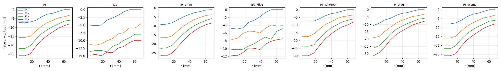
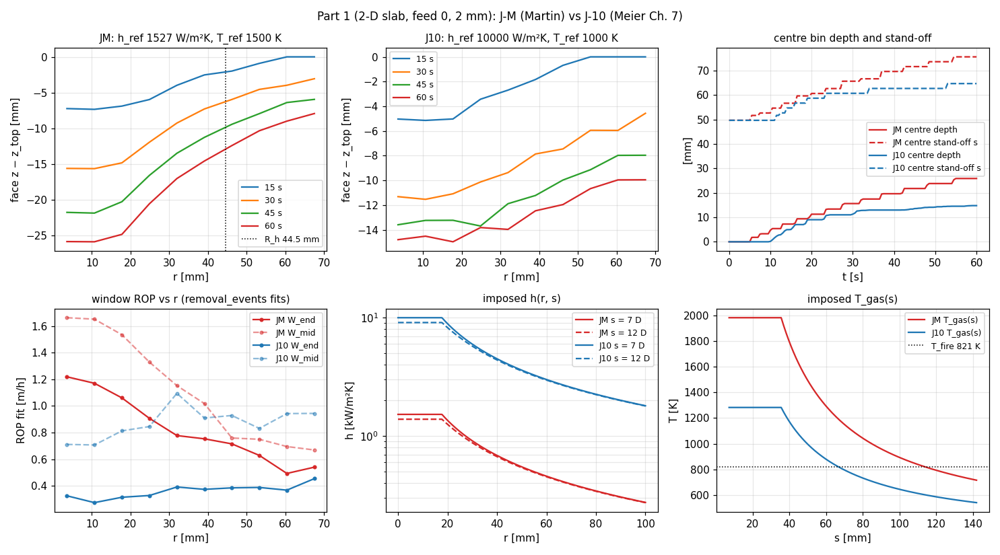
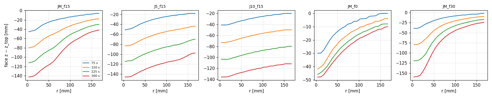
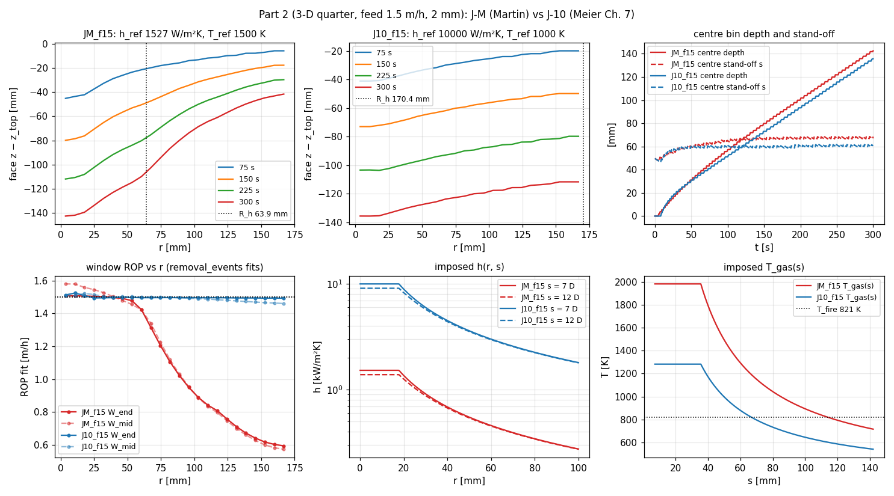

# D2a: impinging-jet face source — results

Generated by `analyze.py` (tables above the discussion marker regenerate). Definitions are in the `analyze.py` docstring. No parameter was adjusted toward Meier's ROP or hole diameter.

## Reference arithmetic (jet.py)

- Martin (1977) at T_film = 1160 K (air, Sutherland): μ = 4.535e-05 Pa·s, k = 0.0728 W/m·K, Pr = 0.732; Re = 4ṁ/(πDμ) = 5.983e+04.
- F(Re) = 864.1, G(2.5 D, 7 D) = 0.2154 → Nu_avg = 163.3, h_avg(2.5 D) = 1674 W/m²K, **h_loc(2.5 D, 7 D) = 1527 W/m²K = J-M h_ref (1527)**.
- h_loc derivation check: area average reproduces G over 2.5–7.5 D (H/D = 2, 7, 12) to 1.0e-12.
- Parser check (`run.py --parser-check`): compiled expressions vs numpy at s0 = 1.5–13 D, all anchors, both sensitivities — see README.

Closed-form pinned ROP at SOD = 7 D (T_fire = 821 K, no conduction losses; analytic, information for D2b):

| anchor | r = 0.0 D (0 mm) | r = 2.5 D (18 mm) | r = 5.0 D (36 mm) | r = 7.5 D (53 mm) | r = 10.0 D (71 mm) | r = 12.5 D (89 mm) | r = 15.0 D (107 mm) | r = 17.5 D (124 mm) | r where ROP_cf = 1.5 m/h [mm] |
|---|---|---|---|---|---|---|---|---|---|
| JM (1527, 1500 K) | 3.17 | 3.17 | 1.57 | 1.02 | 0.75 | 0.58 | 0.47 | 0.39 | 37 |
| J5 (5000, 1200 K) | 5.87 | 5.87 | 2.93 | 1.93 | 1.43 | 1.13 | 0.93 | 0.78 | 68 |
| J10 (10000, 1000 K) | 5.54 | 5.54 | 2.77 | 1.82 | 1.35 | 1.06 | 0.87 | 0.74 | 64 |

## Part 1 — 2-D slab machinery (input_2d_dev, feed 0, 60 s)

| run | h_ref [W/m²K] | T_ref [K] | T_ent | stag | idle | dz | dt [ms] | feed [m/h] | centre ROP W_mid / W_end (W_all) [m/h] | R_h [mm] | centre s end [mm] (ds/dt W_end mm/s) | T_fire mean (p10–p90) [K] | face P [kW] (% of 38) | hole flux [MW/m²] | ledger |
|---|---|---|---|---|---|---|---|---|---|---|---|---|---|---|---|
| JM | 1527 | 1500 | 293 | flat | 2 | 2 | 4 | 0 | 1.66 / 1.22 (1.63) | 44.5 | 75.7 (+0.325) | 821.0 (814–828) | 371.9 W (slab) | 0.316 | 3.7e-15 |
| J10 | 10000 | 1000 | 293 | flat | 2 | 2 | 4 | 0 | 0.71 / 0.33 (1.12) | — | 65.7 (+0.135) | 821.1 (815–828) | 238.7 W (slab) | — | 6.1e-15 |
| JM_1mm | 1527 | 1500 | 293 | flat | 2 | 1 | 4 | 0 | 1.58 / 1.15 (1.53) | 44.2 | 76.7 (+0.310) | 820.9 (815–828) | 365.3 W (slab) | 0.308 | 9.4e-15 |
| J10_idle1 | 10000 | 1000 | 293 | flat | 1 | 2 | 4 | 0 | 0.75 / 0.34 (0.76) | — | 59.7 (+0.000) | 821.1 (815–830) | 238.4 W (slab) | — | 5.4e-15 |
| JM_Tent600 | 1527 | 1500 | 600 | flat | 2 | 2 | 4 | 0 | 1.95 / 1.56 (1.88) | 41.7 | 79.7 (+0.415) | 820.7 (814–828) | 429.8 W (slab) | 0.400 | 4.0e-15 |
| JM_stag | 1527 | 1500 | 293 | rise | 2 | 2 | 4 | 0 | 1.86 / 1.31 (1.79) | 35.8 | 81.7 (+0.337) | 820.8 (814–828) | 379.8 W (slab) | 0.338 | 6.3e-15 |
| JM_dt1ms | 1527 | 1500 | 293 | flat | 2 | 2 | 1 | 0 | 1.59 / 1.17 (1.57) | 44.5 | 75.7 (+0.324) | 820.9 (814–828) | 371.9 W (slab) | 0.316 | 1.4e-14 |

| run | pinned | face: unset | idle | q ≤ 0 | min rule | idle-gap share centre / ring | rim never-fired (hole cols) | fired cols / all, max r fired [mm] | out of range: r>7.5D / r<2.5D / s∉[2,12]D / in hole | max face slope [°] | min patch s (thermo) [mm] |
|---|---|---|---|---|---|---|---|---|---|---|---|
| JM | 0.866 | 0.000 | 0.000 | 0.000 | 0.134 | 0.000 / 0.000 | 0 | 280/280, 69.1 | 0.23 / 0.26 / 0.00 / 0.41 | 31.1 | 49.7 |
| J10 | 0.554 | 0.000 | 0.020 | 0.010 | 0.416 | 0.000 / — | 0 | 280/280, 69.1 | 0.23 / 0.26 / 0.00 / — | 12.0 | 49.7 |
| JM_1mm | 0.796 | 0.000 | 0.000 | 0.000 | 0.204 | 0.000 / 0.000 | 0 | 1120/1120, 69.6 | 0.24 / 0.25 / 0.00 / 0.40 | 26.4 | 49.7 |
| J10_idle1 | 0.306 | 0.000 | 0.620 | 0.000 | 0.074 | 0.238 / — | 0 | 280/280, 69.1 | 0.23 / 0.26 / 0.00 / — | 11.0 | 49.7 |
| JM_Tent600 | 0.918 | 0.000 | 0.000 | 0.000 | 0.082 | 0.000 / 0.000 | 0 | 280/280, 69.1 | 0.23 / 0.26 / 0.00 / 0.43 | 34.0 | 49.7 |
| JM_stag | 0.886 | 0.000 | 0.000 | 0.000 | 0.114 | 0.000 / 0.000 | 0 | 280/280, 69.1 | 0.23 / 0.26 / 0.00 / 0.50 | 33.9 | 49.7 |
| JM_dt1ms | 0.866 | 0.000 | 0.000 | 0.000 | 0.134 | 0.000 / 0.000 | 0 | 280/280, 69.1 | 0.23 / 0.26 / 0.00 / 0.41 | 30.9 | 49.7 |

**JM**: bin-mean level-set depth [mm] vs r (bin centres, 1 D bins), and W_end ROP [m/h]

| t [s] | 0.5 D | 1.5 D | 2.5 D | 3.5 D | 4.5 D | 5.5 D | 6.5 D | 7.5 D | 8.5 D | 9.5 D |
|---|---|---|---|---|---|---|---|---|---|---|
| 15 | 7.3 | 7.4 | 6.9 | 6.0 | 4.0 | 2.5 | 2.0 | 0.9 | 0.0 | 0.0 |
| 30 | 15.6 | 15.7 | 14.9 | 12.0 | 9.3 | 7.3 | 6.0 | 4.6 | 4.0 | 3.1 |
| 45 | 21.8 | 21.9 | 20.3 | 16.6 | 13.5 | 11.3 | 9.5 | 8.0 | 6.4 | 6.0 |
| 60 | 25.9 | 25.9 | 24.9 | 20.6 | 17.1 | 14.6 | 12.4 | 10.4 | 9.0 | 7.9 |
| ROP W_end | 1.22 | 1.17 | 1.06 | 0.91 | 0.78 | 0.75 | 0.72 | 0.63 | 0.49 | 0.54 |

**J10**: bin-mean level-set depth [mm] vs r (bin centres, 1 D bins), and W_end ROP [m/h]

| t [s] | 0.5 D | 1.5 D | 2.5 D | 3.5 D | 4.5 D | 5.5 D | 6.5 D | 7.5 D | 8.5 D | 9.5 D |
|---|---|---|---|---|---|---|---|---|---|---|
| 15 | 5.0 | 5.1 | 5.0 | 3.4 | 2.7 | 1.8 | 0.7 | 0.0 | 0.0 | 0.0 |
| 30 | 11.3 | 11.5 | 11.1 | 10.1 | 9.4 | 7.9 | 7.5 | 5.9 | 6.0 | 4.6 |
| 45 | 13.6 | 13.2 | 13.2 | 13.7 | 11.9 | 11.2 | 10.0 | 9.1 | 8.0 | 8.0 |
| 60 | 14.8 | 14.5 | 15.0 | 13.8 | 14.0 | 12.5 | 12.0 | 10.7 | 10.0 | 10.0 |
| ROP W_end | 0.33 | 0.27 | 0.31 | 0.33 | 0.39 | 0.37 | 0.39 | 0.39 | 0.37 | 0.45 |

**JM_1mm**: bin-mean level-set depth [mm] vs r (bin centres, 1 D bins), and W_end ROP [m/h]

| t [s] | 0.5 D | 1.5 D | 2.5 D | 3.5 D | 4.5 D | 5.5 D | 6.5 D | 7.5 D | 8.5 D | 9.5 D |
|---|---|---|---|---|---|---|---|---|---|---|
| 15 | 9.3 | 9.1 | 8.3 | 6.6 | 5.0 | 3.6 | 2.6 | 2.0 | 1.1 | 1.0 |
| 30 | 16.5 | 16.5 | 15.6 | 12.7 | 10.2 | 8.1 | 6.5 | 5.2 | 4.2 | 3.8 |
| 45 | 22.6 | 22.2 | 20.9 | 17.6 | 14.5 | 11.9 | 9.8 | 8.2 | 6.9 | 6.0 |
| 60 | 26.6 | 26.7 | 25.2 | 21.7 | 18.2 | 15.0 | 12.7 | 10.7 | 9.3 | 8.4 |
| ROP W_end | 1.15 | 1.12 | 1.08 | 0.98 | 0.89 | 0.79 | 0.71 | 0.64 | 0.59 | 0.57 |

**J10_idle1**: bin-mean level-set depth [mm] vs r (bin centres, 1 D bins), and W_end ROP [m/h]

| t [s] | 0.5 D | 1.5 D | 2.5 D | 3.5 D | 4.5 D | 5.5 D | 6.5 D | 7.5 D | 8.5 D | 9.5 D |
|---|---|---|---|---|---|---|---|---|---|---|
| 15 | 4.8 | 5.0 | 4.7 | 3.3 | 2.7 | 1.8 | 0.7 | 0.0 | 0.0 | 0.0 |
| 30 | 7.7 | 7.3 | 6.1 | 5.5 | 5.6 | 6.0 | 4.8 | 3.9 | 4.2 | 4.1 |
| 45 | 10.2 | 10.3 | 10.2 | 9.4 | 8.7 | 7.8 | 7.1 | 7.6 | 5.6 | 4.9 |
| 60 | 11.7 | 11.8 | 11.0 | 9.9 | 9.9 | 10.2 | 8.9 | 8.1 | 7.7 | 7.5 |
| ROP W_end | 0.34 | 0.31 | 0.21 | 0.24 | 0.57 | 0.67 | 0.40 | 0.52 | 0.60 | 0.56 |

**JM_Tent600**: bin-mean level-set depth [mm] vs r (bin centres, 1 D bins), and W_end ROP [m/h]

| t [s] | 0.5 D | 1.5 D | 2.5 D | 3.5 D | 4.5 D | 5.5 D | 6.5 D | 7.5 D | 8.5 D | 9.5 D |
|---|---|---|---|---|---|---|---|---|---|---|
| 15 | 7.4 | 7.3 | 7.4 | 5.9 | 4.0 | 2.7 | 2.0 | 0.9 | 0.0 | 0.0 |
| 30 | 17.5 | 17.4 | 15.7 | 12.6 | 9.6 | 8.0 | 6.0 | 4.6 | 4.0 | 3.4 |
| 45 | 23.7 | 23.7 | 22.8 | 18.6 | 15.0 | 12.0 | 10.0 | 8.0 | 6.9 | 6.0 |
| 60 | 29.9 | 29.9 | 28.1 | 23.4 | 19.0 | 15.9 | 13.3 | 11.2 | 9.8 | 8.0 |
| ROP W_end | 1.56 | 1.52 | 1.37 | 1.24 | 1.08 | 0.85 | 0.76 | 0.70 | 0.66 | 0.53 |

**JM_stag**: bin-mean level-set depth [mm] vs r (bin centres, 1 D bins), and W_end ROP [m/h]

| t [s] | 0.5 D | 1.5 D | 2.5 D | 3.5 D | 4.5 D | 5.5 D | 6.5 D | 7.5 D | 8.5 D | 9.5 D |
|---|---|---|---|---|---|---|---|---|---|---|
| 15 | 10.7 | 9.3 | 7.0 | 5.9 | 4.0 | 2.5 | 2.0 | 0.9 | 0.0 | 0.0 |
| 30 | 19.1 | 18.3 | 14.8 | 12.0 | 9.3 | 7.3 | 6.0 | 4.6 | 4.0 | 3.1 |
| 45 | 26.2 | 24.6 | 20.9 | 16.6 | 13.5 | 11.3 | 9.5 | 8.0 | 6.4 | 6.0 |
| 60 | 31.5 | 29.4 | 25.5 | 20.7 | 17.1 | 14.6 | 12.4 | 10.4 | 9.0 | 7.9 |
| ROP W_end | 1.31 | 1.24 | 1.12 | 0.93 | 0.78 | 0.75 | 0.72 | 0.63 | 0.49 | 0.54 |

**JM_dt1ms**: bin-mean level-set depth [mm] vs r (bin centres, 1 D bins), and W_end ROP [m/h]

| t [s] | 0.5 D | 1.5 D | 2.5 D | 3.5 D | 4.5 D | 5.5 D | 6.5 D | 7.5 D | 8.5 D | 9.5 D |
|---|---|---|---|---|---|---|---|---|---|---|
| 15 | 8.0 | 8.0 | 7.5 | 6.0 | 4.0 | 2.6 | 2.0 | 0.9 | 0.0 | 0.0 |
| 30 | 15.9 | 15.9 | 14.9 | 11.9 | 9.3 | 7.4 | 6.0 | 4.5 | 4.0 | 3.1 |
| 45 | 21.9 | 21.9 | 20.2 | 16.5 | 13.5 | 11.2 | 9.4 | 7.9 | 6.4 | 6.0 |
| 60 | 25.8 | 25.8 | 24.8 | 20.5 | 17.0 | 14.6 | 12.4 | 10.3 | 9.0 | 7.9 |
| ROP W_end | 1.17 | 1.14 | 1.04 | 0.90 | 0.78 | 0.75 | 0.71 | 0.63 | 0.49 | 0.54 |

- **2 → 1 mm (J-M):** band ROP (5.2→22.0 mm) 1.628 → 1.711 m/h (+5.1 %); centre ROP fit W_all 1.626 → 1.532 m/h (-5.8 %; W_mid -4.9 %, W_end -6.0 %); T_fire -0.02 % (5 % bar); end centre depth 25.9 → 26.6 mm (+2.7 %); R_h 44.5 → 44.2 mm.
- **dt 4 → 1 ms (J-M):** band ROP -0.98 %; centre ROP fit W_all -3.67 % (W_mid -4.09 %, W_end -3.96 %); end centre depth -0.28 %; T_fire -0.01 %; R_h 44.5 → 44.5 mm.
- **idle 2 → 1 (J-10):** band ROP (2.3→9.9 mm) 2.35 → 0.92 m/h (-60.7 %); centre ROP fit W_all -32.3 % (W_end +2.9 %); end centre depth 14.8 → 11.7 mm; R_h nan → nan mm; idle share 0.020 → 0.620; face P 238.7 → 238.4 W.
- **T_ent 293 → 600 K (J-M):** band ROP (5.2→22.0 mm) 1.63 → 1.97 m/h (+20.9 %); centre ROP fit W_all +15.6 % (W_end +28.2 %); end centre depth 25.9 → 29.9 mm; R_h 44.5 → 41.7 mm; idle share 0.000 → 0.000; face P 371.9 → 429.8 W.
- **flat → rising stagnation (J-M):** band ROP (5.2→22.0 mm) 1.63 → 2.37 m/h (+45.8 %); centre ROP fit W_all +10.0 % (W_end +7.2 %); end centre depth 25.9 → 31.5 mm; R_h 44.5 → 35.8 mm; idle share 0.000 → 0.000; face P 371.9 → 379.8 W.

## Part 2 — 3-D quarter domain (input_drilling, 60×60×100 at 2 mm, axis at the xlo/ylo corner)

| run | h_ref [W/m²K] | T_ref [K] | T_ent | stag | idle | dz | dt [ms] | feed [m/h] | centre ROP W_mid / W_end (W_all) [m/h] | R_h [mm] | centre s end [mm] (ds/dt W_end mm/s) | T_fire mean (p10–p90) [K] | face P [kW] (% of 38) | hole flux [MW/m²] | ledger |
|---|---|---|---|---|---|---|---|---|---|---|---|---|---|---|---|
| JM_f15 | 1527 | 1500 | 293 | flat | 2 | 2 | 4 | 1.5 | 1.58 / 1.51 (1.58) | 63.9 | 68.7 (+0.002) | 821.0 (815–828) | 20.90 (55.0 %) | 0.492 | 8.1e-15 |
| J5_f15 | 5000 | 1200 | 293 | flat | 2 | 2 | 4 | 1.5 | 1.52 / 1.53 (1.54) | 149.1 | 70.7 (+0.012) | 821.1 (815–828) | 28.78 (75.7 %) | 0.477 | 1.1e-14 |
| J10_f15 | 10000 | 1000 | 293 | flat | 2 | 2 | 4 | 1.5 | 1.51 / 1.51 (1.51) | 170.4 | 60.7 (+0.002) | 821.1 (815–828) | 28.99 (76.3 %) | 0.477 | 1.0e-14 |
| JM_f0 | 1527 | 1500 | 293 | flat | 2 | 2 | 4 | 0 | 0.37 / 0.07 (0.35) | 78.6 | 97.7 (+0.006) | 820.6 (815–828) | 6.13 (16.1 %) | 0.083 | 7.3e-15 |
| JM_f30 | 1527 | 1500 | 293 | flat | 2 | 2 | 4 | 3 | 3.03 / 3.01 (3.03) | 28.4 | 51.4 (-0.000) | 825.5 (815–831) | 24.00 (63.2 %) | 0.999 | 7.9e-15 |

| run | pinned | face: unset | idle | q ≤ 0 | min rule | idle-gap share centre / ring | rim never-fired (hole cols) | fired cols / all, max r fired [mm] | out of range: r>7.5D / r<2.5D / s∉[2,12]D / in hole | max face slope [°] | min patch s (thermo) [mm] |
|---|---|---|---|---|---|---|---|---|---|---|---|
| JM_f15 | 0.965 | 0.000 | 0.000 | 0.000 | 0.035 | 0.000 / 0.000 | 0 | 3600/3600, 168.3 | 0.84 / 0.02 / 0.65 / 0.38 | 48.6 | 47.5 |
| J5_f15 | 0.981 | 0.000 | 0.000 | 0.000 | 0.019 | 0.000 / 0.000 | 0 | 3600/3600, 168.3 | 0.84 / 0.02 / 0.00 / 0.86 | 25.4 | 47.5 |
| J10_f15 | 0.940 | 0.000 | 0.000 | 0.000 | 0.060 | 0.000 / 0.000 | 0 | 3600/3600, 168.3 | 0.84 / 0.02 / 0.00 / 0.86 | 15.1 | 45.9 |
| JM_f0 | 0.666 | 0.000 | 0.037 | 0.000 | 0.297 | 0.310 / 0.021 | 0 | 3600/3600, 168.3 | 0.84 / 0.02 / 0.11 / 0.86 | 23.8 | 49.7 |
| JM_f30 | 0.945 | 0.000 | 0.000 | 0.000 | 0.055 | 0.000 / 0.000 | 0 | 3600/3600, 168.3 | 0.84 / 0.02 / 0.93 / 0.41 | 65.0 | 45.5 |

**JM_f15**: bin-mean level-set depth [mm] vs r (bin centres, 1 D bins), and W_end ROP [m/h]

| t [s] | 0.5 D | 2.5 D | 4.5 D | 6.5 D | 8.5 D | 10.5 D | 12.5 D | 14.5 D | 16.5 D | 18.5 D | 20.5 D | 22.5 D |
|---|---|---|---|---|---|---|---|---|---|---|---|---|
| 75 | 45.3 | 42.3 | 32.9 | 26.2 | 21.7 | 18.2 | 15.9 | 13.3 | 11.3 | 9.7 | 8.0 | 6.0 |
| 150 | 79.9 | 76.3 | 65.3 | 56.7 | 50.5 | 44.0 | 37.1 | 31.6 | 27.5 | 23.8 | 20.5 | 17.9 |
| 225 | 111.9 | 108.1 | 96.7 | 87.6 | 80.3 | 69.4 | 58.6 | 50.1 | 44.2 | 38.5 | 33.8 | 30.2 |
| 300 | 142.5 | 139.4 | 128.0 | 118.7 | 109.9 | 94.5 | 80.0 | 68.6 | 61.1 | 53.3 | 47.2 | 43.3 |
| ROP W_end | 1.51 | 1.51 | 1.50 | 1.49 | 1.42 | 1.21 | 1.02 | 0.89 | 0.81 | 0.71 | 0.64 | 0.60 |

**J5_f15**: bin-mean level-set depth [mm] vs r (bin centres, 1 D bins), and W_end ROP [m/h]

| t [s] | 0.5 D | 2.5 D | 4.5 D | 6.5 D | 8.5 D | 10.5 D | 12.5 D | 14.5 D | 16.5 D | 18.5 D | 20.5 D | 22.5 D |
|---|---|---|---|---|---|---|---|---|---|---|---|---|
| 75 | 51.1 | 48.6 | 42.5 | 36.8 | 32.4 | 28.9 | 25.9 | 23.9 | 21.9 | 20.0 | 19.1 | 17.9 |
| 150 | 83.1 | 81.5 | 75.6 | 69.4 | 64.5 | 60.3 | 56.8 | 53.9 | 51.8 | 49.7 | 47.0 | 43.9 |
| 225 | 114.8 | 113.2 | 106.9 | 100.8 | 95.9 | 91.6 | 87.8 | 84.9 | 82.0 | 79.7 | 75.6 | 71.2 |
| 300 | 145.9 | 144.9 | 138.3 | 132.3 | 127.0 | 122.7 | 119.1 | 115.7 | 113.6 | 110.5 | 104.6 | 98.6 |
| ROP W_end | 1.53 | 1.51 | 1.50 | 1.50 | 1.50 | 1.50 | 1.50 | 1.49 | 1.49 | 1.47 | 1.39 | 1.31 |

**J10_f15**: bin-mean level-set depth [mm] vs r (bin centres, 1 D bins), and W_end ROP [m/h]

| t [s] | 0.5 D | 2.5 D | 4.5 D | 6.5 D | 8.5 D | 10.5 D | 12.5 D | 14.5 D | 16.5 D | 18.5 D | 20.5 D | 22.5 D |
|---|---|---|---|---|---|---|---|---|---|---|---|---|
| 75 | 41.1 | 40.8 | 37.6 | 34.2 | 31.7 | 28.9 | 26.8 | 25.1 | 23.9 | 21.9 | 20.7 | 19.9 |
| 150 | 73.1 | 72.2 | 69.5 | 65.9 | 63.2 | 60.2 | 57.9 | 55.9 | 53.9 | 51.9 | 50.6 | 49.9 |
| 225 | 103.5 | 103.7 | 100.6 | 97.4 | 94.1 | 91.8 | 89.4 | 87.1 | 85.5 | 83.8 | 81.8 | 79.8 |
| 300 | 135.7 | 135.5 | 131.8 | 128.4 | 125.7 | 122.8 | 120.0 | 117.7 | 115.8 | 114.2 | 113.1 | 111.7 |
| ROP W_end | 1.51 | 1.51 | 1.50 | 1.50 | 1.50 | 1.50 | 1.50 | 1.50 | 1.50 | 1.49 | 1.49 | 1.49 |

**JM_f0**: bin-mean level-set depth [mm] vs r (bin centres, 1 D bins), and W_end ROP [m/h]

| t [s] | 0.5 D | 2.5 D | 4.5 D | 6.5 D | 8.5 D | 10.5 D | 12.5 D | 14.5 D | 16.5 D | 18.5 D | 20.5 D | 22.5 D |
|---|---|---|---|---|---|---|---|---|---|---|---|---|
| 75 | 30.0 | 27.6 | 20.0 | 14.7 | 11.0 | 8.0 | 6.0 | 4.1 | 3.8 | 2.0 | 0.5 | 0.0 |
| 150 | 41.9 | 38.3 | 30.5 | 24.4 | 19.4 | 15.9 | 13.0 | 10.3 | 8.7 | 7.3 | 6.0 | 4.0 |
| 225 | 45.9 | 42.7 | 36.7 | 30.4 | 25.1 | 21.2 | 17.8 | 15.3 | 13.2 | 11.1 | 9.6 | 7.9 |
| 300 | 47.9 | 46.2 | 40.0 | 34.3 | 29.1 | 25.0 | 21.6 | 18.5 | 16.4 | 14.1 | 12.0 | 10.5 |
| ROP W_end | 0.07 | 0.14 | 0.17 | 0.20 | 0.20 | 0.18 | 0.18 | 0.15 | 0.15 | 0.14 | 0.14 | 0.13 |

**JM_f30**: bin-mean level-set depth [mm] vs r (bin centres, 1 D bins), and W_end ROP [m/h]

| t [s] | 0.5 D | 2.5 D | 4.5 D | 6.5 D | 8.5 D | 10.5 D | 12.5 D | 14.5 D | 16.5 D | 18.5 D | 20.5 D | 22.5 D |
|---|---|---|---|---|---|---|---|---|---|---|---|---|
| 47.5 | 39.1 | 37.0 | 27.9 | 21.5 | 16.4 | 12.5 | 10.0 | 8.0 | 6.0 | 4.6 | 4.0 | 2.0 |
| 95 | 79.2 | 76.5 | 64.2 | 48.6 | 37.0 | 29.1 | 23.6 | 19.6 | 16.4 | 13.9 | 11.9 | 9.9 |
| 142.5 | 119.4 | 116.0 | 100.9 | 75.0 | 57.2 | 45.7 | 37.3 | 31.2 | 27.0 | 23.2 | 20.0 | 17.9 |
| 190 | 159.5 | 155.7 | 131.4 | 101.2 | 77.5 | 62.1 | 51.0 | 42.9 | 37.6 | 32.3 | 28.3 | 25.7 |
| ROP W_end | 3.01 | 3.00 | 2.50 | 1.98 | 1.53 | 1.24 | 1.03 | 0.89 | 0.80 | 0.70 | 0.63 | 0.58 |

Centre stand-off s(t) (mask top) [mm]:

| run | 10 s | 30 s | 60 s | 100 s | 150 s | 200 s | 250 s | 300 s |
|---|---|---|---|---|---|---|---|---|
| JM_f15 | 51.5 | 57.2 | 62.7 | 66.0 | 67.2 | 68.4 | 67.5 | 68.7 |
| J5_f15 | 53.5 | 65.2 | 68.7 | 70.0 | 71.2 | 70.4 | 71.5 | 70.7 |
| J10_f15 | 49.5 | 59.2 | 60.7 | 60.0 | 61.2 | 60.4 | 61.5 | 60.7 |
| JM_f0 | 53.7 | 65.7 | 75.7 | 85.7 | 91.7 | 95.7 | 95.7 | 97.7 |
| JM_f30 | 47.4 | 48.7 | 49.7 | 50.4 | 50.7 | — | — | — |

<!-- DISCUSSION -->

## Discussion

Hand-written on 2026-09-15 from the tables above. Runs: 7 Part 1, 5 Part 2,
the probe, and 10 parser checks.

**Summary.** The spatial closure works in 3-D:
- Every prescribed-feed run reaches a steady hole.
- The centre ROP locks to the feed and the stand-off locks to a constant.
- T_fire stays at 821 K and the energy ledger closes to ~1e-14.

What the Martin-versus-bracket h choice decides is the **hole width and wall
heating**, not the centre ROP.

**No parameter was adjusted toward Meier's ROP or hole diameter.**
- h_ref, T_ref, T_ent, the profile shapes, `pinned_idle_cycles`, V0 and a0 are
  as the packet states.
- The two changes to the plan are the 4 ms dt cap (checked) and
  `nozzle_collision_radius` = 2.5 D (user decision).

### (i) The h_ref conflict: Martin (J-M) vs the bracket (J-5, J-10)

**Magnitude.** Martin with Meier's mass flow (Re = 6.0×10⁴, film 1160 K) gives
h_loc(2.5 D, 7 D) = 1527 W/m²K (h_avg 1674). That is 3.3× below the bracket
low end (5 kW/m²K) and 6.5× below Meier Ch. 7's 10 kW/m²K. The planner's
estimate is confirmed.

**Centre ROP is not a discriminator under a prescribed feed.**
- All three anchors hold the centre at the feed: 1.51–1.53 m/h in the last
  100 s at 1.5 m/h.
- Each pinned centre column must absorb ρCp(T_fire − T₀)·v_feed = 0.478 MW/m²,
  so the face settles at whatever stand-off supplies it: 9.7 D (J-M), 10.0 D
  (J-5), 8.5 D (J-10).
- The "hole flux" column (0.48–0.49 MW/m²) is that identity, not a prediction.
  Its closeness to the ≈ 0.5 MW/m² derived from Meier's data is therefore not
  independent evidence.

**The anchors differ in how far the flux reaches.**
- **J-M:** ROP ≥ 0.9 v_feed out to R_h = 64 mm, then it falls to 0.6 m/h by
  r ≈ 165 mm. The bowl is bounded, steep (max face slope 49°) and centre-focused.
- **J-10 and J-5:** the whole quarter-domain top keeps pace with the feed
  (R_h = 170 and 149 mm, i.e. the domain edge). Their h at r = 100 mm is still
  ≈ 2 kW/m²K, more than J-M's stagnation value. Their holes are **wider than
  the domain**, so R_h is a lower bound.
- **Face power (×4 quarter):**

| anchor | face power | share of 38 kW |
|---|---|---|
| J-M | 20.9 kW | 55 % |
| J-5 | 28.8 kW | 76 % |
| J-10 | 29.0 kW | 76 % |

  Most of it goes into rock outside any plausible Ø 85–93 mm hole. These powers
  are domain-truncated at r ≈ 170 mm and not meaningful as burner efficiencies.

**Consequence.** With a prescribed feed, the bracket anchors predict a
far wider hole than J-M at the same ROP. D2b's feet rule makes the feed
emergent, and then the anchor will set the ROP as well. The conflict stays
**unresolved by design**.

### (ii) Steady hole and R_h vs feed (3-D, J-M)

| feed | centre ROP W_end | centre s (end, drift) | R_h | steady? |
|---|---|---|---|---|
| 0 | 0.07 m/h (stalling) | 97.7 mm = 13.8 D, still growing slowly | 79 mm (half-depth radius) | no: the face falls behind (stand-off grows) |
| 1.5 m/h | 1.51 | 68.7 mm = 9.7 D, +0.002 mm/s | 64 mm | yes, from ≈ 150 s |
| 3.0 m/h | 3.01 | 51.4 mm = 7.2 D, −0.000 mm/s | 28 mm | yes, from ≈ 60 s |

**Steady state.** A steady bowl forms for both nonzero feeds.
- Doubling the feed moves the balance stand-off in by 2.5 D and **shrinks the
  hole radius by 2.3×**.
- At 3 m/h the face is steep (65°) and the hole narrows toward the 2.5 D flat
  stagnation zone.

**Feed 0.** The face recedes 48 mm at the centre and then stalls. T_gas at
13.8 D is 907 K with h clamped at the 12 D value, so the centre flux is
≈ 0.1 MW/m² before lateral losses. The centre then spends 31 % of its refire
gaps past the idle limit, so its pin expires.

**Collision.** No run collided. With `nozzle_collision_radius` = 2.5 D the
thermo minimum stand-off stayed ≥ 45 mm. The outer rock that the nozzle passed
(s ≤ 0) is where the expressions clamp s at 2 D.

### (iii) Sensitivities (2-D slab, feed 0; band ROP = centre depth gain per time over a common depth band)

- **dt 4 → 1 ms:**
  - Band ROP −1.0 %, end centre depth −0.3 %, T_fire −0.01 %, R_h unchanged.
  - The window fits move −4 % only through the ignition-time offset.
  - **The 4 ms cap is dt-converged.**
- **2 → 1 mm (J-M):**
  - T_fire −0.02 % and end centre depth +2.7 %: pass.
  - Centre ROP is +5.1 % (band) or −5.8 % (40 s window fit): **at the 5 % bar,
    marginal**.
  - The sign flips with the metric because the 1 mm run ignites earlier (face
    form) and the feed-0 face decelerates. A decelerating face is a poor mesh
    probe; the steady 3-D feed runs would be the clean one, but 3-D at 1 mm is
    out of scope.
- **T_ent 293 → 600 K (J-M):**
  - Band ROP +21 %, end depth +15 %, R_h 44.5 → 41.7 mm, face power +16 %.
  - Hot recirculation is a first-order uncertainty (not measured for Meier).
- **Flat → rising stagnation (J-M):**
  - Band ROP +46 % early, end centre depth +22 %.
  - R_h shrinks 44.5 → 35.8 mm, which is the half-depth metric reacting to a
    deeper centre.
  - Face power +2 %: the shape redistributes flux, it does not add much.
- **idle 2 → 1 (J-10):** band ROP −61 %, end depth −21 %, and the idle-expired
  share rises from 2 % to 62 %.
  - On a slowing face, refire gaps exceed 1·t_cell routinely. The 1-D C1 value
    of 1.004 t_cell was the steady best case.
  - **Keep 2.** In the steady 3-D feed runs the idle share is 0 at centre and
    ring.
- **Min rule:** exercised everywhere:
  - 3.5–6 % of column-steps in the steady feed runs;
  - 30 % at feed 0;
  - 13–42 % in 2-D.

  C1's "min rule barely exercised" caveat is closed.
- **Rim:** no in-hole column fails to fire in any run (C1 nit d closed by the
  smooth profile). All 3600 of 3600 quarter-domain columns fire.

### (iv) What D2b's feet rule will need

- **The feet fix the burner stand-off above the face at the foot ring, not at
  the centre.**
  - At SOD = 7 D the analytic pinned closed-form ROP (table at top, T_fire =
    821 K, no lateral loss) is:

| anchor | centre | r = 30 mm | r = 42.5 mm | r = 46.5 mm | r = 60 mm |
|---|---|---|---|---|---|
| J-M | 3.17 | 1.87 | 1.30 | 1.18 | 0.90 |
| J-10 | 5.54 | 3.28 | 2.30 | 2.10 | 1.61 |
| J-5 | 5.87 | 3.48 | 2.44 | 2.23 | 1.71 |

  - The r values are the Meier hole radii, information only.
- **Centre vs ring.** For every anchor the centre at 7 D could run far faster
  than the ring. With feet, the centre runs ahead of the ring until its own
  stand-off grows. This is the bowl seen in the feed runs, where the centre
  stand-off settled 1.5–3 D beyond 7 D at 1.5 m/h.
- **Foot radius.** ROP is set by the ring flux at the **foot radius**, which is
  still unknown (drawings blocker).
  - For J-M, the ring flux at SOD sustains ≥ 1.5 m/h only inside r ≈ 37 mm.
  - For J-5 and J-10 it does so out to 64–68 mm.
  - A foot ring at r ≈ 42–47 mm would therefore give ≈ 1.2–1.3 m/h with J-M and
    ≈ 2.1–2.4 m/h with the bracket anchors, before lateral conduction and the
    face-slope area factor.
- **Caveats D2b must carry:**
  - Face slopes of 25–65° (flux applied on horizontal area; no 1/cos θ; no side
    wall Robin).
  - 84 % of the quarter-domain patch area lies beyond r = 7.5 D and 38–41 % of
    the hole area is outside Martin's validity range. The in-hole fraction is
    mostly the r < 2.5 D flat zone.
  - T_ent as a first-order unknown.
  - Face power far above Meier's data-forced ≈ 3 kW on the hole face.
- **Descent rule.** A feed that is the recession at the foot ring will slow
  toward the ring value, not the centre value.

### (v) Statement

No parameter was adjusted toward Meier's ROP or hole diameter. Meier's
1.3–1.6 m/h and Ø 85–93 mm appear above only as information, and none of the
runs was chosen, rerun or re-weighted to approach them.

### Implementation notes relevant to the numbers

- **AMReX 25.12 parser rewrite bug.** `a/max(r, c)` was rewritten to
  `a·max(r, −c)`. The first probe and Part 1 set ran with the flame effectively
  off. All expressions now put numbers first, `run.py --parser-check` verifies
  them in ALAMO, and every run in the tables was rerun after the fix. See the
  README.
- **Feed-0 stand-off.** The 2-D "min patch s" column shows the unrecessed edge
  (7 D), because at feed 0 the collision radius is the whole patch. In 3-D it
  is the minimum within 2.5 D.
- **Pinned closed-form thermo check.** Not repeated here; it is covered by
  `unit/robin_jet` (b).
