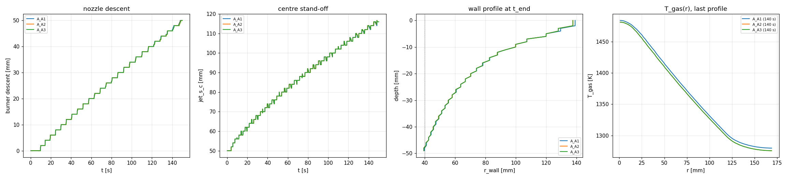
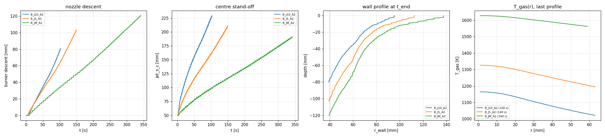
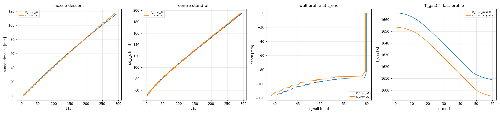
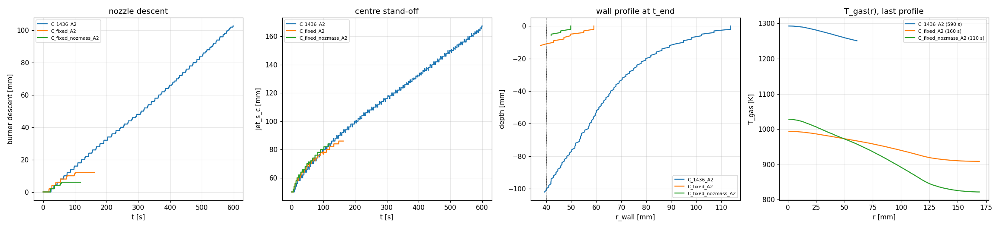

# D2b results: burner on feet, scored Meier ROP / hole diameter

## 0. Pre-registration (written 2026-09-16, before any D2b run)

### Hand prediction (deliverable 5; `feetmodel.py`, output verbatim)

The model is described in the `feetmodel.py` docstring. In short:
- the ring is the 0.9 area-quantile radius of the annulus (38.97 mm) at
  s = 50 mm;
- the centre stand-off s_c is set by centre ROP = v;
- s is linear from s_c (r ≤ r_core) to 50 mm at the ring;
- the face is at T_fire = 821 K;
- the march ends at the ring in steady state (columns beyond have frozen),
  and T_rec = T_exhaust is iterated to its fixed point.

```
r_q = 38.97 mm (0.9 area quantile of [28, 40] mm); r_core = 18.75 mm; foot_standoff = 50 mm; D = 7.5 mm; cp = 1250
J-M 1900 exhaust (scored): h_ref 1449: v = 1.815 m/h (stable), NO centre equilibrium (centre outruns the ring at every s_c; deep-pit limit s_c -> inf, evaluated at 2 m), phi = 0.019, T_stag = 1683 K, T_rec = 1679 K, T_gas(r_q) = 1679 K, P_face = 4.08 kW; v(r) > 0 out to 200 mm; depth-mean Ø 0-0.5 m 112.1 mm, 0-303 mm (600 s) 128.3 mm, min Ø 85.3 mm
   r_wall(z): 0 mm -> 200.0, 10 mm -> 188.6, 20 mm -> 121.9, 50 mm -> 74.4, 100 mm -> 57.1, 200 mm -> 48.1, 300 mm -> 45.1, 500 mm -> 42.7
J-5 1900 exhaust: h_ref 5000: v = 4.310 m/h (stable), NO centre equilibrium (centre outruns the ring at every s_c; deep-pit limit s_c -> inf, evaluated at 2 m), phi = 0.019, T_stag = 1406 K, T_rec = 1397 K, T_gas(r_q) = 1397 K, P_face = 9.50 kW; v(r) > 0 out to 200 mm; depth-mean Ø 0-0.5 m 112.6 mm, 0-500 mm (600 s) 112.6 mm, min Ø 85.3 mm
   r_wall(z): 0 mm -> 200.0, 10 mm -> 195.7, 20 mm -> 124.3, 50 mm -> 75.0, 100 mm -> 57.3, 200 mm -> 48.2, 300 mm -> 45.2, 500 mm -> 42.7
J-10 1900 exhaust: h_ref 10000: v = 5.881 m/h (stable), NO centre equilibrium (centre outruns the ring at every s_c; deep-pit limit s_c -> inf, evaluated at 2 m), phi = 0.019, T_stag = 1225 K, T_rec = 1212 K, T_gas(r_q) = 1212 K, P_face = 13.01 kW; v(r) > 0 out to 200 mm; depth-mean Ø 0-0.5 m 111.7 mm, 0-500 mm (600 s) 111.7 mm, min Ø 85.2 mm
   r_wall(z): 0 mm -> 200.0, 10 mm -> 184.9, 20 mm -> 120.1, 50 mm -> 73.9, 100 mm -> 56.9, 200 mm -> 48.1, 300 mm -> 45.0, 500 mm -> 42.6
J-M 1900 fixed 293 K: h_ref 1449: no equilibrium on [0.05, 30] m/h (max ring - v = -0.05) -> the ring cannot keep up with the centre-set stand-off at any v: STALL predicted
   centre self-stall stand-off (T_stag = T_fire) 114 mm; ring ROP at r = 40 mm if the centre were held: s_c 50 mm -> ring 1.10 m/h (T_stag 1498 K); s_c 62 mm -> ring 0.73 m/h (T_stag 1265 K); s_c 80 mm -> ring 0.35 m/h (T_stag 1046 K); s_c 100 mm -> ring 0.07 m/h (T_stag 896 K)
J-M 1900 fixed, nozzle mass: h_ref 1449: no equilibrium on [0.05, 30] m/h (max ring - v = -0.05) -> the ring cannot keep up with the centre-set stand-off at any v: STALL predicted
   centre self-stall stand-off (T_stag = T_fire) 114 mm; ring ROP at r = 40 mm if the centre were held: s_c 50 mm -> ring 1.02 m/h (T_stag 1498 K); s_c 62 mm -> ring 0.65 m/h (T_stag 1265 K); s_c 80 mm -> ring 0.29 m/h (T_stag 1046 K); s_c 100 mm -> ring 0.04 m/h (T_stag 896 K)
J-M 1436 exhaust: h_ref 1392: v = 0.966 m/h (stable), NO centre equilibrium (centre outruns the ring at every s_c; deep-pit limit s_c -> inf, evaluated at 2 m), phi = 0.019, T_stag = 1316 K, T_rec = 1314 K, T_gas(r_q) = 1314 K, P_face = 2.25 kW; v(r) > 0 out to 200 mm; depth-mean Ø 0-0.5 m 110.0 mm, 0-161 mm (600 s) 152.9 mm, min Ø 85.0 mm
   r_wall(z): 0 mm -> 200.0, 10 mm -> 165.9, 20 mm -> 113.3, 50 mm -> 72.1, 100 mm -> 56.2, 200 mm -> 47.7, 300 mm -> 44.8, 500 mm -> 42.5
D2a2 cross-check (T_mix = 293.15 K, s linear from s_c to s_ring at 40 mm):
  JM_19: s_c 62 mm, s_ring 30 mm: T_stag 1265 K, T_gas(40) 1158 K, ring ROP 0.65 m/h (D2a2 measured 0.54)
  JM_19: s_c 62 mm, s_ring 20 mm: T_stag 1265 K, T_gas(40) 1158 K, ring ROP 0.65 m/h (D2a2 measured 0.54)
  J5_19: s_c 84 mm, s_ring 30 mm: T_stag 1010 K, T_gas(40) 896 K, ring ROP 0.48 m/h (D2a2 measured 0.57)
  J5_19: s_c 84 mm, s_ring 20 mm: T_stag 1010 K, T_gas(40) 896 K, ring ROP 0.48 m/h (D2a2 measured 0.57)
  J10_19: s_c 83 mm, s_ring 30 mm: T_stag 1019 K, T_gas(40) 852 K, ring ROP 0.39 m/h (D2a2 measured 0.71)
  J10_19: s_c 83 mm, s_ring 20 mm: T_stag 1019 K, T_gas(40) 852 K, ring ROP 0.39 m/h (D2a2 measured 0.71)
  J5_19_ent: s_c 87 mm, s_ring 30 mm: T_stag 986 K, T_gas(40) 932 K, ring ROP 0.75 m/h (D2a2 measured 0.62)
  J5_19_ent: s_c 87 mm, s_ring 20 mm: T_stag 986 K, T_gas(40) 932 K, ring ROP 0.75 m/h (D2a2 measured 0.62)
  J10_19_ent: s_c 89 mm, s_ring 30 mm: T_stag 970 K, T_gas(40) 890 K, ring ROP 0.95 m/h (D2a2 measured 1.27)
  J10_19_ent: s_c 89 mm, s_ring 20 mm: T_stag 970 K, T_gas(40) 890 K, ring ROP 0.95 m/h (D2a2 measured 1.27)
```

**Reading, before running:**
- **Exhaust recirculation has no centre equilibrium.** The entrained gas is
  the jet's own exhaust, so T_stag → T_rec as s_c grows, and m = mdot/φ grows
  without bound. The centre is faster than the ring at every stand-off, and
  the pit is bounded only by the wall treatment (Stage A) or the domain
  bottom.
- **In the deep-pit limit the gas over the face is uniform at T_rec,** set by
  the global balance P_face = mdot·cp·(T_nozzle − T_rec). The ring ROP then
  follows from h at the ring:

  | case | ring ROP | T_rec | P_face |
  |---|---|---|---|
  | **J-M, 1900 K (scored)** | **1.82 m/h** | 1679 K | 4.1 kW |
  | J-5, 1900 K | 4.3 m/h | 1397 K | 9.5 kW |
  | J-10, 1900 K | 5.9 m/h | 1212 K | 13.0 kW |
  | J-M, 1436 K | 0.97 m/h | 1314 K | 2.3 kW |

- **Fixed 293 K entrainment (either mass treatment): stall predicted.** The
  centre drills ahead until its T_stag reaches T_fire (s_c = 114 mm), and the
  ring ROP falls to zero on the way (0.07 m/h at s_c = 100 mm). Only a wall
  treatment that holds the centre near the ring (s_c ≲ 60 mm) would keep it
  drilling.
- **Hole.**
  - The wall is at the column's own freeze depth
    D(r) = 50 mm · v(r)/(v − v(r)). The packet's d(r) = 50 mm · v/(v − v(r))
    is the feet's depth at that moment, exactly 50 mm deeper.
  - Depth-mean Ø over 0–0.5 m: 110–113 mm for all four exhaust cases.
  - Minimum Ø at 0.5 m: 85 mm (still narrowing toward 2·r_q = 78 mm).
  - The shallow wall reaches the domain edge: v(r) > 0 out to 200 mm in the
    hand model.
- **D2a2 cross-check.** With D2a2's measured s_c the model gives ring ROPs of
  0.39–0.95 m/h against D2a2's measured 0.54–1.27 m/h: J-M +20 %, J-5 −16 %
  (nozzle mass) and +21 % (entrained), J-10 −45 % and −25 %. The model uses a
  firing face everywhere, while D2a2's face was mostly unfired, so this
  agreement is order-of-magnitude, not closure-level.

### Stage A decision rule (written before Stage A runs)

Runs: J-M, 150 s, with A1 `flake_coherence_length = 0.004`, A2
`flake_coherence_length = 0`, A3 `spall.surface_normal = 1`.
Scoring window: 50–150 s.

1. **Energy ratio** R = ρCp·ΔT_fire·(removed volume rate) / (absorbed face power).
   - The removed volume rate is Σ h_applied·dx·dy over the window.
   - ΔT_fire is the window-mean regime-1 T_top − 293.15 K.
   - The absorbed face power is the window mean of the jet profile's P_bin
     sum (= jet_P_face when there is no floor supply).
   - Whole hole: R ≤ 1.05. R per 1 D ring is reported; a rim ring may
     exceed 1.
2. **Overheating:** regime-1 T_top p99 ≤ 873 K, i.e. the pinned T_fire band
   (C1 / S1b: 821–823 K at V0 = V_cell) + 50 K.
3. **Artefacts, none allowed.**
   - Needles: a column whose end depth exceeds every 4-neighbour's by more
     than 2 dz (4 mm).
   - Never-fired columns inside r_wall(2 mm).
4. **Choice among treatments passing 1–3:** A2 > A3 > A1.
5. **Tie-break, if none passes 1–3.** Accept the treatments whose violations
   do not touch the foot annulus:
   - ring-bin R ≤ 1.05;
   - no ring column with T_top > 873 K;
   - no never-fired ring column;
   - no needle in the ring.

   Choose among them in the order A2 > A3 > A1, and carry the violation as a
   caveat.
6. **If every treatment violates inside the ring, stop and report.**
7. **ROP proximity to Meier is not looked at.**

### Scoring addendum (written 2026-09-16 18:38, after Stage A, before any Stage B result)

These changes come from review feedback on the Stage A runs. They change
where the Meier numbers are measured, not the bands.

- **Volume rate is scored inside Ø 93** (r ≤ 46.5 mm): 4·Σ h_applied·dx·dy
  over the window for those columns.
  - Meier's 2.47 cm³/s and 2.83 kW are ROP × nominal hole area. Removal
    from the mouth crater outside the hole would otherwise be counted as a
    definitional miss of 3–4×. (Stage A A2: 7.76 cm³/s over the whole top,
    2.99 inside Ø 93.)
  - Also reported: the whole-top rate, the packet's wall-profile rate
    d/dt ∫π r_wall² dz, and ROP × the block-mean hole area.
- **Rock-side face power** (vs 2.83 kW) is also taken inside Ø 93: 4 × Σ
  P_bin with bin centre ≤ 46.5 mm. The whole-top face power is still
  reported.
- **Hole Ø is scored over the 0.5 m block, as the packet's target table
  states** (depth-mean 85–93 mm; minimum ≥ 80 mm).
  - Columns whose face is above the nozzle keep their drilled depth.
  - Active columns are projected with the run's own window recession rate
    v(r), in bins of width dz. A column stops when the nozzle, descending at
    the burner ROP v, reaches it: t* = (d − n)/(v − v(r)), final depth
    d + v(r)·t*.
  - The depth where Ø falls to 93 and to 85 mm is reported with the score.
  - The depth-mean over the drilled depth alone is reported but not scored,
    because the drilled depth (≈ 0.1 m) is mostly mouth crater.
- **Stage A needles.** The rule-3 definition is kept (deeper than *every*
  4-neighbour by > 2 dz). Under it, A1–A3 have none at 62.7, 75, 100, 125
  and 150 s, whether depths come from k_top or from summed h_applied.
  - The looser "deeper than *some* neighbour by > 4 mm" counts wall steps
    steeper than 63°. A2 has 2 / 15 / 74 of them at 75 / 100 / 150 s (6 in
    the ring at 150 s); A1 has none. This is carried as an A2 caveat.
- **Stall signal.** `foot_stalled_steps` is replaced by `foot_stall_time`
  (simulated time since `nozzle_z` last decreased). The Stage B/C/D runs use
  the earlier binary, so their tables give the longest hold computed from
  `nozzle_z`.

### Correction to the scoring addendum (2026-09-17, after the thesis reread)

- **Volume rate:** Meier's 3.42 L was measured *by filling the finished hole with
  water* (thesis p. 221), so it is the whole excavation, mouth included. The
  like-for-like model number is the **whole-top removal rate** (B_JM_A2:
  5.68 cm³/s, 2.3× the measured 2.47), not the inside-Ø 93 rate (3.27). The
  addendum's inside-Ø 93 scoring is withdrawn; the tables below are left as run
  and this note governs their reading. The hole-Ø verdict (funnel) is unchanged.
- **"1436 K = chamber thermocouple"** is not a gas temperature: the igniter
  thermocouple sat upstream of the lifted flame and read ≈ 550 °C during
  drilling (Fig. 8.7, p. 220). The C_1436 run is a generic low-temperature
  case; the nozzle gas temperature is unmeasured (adiabatic ≈ 1900 K is the
  upper bound; cooling water 160 L/h, ΔT unreported).
- **Fig. 8.8 (p. 224)** shows no collar funnel: the model's 200 mm mouth is a
  real error (free-surface wall jet never entrains ambient air; exhaust
  recirculation from t = 0), to be fixed in the next packet.
- Full page-cited notes: `Claude_markdowns/meier_thesis_notes.md`.
- **(D2c, 2026-09-17) Additions.**
  - The digitised Fig. 8.8 (`validation/meier/meier_fig8_8_hole_profile.csv`,
    visible width = lower bound) has a **mild collar** (96 → 87 mm over the top
    75 mm), so "no collar funnel" means about 10 mm of widening, not none.
  - B_JM_A2 re-scored with the D2c rules (whole excavation, azimuth-mean
    profile against Fig. 8.8, drilled-depth Ø with the 2 mm rule):
    `studies/d2c_steady/RESULTS.md` §Dry run. The tables below are not
    rewritten.

<!-- RESULTS -->

## 1. Stage A: wall treatment

| treatment | R (hole) | R (foot rings) | T_fire p99 / max | ring T_top max | needles (ring) | never-fired in hole (ring) | passes 1-3 | ring clean |
|---|---|---|---|---|---|---|---|---|
| A1 | 0.739 | 0.867 | 887 / 965 K | 862 K | 0 (0) | 89 (0) | no (TA) | yes |
| A2 | 0.741 | 0.868 | 838 / 863 K | 862 K | 0 (0) | 71 (0) | no (A) | yes |
| A3 | 0.740 | 0.864 | 838 / 863 K | 862 K | 0 (0) | 71 (0) | no (A) | yes |

**Choice: A2**: no treatment passes 1-3; tie-break (rule 5): ring-clean treatments A1, A2, A3; order A2 > A3 > A1; its violations are carried as a caveat.

| run | status / t_end | window | ROP (burner) | ring columns | sub-fits (50 s) | T_fire mean [p10, p90] | ΔT_fire | jet_s_c | T_stag | T_rec | gap | face power ×4 | cap ×4 | mdot cp (T_noz − T_exh) | face power inside Ø 93 ×4 (vs 2.83 kW) | R | removed vol. rate | wall vol. rate | depth-mean Ø (drilled) | min Ø | feet depth | centre depth |
|---|---|---|---|---|---|---|---|---|---|---|---|---|---|---|---|---|---|---|---|---|---|---|
| A_A1 | ok / 150 s | 50–150 s (not steady) | 1.21 m/h | 1.38 m/h | 1.17 | 822.7 [814.8, 830.0] K | 530 K | 98 mm | 1513 K | 1267 K | 50.0 mm | 11.97 kW | 60.08 kW | 11.97 kW | 3.93 kW (1.39×) | 0.739 | 7.69 cm³/s | 8.24 cm³/s | 146.0 mm (dom) | 79.6 mm | 50 mm | 116 mm |
| A_A2 | ok / 150 s | 50–150 s (not steady) | 1.20 m/h | 1.37 m/h | 1.16 | 821.0 [814.8, 828.2] K | 528 K | 98 mm | 1512 K | 1266 K | 50.0 mm | 12.00 kW | 60.04 kW | 12.00 kW | 3.97 kW (1.40×) | 0.741 | 7.76 cm³/s | 8.26 cm³/s | 145.4 mm (dom) | 78.6 mm | 50 mm | 116 mm |
| A_A3 | ok / 150 s | 50–150 s (not steady) | 1.20 m/h | 1.37 m/h | 1.16 | 821.0 [814.8, 828.2] K | 528 K | 98 mm | 1512 K | 1266 K | 50.0 mm | 12.00 kW | 60.04 kW | 12.00 kW | 3.97 kW (1.40×) | 0.740 | 7.75 cm³/s | 8.26 cm³/s | 145.4 mm (dom) | 78.6 mm | 50 mm | 116 mm |

| run | pinned | face: unset / idle / qneg / minrule | foot_carry_cols min / mean | longest hold [s] | rim (ring) | needles (ring) | R foot rings | T_fire p99 | ledger max | max slope | out of Martin range |
|---|---|---|---|---|---|---|---|---|---|---|---|
| A_A1 | 0.61 | 0.30 / 0.00 / 0.00 / 0.095 | 18 / 29.9 | 9.5 | 89 (0) | 0 (0) | 0.867 | 887 K | 1.1e-14 | 65° | 0.83 |
| A_A2 | 0.61 | 0.30 / 0.00 / 0.00 / 0.095 | 18 / 29.9 | 9.5 | 71 (0) | 0 (0) | 0.868 | 838 K | 8.3e-15 | 72° | 0.84 |
| A_A3 | 0.61 | 0.30 / 0.00 / 0.00 / 0.095 | 18 / 29.9 | 9.5 | 71 (0) | 0 (0) | 0.864 | 838 K | 6.3e-15 | 72° | 0.84 |



## 2. Stage B: scored runs

| run | status / t_end | window | ROP (burner) | ring columns | sub-fits (50 s) | T_fire mean [p10, p90] | ΔT_fire | jet_s_c | T_stag | T_rec | gap | face power ×4 | cap ×4 | mdot cp (T_noz − T_exh) | face power inside Ø 93 ×4 (vs 2.83 kW) | R | removed vol. rate | wall vol. rate | depth-mean Ø (drilled) | min Ø | feet depth | centre depth |
|---|---|---|---|---|---|---|---|---|---|---|---|---|---|---|---|---|---|---|---|---|---|---|
| B_J10_A2 | bottom / 103 s | 0–103 s (not steady) | 2.82 m/h | 3.57 m/h | 3.19, 2.82 | 821.3 [815.1, 828.7] K | 528 K | 152 mm | 1172 K | 867 K | 50.0 mm | 19.54 kW | 66.01 kW | 19.54 kW | 10.64 kW (3.76×) | 0.737 | 12.55 cm³/s | 13.18 cm³/s | 118.6 mm | 78.2 mm | 81 mm | 260 mm |
| B_J5_A2 | bottom / 150 s | 0–150 s (not steady) | 2.43 m/h | 2.93 m/h | 2.91, 2.26 | 821.3 [815.1, 828.7] K | 528 K | 137 mm | 1301 K | 1006 K | 50.0 mm | 16.90 kW | 68.80 kW | 16.90 kW | 8.37 kW (2.95×) | 0.774 | 11.40 cm³/s | 12.11 cm³/s | 125.7 mm | 78.4 mm | 103 mm | 264 mm |
| B_JM_A2 | bottom / 342 s | 171–342 s (not steady) | 1.36 m/h | 1.52 m/h | 1.39, 1.39, 1.34 | 821.0 [814.9, 828.3] K | 528 K | 157 mm | 1587 K | 1484 K | 50.0 mm | 7.87 kW | 102.47 kW | 7.87 kW | 4.45 kW (1.57×) | 0.828 | 5.68 cm³/s | 5.67 cm³/s | 135.9 mm (dom) | 78.2 mm | 121 mm | 262 mm |

| run | pinned | face: unset / idle / qneg / minrule | foot_carry_cols min / mean | longest hold [s] | rim (ring) | needles (ring) | R foot rings | T_fire p99 | ledger max | max slope | out of Martin range |
|---|---|---|---|---|---|---|---|---|---|---|---|
| B_J10_A2 | 0.27 | 0.69 / 0.00 / 0.04 / 0.001 | 18 / 34.3 | 8.5 | 144 (0) | 0 (0) | 0.903 | 839 K | 9.3e-15 | 84° | 0.77 |
| B_J5_A2 | 0.35 | 0.49 / 0.00 / 0.15 / 0.008 | 18 / 31.8 | 5.9 | 86 (0) | 0 (0) | 0.918 | 839 K | 7.4e-15 | 83° | 0.85 |
| B_JM_A2 | 0.32 | 0.10 / 0.00 / 0.58 / 0.003 | 18 / 22.7 | 9.5 | 71 (0) | 0 (0) | 0.846 | 838 K | 1.8e-14 | 82° | 0.88 |

### B_J10_A2 (bracket implication)

| criterion | target | simulation | verdict | hand prediction |
|---|---|---|---|---|
| ROP | [1.04, 1.92] m/h | 2.82 m/h (ring columns 3.57) | FAIL | 5.88 m/h |
| hole Ø, depth-mean over 0–0.5 m | 85–93 mm | 95.6 mm (frozen columns as drilled, active columns projected with the run's own v(r); Ø ≤ 93 from 166 mm, ≤ 85 from 400 mm); drilled depth only: 118.6 mm | FAIL | 111.7 mm; 205.0 mm over the drilled depth |
| hole Ø, minimum over 0–0.5 m | ≥ 80 mm | 84.0 mm (drilled depth: 78.2 mm) | PASS | 85.2 mm |
| volume rate inside Ø 93 | [1.98, 2.96] cm³/s | 8.54 cm³/s; whole top 12.55, wall profile 13.18, ROP × block-mean area 5.81 | FAIL | 9.31 cm³/s (π r_wall² at the ring rate) |
| ΔT_fire | 500–560 K | 528 K | PASS | 528 K |
| ROP flatness | sub-fits within ±10 % | max 6.0 %; jet_s_c drift 1.60 mm/s (limit 0.02); face power ×4 drift -60 W/s (no steady window) | FAIL | — |
| ledger | round-off | 9.3e-15 | PASS | — |
| mesh 2 → 1 mm | within 5 % | not evaluated | — | — |

Wall profile r_wall(z) [mm], simulation | hand: z 10: 81 | 185; z 20: 69 | 120; z 50: 50 | 74; z 100: nan | 57; z 150: nan | 51; z 200: nan | 48

### B_J5_A2 (bracket implication)

| criterion | target | simulation | verdict | hand prediction |
|---|---|---|---|---|
| ROP | [1.04, 1.92] m/h | 2.43 m/h (ring columns 2.93) | FAIL | 4.31 m/h |
| hole Ø, depth-mean over 0–0.5 m | 85–93 mm | 99.0 mm (frozen columns as drilled, active columns projected with the run's own v(r); Ø ≤ 93 from 189 mm, ≤ 85 from 438 mm); drilled depth only: 125.7 mm | FAIL | 112.6 mm; 188.9 mm over the drilled depth |
| hole Ø, minimum over 0–0.5 m | ≥ 80 mm | 84.0 mm (drilled depth: 78.4 mm) | PASS | 85.3 mm |
| volume rate inside Ø 93 | [1.98, 2.96] cm³/s | 6.73 cm³/s; whole top 11.40, wall profile 12.11, ROP × block-mean area 5.47 | FAIL | 6.85 cm³/s (π r_wall² at the ring rate) |
| ΔT_fire | 500–560 K | 528 K | PASS | 528 K |
| ROP flatness | sub-fits within ±10 % | max 12.7 %; jet_s_c drift 1.00 mm/s (limit 0.02); face power ×4 drift -55 W/s (no steady window) | FAIL | — |
| ledger | round-off | 7.4e-15 | PASS | — |
| mesh 2 → 1 mm | within 5 % | not evaluated | — | — |

Wall profile r_wall(z) [mm], simulation | hand: z 10: 93 | 196; z 20: 76 | 124; z 50: 60 | 75; z 100: 40 | 57; z 150: nan | 51; z 200: nan | 48

### B_JM_A2 (scored)

| criterion | target | simulation | verdict | hand prediction |
|---|---|---|---|---|
| ROP | [1.04, 1.92] m/h | 1.36 m/h (ring columns 1.52) | PASS | 1.82 m/h |
| hole Ø, depth-mean over 0–0.5 m | 85–93 mm | 104.3 mm (frozen columns as drilled, active columns projected with the run's own v(r); Ø ≤ 93 from 245 mm, ≤ 85 from 488 mm); drilled depth only: 135.9 mm | FAIL | 112.1 mm; 176.2 mm over the drilled depth |
| hole Ø, minimum over 0–0.5 m | ≥ 80 mm | 84.9 mm (drilled depth: 78.2 mm) | PASS | 85.3 mm |
| volume rate inside Ø 93 | [1.98, 2.96] cm³/s | 3.27 cm³/s; whole top 5.68, wall profile 5.67, ROP × block-mean area 3.50 | FAIL | 2.88 cm³/s (π r_wall² at the ring rate) |
| ΔT_fire | 500–560 K | 528 K | PASS | 528 K |
| ROP flatness | sub-fits within ±10 % | max 2.5 %; jet_s_c drift 0.39 mm/s (limit 0.02); face power ×4 drift -22 W/s (no steady window) | FAIL | — |
| ledger | round-off | 1.8e-14 | PASS | — |
| mesh 2 → 1 mm | ring ROP and T_fire within 5 % | ring ROP -4.8 %, T_fire +0.00 %, burner ROP -6.4 % (1 mm vs 2 mm, trimmed; windows 147–295 / 145–290 s; steady False / False) | FAIL | — |

Wall profile r_wall(z) [mm], simulation | hand: z 10: 108 | 189; z 20: 87 | 122; z 50: 66 | 74; z 100: 46 | 57; z 150: nan | 51; z 200: nan | 48



## 3. Stage D: mesh check

| run | status / t_end | window | ROP (burner) | ring columns | sub-fits (50 s) | T_fire mean [p10, p90] | ΔT_fire | jet_s_c | T_stag | T_rec | gap | face power ×4 | cap ×4 | mdot cp (T_noz − T_exh) | face power inside Ø 93 ×4 (vs 2.83 kW) | R | removed vol. rate | wall vol. rate | depth-mean Ø (drilled) | min Ø | feet depth | centre depth |
|---|---|---|---|---|---|---|---|---|---|---|---|---|---|---|---|---|---|---|---|---|---|---|
| D_1mm_A2 | bottom / 295 s | 147–295 s (not steady) | 1.33 m/h | 1.54 m/h | 1.29, 1.35 | 821.1 [814.9, 828.4] K | 528 K | 162 mm | 1660 K | 1585 K | 50.0 mm | 5.96 kW | 111.45 kW | 5.96 kW | 4.92 kW (1.74×) | 0.746 | 3.88 cm³/s | 4.95 cm³/s | 114.2 mm (dom) | 81.3 mm | 116 mm | 261 mm |
| D_2mm_A2 | bottom / 290 s | 145–290 s (not steady) | 1.43 m/h | 1.62 m/h | 1.38, 1.46 | 821.1 [814.9, 828.5] K | 528 K | 161 mm | 1655 K | 1579 K | 50.0 mm | 6.07 kW | 110.65 kW | 6.07 kW | 4.83 kW (1.70×) | 0.805 | 4.26 cm³/s | 5.05 cm³/s | 112.1 mm (dom) | 78.6 mm | 117 mm | 262 mm |

| run | pinned | face: unset / idle / qneg / minrule | foot_carry_cols min / mean | longest hold [s] | rim (ring) | needles (ring) | R foot rings | T_fire p99 | ledger max | max slope | out of Martin range |
|---|---|---|---|---|---|---|---|---|---|---|---|
| D_1mm_A2 | 0.72 | 0.01 / 0.13 / 0.14 / 0.001 | 66 / 75.9 | 4.4 | 31 (0) | 0 (0) | 0.755 | 838 K | 9.4e-15 | 80° | 0.56 |
| D_2mm_A2 | 0.82 | 0.02 / 0.04 / 0.12 / 0.000 | 18 / 23.3 | 7.9 | 11 (0) | 0 (0) | 0.826 | 838 K | 6.9e-15 | 82° | 0.54 |

Mesh: ring ROP -4.8 %, T_fire +0.00 %, burner ROP -6.4 % (1 mm vs 2 mm, trimmed; windows 147–295 / 145–290 s; steady False / False) → **FAIL**; pinned share 0.82 (2 mm) vs 0.72 (1 mm); unset-face share 0.02 vs 0.01.



## 4. Stage C: sensitivities

| run | status / t_end | window | ROP (burner) | ring columns | sub-fits (50 s) | T_fire mean [p10, p90] | ΔT_fire | jet_s_c | T_stag | T_rec | gap | face power ×4 | cap ×4 | mdot cp (T_noz − T_exh) | face power inside Ø 93 ×4 (vs 2.83 kW) | R | removed vol. rate | wall vol. rate | depth-mean Ø (drilled) | min Ø | feet depth | centre depth |
|---|---|---|---|---|---|---|---|---|---|---|---|---|---|---|---|---|---|---|---|---|---|---|
| C_1436_A2 | ok / 600 s | 300–600 s (not steady) | 0.67 m/h | 0.73 m/h | 0.68, 0.68, 0.65, 0.67, 0.65 | 820.9 [814.8, 828.3] K | 528 K | 141 mm | 1262 K | 1197 K | 50.0 mm | 4.52 kW | 69.06 kW | 4.52 kW | 2.39 kW (0.84×) | 0.691 | 2.72 cm³/s | 2.74 cm³/s | 129.9 mm | 78.6 mm | 103 mm | 220 mm |
| C_fixed_A2 | stalled / 162 s | 12–162 s (not steady) | 0.28 m/h | 0.50 m/h | -0.00, 0.32, 0.60 | 820.9 [814.6, 828.3] K | 528 K | 75 mm | 1112 K | — K | 50.0 mm | 5.71 kW | 30.39 kW | 17.91 kW | 1.59 kW (0.56×) | 0.189 | 0.94 cm³/s | 0.96 cm³/s | 99.1 mm | 75.3 mm | 12 mm | 48 mm |
| C_fixed_nozmass_A2 | stalled / 118 s | 0–118 s (not steady) | 0.17 m/h | 0.39 m/h | -0.00, 0.45 | 820.9 [814.7, 828.3] K | 528 K | 70 mm | 1169 K | — K | 50.0 mm | 6.09 kW | 16.56 kW | 19.91 kW | 1.75 kW (0.62×) | 0.161 | 0.86 cm³/s | 0.97 cm³/s | 92.9 mm | 84.0 mm | 6 mm | 40 mm |

| run | pinned | face: unset / idle / qneg / minrule | foot_carry_cols min / mean | longest hold [s] | rim (ring) | needles (ring) | R foot rings | T_fire p99 | ledger max | max slope | out of Martin range |
|---|---|---|---|---|---|---|---|---|---|---|---|
| C_1436_A2 | 0.33 | 0.33 / 0.02 / 0.31 / 0.009 | 18 / 23.9 | 24.6 | 139 (0) | 0 (0) | 0.741 | 838 K | 1.5e-14 | 78° | 0.82 |
| C_fixed_A2 | 0.12 | 0.83 / 0.04 / 0.00 / 0.008 | 18 / 43.5 | 61.1 | 12 (0) | 0 (0) | 0.580 | 838 K | 1.6e-14 | 50° | 0.18 |
| C_fixed_nozmass_A2 | 0.09 | 0.89 / 0.01 / 0.00 / 0.004 | 19 / 53.0 | 60.3 | 20 (0) | 0 (0) | 0.484 | 839 K | 7.9e-15 | 50° | 0.15 |

### C_1436_A2 (sensitivity, verdict table)

| criterion | target | simulation | verdict | hand prediction |
|---|---|---|---|---|
| ROP | [1.04, 1.92] m/h | 0.67 m/h (ring columns 0.73) | FAIL | 0.97 m/h |
| hole Ø, depth-mean over 0–0.5 m | 85–93 mm | 102.3 mm (frozen columns as drilled, active columns projected with the run's own v(r); Ø ≤ 93 from 250 mm, ≤ 85 from — mm); drilled depth only: 129.9 mm | FAIL | 110.0 mm; 180.1 mm over the drilled depth |
| hole Ø, minimum over 0–0.5 m | ≥ 80 mm | 86.0 mm (drilled depth: 78.6 mm) | PASS | 85.0 mm |
| volume rate inside Ø 93 | [1.98, 2.96] cm³/s | 1.50 cm³/s; whole top 2.72, wall profile 2.74, ROP × block-mean area 1.60 | FAIL | 1.52 cm³/s (π r_wall² at the ring rate) |
| ΔT_fire | 500–560 K | 528 K | PASS | 528 K |
| ROP flatness | sub-fits within ±10 % | max 2.4 %; jet_s_c drift 0.17 mm/s (limit 0.02); face power ×4 drift -8 W/s (no steady window) | FAIL | — |
| ledger | round-off | 1.5e-14 | PASS | — |
| mesh 2 → 1 mm | within 5 % | not evaluated | — | — |

Wall profile r_wall(z) [mm], simulation | hand: z 10: 95 | 166; z 20: 80 | 113; z 50: 61 | 72; z 100: 40 | 56; z 150: nan | 51; z 200: nan | 48

### C_fixed_A2 (sensitivity, verdict table)

| criterion | target | simulation | verdict | hand prediction |
|---|---|---|---|---|
| ROP | [1.04, 1.92] m/h | 0.28 m/h (ring columns 0.50) | FAIL | — m/h (stall predicted) |
| hole Ø, depth-mean over 0–0.5 m | 85–93 mm | 87.5 mm (frozen columns as drilled, active columns projected with the run's own v(r); Ø ≤ 93 from 61 mm, ≤ 85 from 260 mm); drilled depth only: 99.1 mm | PASS | — mm; — mm over the drilled depth |
| hole Ø, minimum over 0–0.5 m | ≥ 80 mm | 79.8 mm (drilled depth: 75.3 mm) | FAIL | — mm |
| volume rate inside Ø 93 | [1.98, 2.96] cm³/s | 0.84 cm³/s; whole top 0.94, wall profile 0.96, ROP × block-mean area 0.47 | FAIL | — cm³/s (π r_wall² at the ring rate) |
| ΔT_fire | 500–560 K | 528 K | PASS | 528 K |
| ROP flatness | sub-fits within ±10 % | max 100.0 %; jet_s_c drift 0.19 mm/s (limit 0.02); face power ×4 drift -37 W/s (no steady window) | FAIL | — |
| ledger | round-off | 1.6e-14 | PASS | — |
| mesh 2 → 1 mm | within 5 % | not evaluated | — | — |

Wall profile r_wall(z) [mm], simulation | hand: z 10: 43 | nan; z 20: nan | nan; z 50: nan | nan; z 100: nan | nan; z 150: nan | nan; z 200: nan | nan

### C_fixed_nozmass_A2 (sensitivity, verdict table)

| criterion | target | simulation | verdict | hand prediction |
|---|---|---|---|---|
| ROP | [1.04, 1.92] m/h | 0.17 m/h (ring columns 0.39) | FAIL | — m/h (stall predicted) |
| hole Ø, depth-mean over 0–0.5 m | 85–93 mm | 85.7 mm (frozen columns as drilled, active columns projected with the run's own v(r); Ø ≤ 93 from 27 mm, ≤ 85 from 118 mm); drilled depth only: 92.9 mm | PASS | — mm; — mm over the drilled depth |
| hole Ø, minimum over 0–0.5 m | ≥ 80 mm | 84.0 mm (drilled depth: 84.0 mm) | PASS | — mm |
| volume rate inside Ø 93 | [1.98, 2.96] cm³/s | 0.84 cm³/s; whole top 0.86, wall profile 0.97, ROP × block-mean area 0.28 | FAIL | — cm³/s (π r_wall² at the ring rate) |
| ΔT_fire | 500–560 K | 528 K | PASS | 528 K |
| ROP flatness | sub-fits within ±10 % | max 100.0 %; jet_s_c drift 0.28 mm/s (limit 0.02); face power ×4 drift -58 W/s (no steady window) | FAIL | — |
| ledger | round-off | 7.9e-15 | PASS | — |
| mesh 2 → 1 mm | within 5 % | not evaluated | — | — |

Wall profile r_wall(z) [mm], simulation | hand: z 10: nan | nan; z 20: nan | nan; z 50: nan | nan; z 100: nan | nan; z 150: nan | nan; z 200: nan | nan



<!-- DISCUSSION -->

## 5. Discussion

Written after all runs, from the tables above. Stage A chose **A2** (no
coherence cap) by the tie-break in rule 5. Its caveats:
- 71 never-fired columns inside r_wall(2 mm), none in the ring;
- steps on walls steeper than 63°: 74 columns at 150 s, 6 of them in the
  ring;
- A3 behaved the same as A2 (see (v)).

### (i) Verdict

**J-M (scored): ROP passes; the hole diameter and volume fail; there is no
steady state.**

| run | ROP [m/h] | Ø depth-mean 0–0.5 m [mm] | Ø min [mm] | vol. inside Ø 93 [cm³/s] | ΔT_fire | steady | outcome |
|---|---|---|---|---|---|---|---|
| target | 1.04–1.92 | 85–93 | ≥ 80 | 1.98–2.96 | 500–560 K | yes | |
| **J-M, exhaust (scored)** | **1.36 PASS** | **104.3 FAIL** | **84.9 PASS** | **3.27 FAIL** | 528 PASS | no (s_c +0.39 mm/s) | drills, ROP in band, hole too wide |
| J-M, fixed 293 K | 0.28 FAIL | 87.5 (see note) | 79.8 FAIL | 0.84 FAIL | 528 | no | **stalled at 162 s** (feet 12 mm down) |
| J-M, fixed 293 K, nozzle mass | 0.17 FAIL | 85.7 (see note) | 84.0 | 0.84 FAIL | 528 | no | **stalled at 118 s** (feet 6 mm down) |
| J-M, T_nozzle 1436 K | 0.67 FAIL | 102.3 FAIL | 86.0 PASS | 1.50 FAIL | 528 | no (s_c +0.17 mm/s) | drills, below the band |
| J-5 (bracket) | 2.43 FAIL | 99.0 FAIL | 84.0 PASS | 6.73 FAIL | 528 | no, 150 s run | above the band |
| J-10 (bracket) | 2.82 FAIL | 95.6 FAIL | 84.0 PASS | 8.54 FAIL | 528 | no, 103 s run | above the band |

Note: for the two stalled runs, the Ø values come from projecting the
columns of a hole that stopped deepening. They say nothing about a 0.5 m
hole, and the "pass" is not a result.

**Reading the J-M line.**
- **The ROP line is the test of the jet, and J-M lands inside Meier's band.**
  - 1.36 m/h over 171–342 s; the ring columns give 1.52 m/h.
  - At 1 mm, Stage D's burner ROP is 6.4 % lower (≈ 1.27 m/h), still in the
    band.
  - But the hole is not a steady one (see (ii)). The rate is still rising
    slowly: 50 s fits of 1.20 m/h at s_c = 100 mm and 1.40 m/h at 190 mm.
  - So "in band" holds for this 0–342 s transient in a 0.30 m domain, not for
    a converged drilling state.
- **The hole Ø and volume fail for one shared reason: the hole is too wide
  for too long.**
  - The wall reaches Ø 93 only at 245 mm depth and Ø 85 at 488 mm.
  - ROP × block-mean area = 3.50 cm³/s, close to the measured 3.27 inside
    Ø 93. The volume miss is the diameter miss restated, as the packet's
    target table anticipated.
  - As the packet requires, the Ø result is read as a check of the profile
    shape and the above-nozzle freeze rule, **not** as support for or
    against the anchor.
- **The minimum Ø passes (84.9 mm).** It is still narrowing toward the foot
  radius at 0.5 m.

### (ii) Hand prediction vs simulation

| case | hand ROP (deep-pit limit) | simulated ROP | simulated T_rec (window mean) | hand T_rec |
|---|---|---|---|---|
| J-M | 1.82 | 1.36 | 1484 K (1247 → 1561) | 1679 K |
| J-M 1436 K | 0.97 | 0.67 | 1197 K | 1314 K |
| J-5 | 4.31 | 2.43 | 1006 K | 1397 K |
| J-10 | 5.88 | 2.82 | 867 K | 1212 K |

- **The difference is the approach to the deep-pit limit.**
  - The hand numbers assume a pit so deep that the gas over the ring equals
    T_rec, the exhaust recirculates at that temperature, and only the ring
    and the core fire.
  - In J-M, face power ×4 falls as the pit deepens, while T_rec rises and
    so does the ring rate:

    | s_c | face power ×4 | T_rec | ROP (50 s fit) |
    |---|---|---|---|
    | 80 mm | 12.4 kW | 1247 K | 1.30 m/h |
    | 100 mm | 11.9 kW | 1269 K | 1.20 m/h |
    | 130 mm | 9.7 kW | 1388 K | 1.27 m/h |
    | 160 mm | 7.5 kW | 1506 K | 1.39 m/h |
    | 190 mm | 6.4 kW | 1561 K | 1.40 m/h |

    The mouth crater stops firing as the nozzle passes it, so less of the
    jet's enthalpy is spent outside the ring. Face power inside Ø 93 is
    4.45 kW against the hand model's 4.08 kW.
  - The J-5 and J-10 runs reached the domain bottom after 150 and 103 s,
    far from that limit (T_rec 400 K below the hand value). Their
    hand/simulation ratio is not a closure error.
- **The closure itself matches.** Review check at 75 s: with the run's own
  ring gas temperature, the closed-form rate is 1.30 m/h against a
  simulated ring-bin recession of 1.31 m/h. The gap to the hand model is
  entirely in the gas temperature that reaches the ring.
- **Hole profile.**
  - The hand model's depth-mean Ø over the block is 112 mm; the simulation
    gives 104 mm. Both narrow through Ø 93 at about 250 mm.
  - The shallow wall is narrower in the simulation (Ø 216 vs 378 mm at
    10 mm depth), because the 0.12 m quarter domain and the 0.2 m patch
    bound it.

### (iii) Sensitivities

| change (from J-M) | ROP | effect | could it move the verdict? |
|---|---|---|---|
| T_nozzle 1900 → 1436 K | 1.36 → 0.67 m/h | −51 %, ≈ 0.11 %/K | **yes**: below the band |
| entrainment exhaust → fixed 293 K | 1.36 → stall | ROP 0.28 before the stall | **yes**: stall |
| fixed 293 K, entrained → nozzle mass | 0.28 → 0.17 (both stall) | — | no (both stall) |
| h anchor 1449 → 5000 (J-5) | 1.36 → 2.43 | d ln ROP / d ln h ≈ 0.47 | **yes**: above the band |
| h anchor 1449 → 10000 (J-10) | 1.36 → 2.82 | ≈ 0.38 | **yes**: above the band |
| mesh 2 → 1 mm (trimmed) | burner −6.4 %, ring −4.8 %, T_fire 0.00 % | ≈ 6 %/mm | no (1.27 m/h is still in band) |

- The J-5 and J-10 elasticities mix h with an earlier, shallower window, so
  they are indicative only.
- **Mesh.** The 5 % target is met on ring ROP and T_fire, but neither run
  has a steady window, so the criterion is recorded as FAIL.
  - Pinned share: 0.82 at 2 mm, 0.72 at 1 mm.
  - Face-form "unset" share: 0.02 at 2 mm, 0.01 at 1 mm.
  - The D2a2 review's open question (face-form uptake by unfired rock) is
    therefore small in the trimmed domain.
  - In the full domain (J-M), 58 % of in-patch column-steps are face-form
    with q < 0: the frozen mouth crater loses heat to the gas.

### (iv) Stalls

- **Both fixed-293 K runs stalled, as the hand model predicted.**
  - With entrained mass: at 162 s, with s_c = 86 mm, the centre 48 mm deep
    and the feet 12 mm down.
  - With nozzle mass: at 118 s, with s_c = 84 mm, the centre 40 mm deep and
    the feet 6 mm down.
  - Before stalling, the ring columns receded at 0.50 and 0.39 m/h.
  - Following Context point 4, the reading is: **with 293 K entrainment, the
    jet alone does not clear the ring here.** The centre drills ahead, the
    gas reaching the ring cools toward T_fire, and the ring stops. A real
    operator would have pushed the burner at this point (Meier's
    "intermittent and rough axial displacement").
  - This is not "the physics says it cannot drill". It says 293 K
    entrainment is incompatible with Meier's continuous descent in this
    model, which is the argument for the exhaust mode.
- **No exhaust-mode run stalled.** The longest holds are the initial
  heat-up: 9.5 s (J-M) and 24.6 s (1436 K).
- `foot_carry_cols` never fell below 18 of 162 columns.

### (v) What D3 must say

- **Slope area factor.** Flux is applied on horizontal cell area. Wall
  slopes reach 78–84° in the hole, with no 1/cos θ factor and no side-wall
  Robin.
- **Side-wall and exhaust heating.** The exhaust leaves over a frozen mouth
  that loses heat to the gas: 58 % of in-patch column-steps are face-form
  with q < 0 (J-M). Side walls are not heated by the rising exhaust.
- **Pad-covered rock is heated.** Every ring column gets the full wall-jet
  flux.
- **The quarter-domain "tripod"** is a 4-fold symmetric proxy for three
  pads.
- **Face-form mesh sensitivity and the Stage D result.**
  - Ring −4.8 %, burner −6.4 %, T_fire 0.00 % from 2 to 1 mm.
  - No steady window at either resolution, and the trimmed domain.
- **Entrainment near the surface.** Exhaust recirculation applies from the
  first step, including before a hole exists.
- **The centre pit is an extrapolation artefact.**
  - The h expression clips the stand-off at 12 D, so beyond 90 mm the
    centre keeps 1.86× the ring's coefficient.
  - With the unclipped Martin shape, the hand model finds a centre
    equilibrium at s_c ≈ 0.40 m (1.93 m/h). Clipped, there is none.
  - The pit reached the domain bottom in every exhaust run; the watchdog
    ended them 40 mm above it. The ring feels the pit only through the face
    power, as tabulated in (ii).
- **Out-of-range correlation area.** In the exhaust runs, 77–88 % of the
  in-hole columns are outside Martin's r ∈ [2.5, 7.5] D or s ∈ [2, 12] D at
  t_end (J-M 88 %).
- **The size effect is switched off** (V0 = V_cell). No size-scaling claim
  is made.
- **Wall treatment.**
  - A3 (`spall.surface_normal = 1`) is inert under the pinned closure: the
    cos θ normal thickness is divided back out by the applied recession, so
    A3 = A2.
  - A2's walls exceed 63° (steps > 4 mm against a neighbour).
- **No steady window anywhere.** Scores are transient-window scores, taken
  0.5–3.4 min into the run in a 0.30 m domain.

### (vi) No tuning

**No parameter was adjusted toward Meier's ROP, hole diameter or volume
rate.** The Stage A treatment was chosen by the rule written before Stage A.
The scoring addendum (where the Meier numbers are measured) was written
before any Stage B result.

Numbers taken from outside the repo, with their sources:
- **Meier 2017, ETH Diss. 24021, Ch. 8 (pp. 193–226)**, via
  `validation/meier/meier-2017-pilot-660kg-validation-reference.md` and
  `Claude_markdowns/2026-09-15b.md`:
  - ROP 1.3–1.6 m/h (band ±20 %);
  - hole Ø 85–93 mm;
  - 3.42 L over 0.50 m → 2.47 cm³/s;
  - mass flow 52 kg/h air + 2.47 kg/h CH₄ = 0.01513 kg/s;
  - chamber temperature 1436 K (uncorrected thermocouple);
  - operator displacement "intermittent and rough" (pp. 219–220).
- **Adiabatic flame temperature** 1900 K (the J-M anchor, from the D2a/D2a2
  packets).
- **Burner drawings VT5**, sheets 1/17 and 15/17:
  - tube OD Ø 80 / ID Ø 56 (foot annulus [28, 40] mm);
  - nozzle exit 50 mm above the foot tips;
  - nozzle bore Ø 7.5 mm.
- **Martin (1977)** impinging-jet correlation for the h(r, s) shape.
  - The J-M anchor h_ref = 1449 W/m²K at the measured mass flow, with
    1392 W/m²K at 1436 K.
- **Reference bracket** h = 5 and 10 kW/m²K (the J-5 and J-10 runs), from
  the Meier validation reference packet.
- **Derived from the Meier numbers, not new data:**
  - rock-side removal power 2.83 kW = 2.47 cm³/s × ρCp × 528 K;
  - ΔT_fire band 500–560 K.
- **Planner's values:** product cp = 1250 J/kgK, and ρCp = 2.1725e6 J/m³K
  (the repo's granite value).
